<style>
section {
    font-size: 30px;
}
.red-text {
  color: #ad0c0c;
}
/* Custom CSS for the copy button */
.copy-button {
  position: absolute;
  background-color: white; /* Change this to desired background color */
  color: black; /* Change this to desired text color */
  z-index: 10;
  transition: background-color 0.3s ease; /* Smooth transition */
  top: 0;
  right: 0;
  /* padding: 5px; */
  background: #f5f5f5;
  border: 1px solid #ccc;
  cursor: pointer;
  font-size: 12px;
}

/* Change color on hover */
.copy-button:hover {
  background-color: skyblue; /* Change this to desired hover background color */
}

/* Styling for code block and wrapper */
.code-block-wrapper {
  position: relative;
  display: block;
  width: 100%;
  margin: 0;
  padding: 0;
  overflow-x: auto;
}
pre {
    white-space: pre-wrap; /* This will wrap long lines */
    word-wrap: break-word; /* This will break long words */
    margin-top: 5px;
    overflow-x: auto;
}
input[type="checkbox"] {
  transform: scale(1.5);
  margin-right: 10px;
}
</style>


# ALAMODEハンズオン講習会 –CCMS講習会–
#### 2024年8月5日

<br><br><br>

### 講師: 只野 央将 (NIMS)
### TA: 増木 亮太（東京大学）

### 謝辞：CCMSスタッフ （特に井戸様、藤堂様）、物性研スパコン計算資源
---

# 本日のスケジュール

- ALAMODEの概要 (**60**分)
- MateriApps LIVE!を利用したハンズオン（Force constantの計算）(**45**分)
- 物性研スパコンを利用したハンズオン (熱伝導率、有限温度フォノン計算) (**45**分)
- 今後の展望 (**10**分)

できれば概要説明を短めにして、ハンズオン時間を多めに取りたいと思います。

---

# ALAMODE

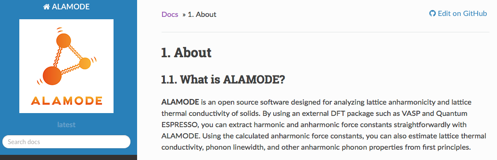

- フォノンの非調和効果を計算するためのオープンソースアプリ
- MITライセンス
- 最新版は1.5.0 (2024年2月リリース)
- 主にC++で書かれている。補助的にPythonを利用。


--- 

# 主要機能

1. 線形回帰による調和・非調和力定数の推定 (ハンズオン1)
1. 格子熱伝導率計算 (ハンズオン2)
1. 自己無撞着フォノン（SCP）法による有限温度フォノン計算 (ハンズオン2)
1. 準調和近似またはSCP法に基づく有限温度構造最適化

--- 

# 必要なもの

1. 与えた結晶構造にたいする力を計算できる外部ツール（DFTコード、経験的ポテンシャル、MLポテンシャルなど）
   - `VASP`, `Quantum ESPRESSO`, `OpenMX`, `xTAPP`, `LAMMPS`に対するインターフェイスツールを提供。
   - 新たにインターフェイスを作ること自体は比較的簡単
1. コンパイラやライブラリ
   - Boost, Eigen, LAPACK, MPI
1. Pythonの解析ツール
   - numpy, scipy, matplotlib, libxml, spglib, pymatgen, h5pyなど

---

# ALAMODE計算の流れ

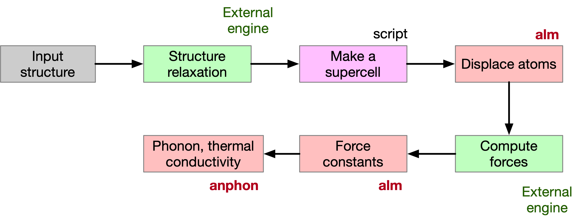

- almコード：力定数の計算
- anphonコード：フォノン、熱伝導、SCPH計算

---

# ポテンシャルエネルギーのTaylor展開

<style scoped>
section {
    font-size: 24px;
}
</style>

<style>
img[alt~="top-right"] {
  position: absolute;
  top: 150px;
  right: 100px;
  width: 300px;
}
</style>

#### 仮定
- Born–Oppenheimer（BO）近似
- BOエネルギー曲面が原子変位の解析関数
- 原子変位が小さい

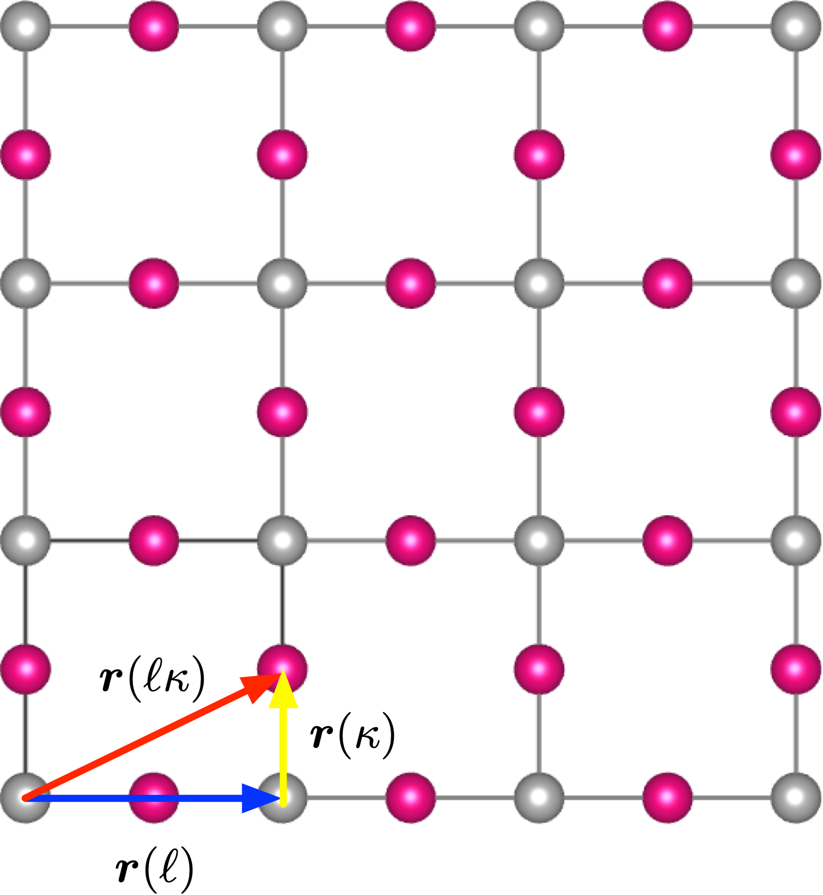

$$
\begin{aligned}
U - U_{0} &= U_{2} + U_{3} + U_{4} + \cdots \\
& = \frac{1}{2}\sum_{\{\ell,\kappa,\mu\}} \Phi_{\mu_{1}\mu_{2}}(\ell_{1}\kappa_{1};\ell_{2}\kappa_{2}) \times u_{\mu_{1}}(\ell_{1}\kappa_{1}) u_{\mu_{2}}(\ell_{2}\kappa_{2}) \\
& + \frac{1}{3!}\sum_{\{\ell,\kappa,\mu\}} \Phi_{\mu_{1}\mu_{2}\mu_{3}}(\ell_{1}\kappa_{1};\ell_{2}\kappa_{2};\ell_{3}\kappa_{3}) \times u_{\mu_{1}}(\ell_{1}\kappa_{1}) u_{\mu_{2}}(\ell_{2}\kappa_{2})u_{\mu_{3}}(\ell_{3}\kappa_{3}) \\
& + \frac{1}{4!}\sum_{\{\ell,\kappa,\mu\}} \Phi_{\mu_{1}\mu_{2}\mu_{3}\mu_{4}}(\ell_{1}\kappa_{1};\ell_{2}\kappa_{2};\ell_{3}\kappa_{3};\ell_{4}\kappa_{4}) \times u_{\mu_{1}}(\ell_{1}\kappa_{1}) u_{\mu_{2}}(\ell_{2}\kappa_{2})u_{\mu_{3}}(\ell_{3}\kappa_{3}) u_{\mu_{4}}(\ell_{4}\kappa_{4}) + \cdots
\end{aligned}
$$

---

<style scoped>
section {
    font-size: 24px;
}
</style>

# 原子間力定数 (IFC)

$n$次の力定数
$$
\Phi_{\mu_{1}\dots\mu_{n}}(\ell_{1}\kappa_{1};\dots;\ell_{n}\kappa_{n}) 
= \frac{\partial^{n} U}{\partial u_{\mu_{1}}(\ell_{1}\kappa_{1})\cdots \partial u_{\mu_{n}}(\ell_{n}\kappa_{n})}\bigg|_{\{u\}=0}
$$
<br>

- 2次（調和）項　→　フォノン分散（0 K）
- 3次　　　　項　→　フォノン−フォノン散乱、熱膨張、...
- 4次　　　　項　→　有限温度フォノン、高次フォノン散乱


---

# 調和近似
<style scoped>
section {
    font-size: 24px;
}
img[alt~="bottom-left"] {
  position: absolute;
  bottom: 50px;
  left: 100px;
  width: 400px;
}
</style>

<div class="columns">
<div>

#### 非調和項を無視
$$
U - U_{0} = U_{2} + U_{3} + U_{4} + \cdots \approx U_{2}
$$

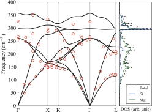

</div>

<div>

#### ハミルトニアン 
$$
\begin{aligned}
H_{0}&=T + U_{2}\\
&= \sum_{\ell_1,\kappa_1,\mu_1}\frac{\{p_{\mu_{1}}(\ell_{1}\kappa_{1})\}^{2}}{2M_{\kappa_{1}}} + \frac{1}{2}\sum_{\{\ell,\kappa,\mu\}}\Phi_{\mu_{1}\mu_{2}}(\ell_1\kappa_1;\ell_2\kappa_2) u_{\mu_{1}}(\ell_{1}\kappa_1)u_{\mu_2}(\ell_2\kappa_2) \\
&= \sum_{\boldsymbol{q},\kappa}\frac{\boldsymbol{p}^{*}(\kappa;\boldsymbol{q})\cdot\boldsymbol{p}(\kappa;\boldsymbol{q})}{2M_{\kappa}}+ \frac{1}{2}\sum_{\boldsymbol{q},\kappa,\kappa'} \boldsymbol{u}^{*}(\kappa;\boldsymbol{q})\cdot \Phi (\kappa\kappa';\boldsymbol{q})\boldsymbol{u}(\kappa';\boldsymbol{q}) \\
&=\frac{1}{2}\sum_{\boldsymbol{q},j}P_{\boldsymbol{q}j}^{*}P_{\boldsymbol{q}j} + \frac{1}{2}\sum_{\boldsymbol{q},j}\omega_{\boldsymbol{q}j}^{2}Q_{\boldsymbol{q}j}^{*}Q_{\boldsymbol{q}j} \\
& =\sum_{\boldsymbol{q},j}\hbar\omega_{\boldsymbol{q}j}\left(b_{\boldsymbol{q}j}^{\dagger}b_{\boldsymbol{q}j}+\frac{1}{2} \right).
\end{aligned}
$$

<br>

#### 動力学行列

$$
D_{\mu\nu}(\kappa\kappa';\boldsymbol{q}) = \frac{1}{\sqrt{M_{\kappa}M_{\kappa'}}}
\sum_{\ell'}\Phi_{\mu\nu}(0\kappa;\ell'\kappa')e^{i\boldsymbol{q}\cdot\boldsymbol{r}(\ell)}
$$

$$
\omega_{\boldsymbol{q}j}^{2} = (\boldsymbol{e}_{\boldsymbol{q}j}^{*})^{\mathrm{T}} D(\boldsymbol{q})\boldsymbol{e}_{\boldsymbol{q}j}.
$$

</div>


---

# IFCの第一原理計算

<style scoped>
section {
    font-size: 23px;
}
</style>

<table>
  <thead>
    <tr>
      <th></th>
      <th> DFPT </th>
      <th> Direct method</th>
    </tr>
  </thead>
  <tbody>
    <tr>
      <th>Pros.</th>
      <td style="width: 450px; word-wrap: break-word;">
      <ul style="font-size: 18px;">
      <li> Primitive cellでq≠0のフォノンが計算可能。効率的。</li>
      <li> 誘電テンソルやボルン有効電荷、電子格子相互作用も計算可能。</li>
      </ul>
      </td>
      <td style="width: 450px; word-wrap: break-word;">
      <ul style="font-size: 18px;">
      <li> 実装が比較的簡単。</li>
      <li> 高次項の推定も可能。</li>
      <li> 力さえ計算出来れば良いので、組み合わせられる汎関数が多い。</li>
      </ul>
      </td>      
    </tr>
    <tr>
      <th>Cons.</th>
      <td style="width: 400px; word-wrap: break-word;">
      <ul style="font-size: 18px;">
      <li> 3次項まで。より高次の項は差分法を使う必要あり。</li>
      <li> Meta-GGAやハイブリッド汎関数などと組み合わせた計算がサポートされていない。</li>
      </ul>
      </td>
      <td style="width: 400px; word-wrap: break-word;">
      <ul style="font-size: 18px;">
      <li> スーパーセルを用いる必要がある。</li>
      </ul>
      </td>
    </tr>
    <tr>
      <th>ソフトウェア</th>
      <td style="width: 400px; word-wrap: break-word;">
      <ul style="font-size: 20px;">
      <li> Quantum ESPRESSO </li>
      <li> Abinit </li>
      <li> VASP (q=0のみ) </li>
      </ul>
      </td>
      <td style="width: 400px; word-wrap: break-word;">
      <ul style="font-size: 20px;">
      <li> Phonopy </li>
      <li> thirdorder.py, fourthorder.py </li>
      <li style="color: red">ALAMODE</li>
      <li> HiPhive </li>
      </ul>
      </td>
    </tr>
  </tbody>
</table>


--- 

<style scoped>
.columns {
    display: grid;
    grid-template-columns: 1fr 2fr; /* Adjust the fractions to set different widths */
    gap: 0rem;
}
section {
    font-size: 24px;
}
</style>

# 直接法1 (差分法)

<div class="columns">
<div>

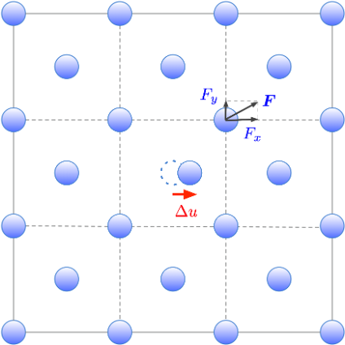

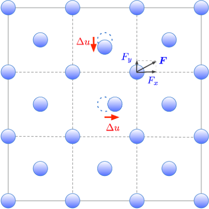

</div>

<div>

### 調和項

$$
\begin{aligned}
&\Phi_{\mu_{1}\mu_{2}}(\ell_{1}\kappa_{1};\ell_{2}\kappa_{2}) = \Phi(1;2)\\
& = \frac{\partial^{2} U}{\partial u_1\partial u_2} = -\frac{\partial F_2}{\partial u_1}
\approx - \frac{F_{2}(u_1 = +\Delta u) - F_{2}(u_1 = -\Delta u)}{2\Delta u}
\end{aligned}
$$

<br>

### 3次非調和項

$$
\begin{aligned}
\Phi(1;2;3) &= \frac{\partial^{3} U}{\partial u_1\partial u_2 \partial u_3} = -\frac{\partial F_3}{\partial u_1 \partial u_2} \\
&\approx -\frac{1}{4(\Delta u)^{2}} [F_3 (u_1 = u_2 = \Delta u) + F_3 (u_1 = u_2 = -\Delta u) \\
& \hspace{10mm}  - F_3 (u_1 = \Delta u, u_2 = -\Delta u) -F_3 (u_1 = -\Delta u, u_2 = \Delta u) ]
\end{aligned}
$$

<br>

This method is implemented in `phonopy` and `thirdorder.py`.
</div>


---

<style scoped>
section {
    font-size: 23px;
}
</style>

# 直接法2 （線形回帰）

$$
\begin{aligned}
U_{\mathrm{ALM}}-U_{0} &= U_{2} + U_{3} + U_{4} + \cdots\\
&= \frac{1}{2}\sum_{1,2}\Phi(1;2)u_1 u_2 + \frac{1}{3!}\sum_{1,2,3}\Phi(1;2;3)u_1 u_2 u_3 + \frac{1}{4!}\sum_{1,2,3,4}\Phi(1;2;3;4)u_1 u_2 u_3 u_4 + \cdots \\
&= \boldsymbol{\Phi}\cdot\boldsymbol{b}
\end{aligned}
$$

このモデルから計算する力は$\boldsymbol{F}_{\mathrm{ALM}}=-\frac{\partial U_{\mathrm{ALM}}}{\partial \boldsymbol{u}} = -\frac{\partial \boldsymbol{b}^{T}}{\partial \boldsymbol{u}}\boldsymbol{\Phi} = A\boldsymbol{\Phi}$と書ける。

そこで、最小自乗法を用いて力定数$\boldsymbol{\Phi}$を計算することが出来る。

$$
\boldsymbol{\Phi}_{\mathrm{OLS}}
= \underset{\boldsymbol{\Phi}}{\mathrm{argmin}} \frac{1}{2N_{d}}\| \mathbb{A}\boldsymbol{\Phi} - \mathscr{F}_{\mathrm{DFT}} \|_{2}^{2}
$$

行列$\mathbb{A}$は一つの原子変位パターンに対して計算される行列$A$を縦に連結させたもの。
$$
A = \begin{pmatrix}
- u_{1}^{x} & -\frac{1}{2}u_{1}^{x}u_{2}^{x} & -\frac{1}{3!}u_{1}^{x}u_{2}^{x}u_{3}^{x} & \cdots \\
 \vdots & \vdots & \vdots & \vdots \\
- u_{N_s}^{z} & -\frac{1}{2}u_{N_{s}}^{z}u_{N_{s}-1}^{z} & -\frac{1}{3!}u_{N_{s}}^{z}u_{N_{s}-1}^{z}u_{N_{s}-2}^{z}& \cdots \\
\end{pmatrix}
$$

--- 

<style scoped>
section {
    font-size: 24px;
}
</style>

# 直接法2 （線形回帰）

#### 最小自乗法
$$
\boldsymbol{\Phi}_{\mathrm{OLS}}
= \underset{\boldsymbol{\Phi}}{\mathrm{argmin}}  \frac{1}{2N_{d}}\| \mathbb{A}\boldsymbol{\Phi} - \mathscr{F}_{\mathrm{DFT}} \|_{2}^{2}
$$
- $\boldsymbol{\Phi}_{\mathrm{OLS}}$をユニークに決めるには$\mathbb{A}^{\intercal}\mathbb{A}$をfull-rankにする必要がある。$\boldsymbol{\Phi}_{\mathrm{OLS}}$要素数が多いほど多くの学習データが必要。
<br>

#### ペナルティ項付きの回帰　（ここではElastic net）
$$
\boldsymbol{\Phi}_{\mathrm{enet}} = \mathop{\rm argmin}\limits_{\boldsymbol{\Phi}} \frac{1}{2N_{d}}   \|\mathbb{A} \boldsymbol{\Phi} - \boldsymbol{\mathscr{F}}_{\mathrm{DFT}}\|^{2}_{2} + \alpha \beta \| \boldsymbol{\Phi}  \|_{1} + \frac{1}{2} \alpha (1-\beta) \| \boldsymbol{\Phi}  \|_{2}^{2}
$$
- $\boldsymbol{\Phi}_{\mathrm{enet}}$は$\mathbb{A}^{\intercal}\mathbb{A}$がfull-rankでなくても計算出来る。
- $\alpha$はペナルティの強さを制御するハイパーパラメータで、例えばCross validationなどで決定する。
- ペナルティ項には色々と種類がある（e.g., adaptive LASSO）

---

<style scoped>
section {
    font-size: 24px;
}
</style>

# IFCの対称性とsum rule

- Permutation 
$$
\Phi_{\mu_{1}\mu_{2}\mu_{3}}(\ell_{1}\kappa_{1};\ell_{2}\kappa_{2};\ell_{3}\kappa_{3})=\Phi_{\mu_{1}\mu_{3}\mu_{2}}(\ell_{1}\kappa_{1};\ell_{3}\kappa_{3};\ell_{2}\kappa_{2})=\dots.
$$

- Periodicity
$$
\Phi_{\mu_{1}\mu_{2}\dots\mu_{n}}(\ell_{1}\kappa_{1};\ell_{2}\kappa_{2};\dots;\ell_{n}\kappa_{n})=\Phi_{\mu_{1}\mu_{2}\dots\mu_{n}}(0\kappa_{1};\ell_{2}-\ell_{1}\kappa_{2};\dots;\ell_{n}-\ell_{1}\kappa_{n}).
$$

- Space group symmetry
$$
\sum_{\nu_{1},\dots,\nu_{n}}\Phi_{\nu_{1}\dots\nu_{n}}(L_{1}K_{1};\dots;L_{n}K_{n}) O_{\nu_{1}\mu_{1}}\cdots O_{\nu_{n}\mu_{n}} = \Phi_{\mu_{1}\dots\mu_{n}}(\ell_{1}\kappa_{1};\dots;\ell_{n}\kappa_{n}),
$$

- Acoustic sum rule（並進対称性）
$$
\sum_{\ell_{1}\kappa_{1}}\Phi_{\mu_{1}\mu_{2}\dots\mu_{n}}(\ell_{1}\kappa_{1};\ell_{2}\kappa_{2};\dots;\ell_{n}\kappa_{n}) = 0
$$

これらはすべて自動的に考慮される。回転対称性についてはオプションで考慮出来るが、制限もある。

---

<style scoped>
section {
    font-size: 23px;
}
</style>

# Dynamical matrixについて

#### 無限サイズの結晶におけるDynamical matrix
$$
\bar{D}_{\mu\nu}(\kappa\kappa';\boldsymbol{q}) = \frac{1}{\sqrt{M_{\kappa}M_{\kappa'}}}\sum_{L}^{\infty}\bar{\Phi}_{\mu\nu}(0\kappa;L\kappa')e^{i\boldsymbol{q}\cdot\boldsymbol{r}(L)} 
= \frac{1}{\sqrt{M_{\kappa}M_{\kappa'}}}\sum_{\ell'}\sum_{L_{s}}^{\infty}\bar{\Phi}_{\mu\nu}(0\kappa;L_s+\ell'\kappa')e^{i\boldsymbol{q}\cdot(\boldsymbol{r}(L_s) + \boldsymbol{r}(\ell'))}
$$


#### 周期境界条件の下で計算されたIFCから求めるDynamical Matrix
$$
D_{\mu\nu}(\kappa\kappa';\boldsymbol{q}) = \frac{1}{\sqrt{M_{\kappa}M_{\kappa'}}}\sum_{\ell'}\Phi_{\mu\nu}(0\kappa;\ell'\kappa')e^{i\boldsymbol{q}\cdot\boldsymbol{r}(\ell')} 
=\frac{1}{\sqrt{M_{\kappa}M_{\kappa'}}}\sum_{\ell'}\big[\sum_{L_s}^{\infty}\bar{\Phi}_{\mu\nu}(0\kappa;L_s+\ell'\kappa')\big]e^{i\boldsymbol{q}\cdot\boldsymbol{r}(\ell')} 
$$


一般に、上の両者は異なるが、$e^{i\boldsymbol{q}\cdot\boldsymbol{r}(L_s)}=1$がすべての$L_s$で満たされる$\boldsymbol{q}$点では完全に一致する。この$\boldsymbol{q}$点を<span class='red-text'>スーパーセルサイズにcommensurateな$\boldsymbol{q}$点</span>と呼ぶ。

---

<style scoped>
section {
    font-size: 24px;
}
img[alt~="top-right"] {
  position: absolute;
  top: 100px;
  right: 100px;
  width: 400px;
}
</style>

# 格子熱伝導


#### Fourier則　 $\boldsymbol{j} = -\kappa \nabla T$

#### フォノンガスモデル 　$\boldsymbol{j}\approx\boldsymbol{j}_{\mathrm{QP}}=\frac{1}{NV}\sum_{q}\hbar\omega_q \boldsymbol{v}_{q}\mathfrak{n}_{q}$.

- ここで$\mathfrak{n}_{q}$は非平衡状態でのフォノン分布関数。
$\mathfrak{n}_{q} \simeq n_{q} + \boldsymbol{f}_{q}\cdot\nabla T \beta n_q (n_{q} + 1)$と線形近似し、線形化したBoltzmann方程式を数値的に解くことで$\boldsymbol{f}_q$を求める。

#### 線形化Boltzmann方程式
$$
-\beta^{-1}\boldsymbol{v}_{q} \left( \frac{\partial n_{q}}{\partial T}\right) 
= \bigg\{ \sum_{q'} (\boldsymbol{f}_{q} - \boldsymbol{f}_{q'}) \Lambda_{q}^{q'}  
+ \sum_{q',q''} \left[ (\boldsymbol{f}_{q} + \boldsymbol{f}_{q'} - \boldsymbol{f}_{q''})\Lambda_{qq'}^{q''} + \frac{1}{2} (\boldsymbol{f}_{q} - \boldsymbol{f}_{q'} - \boldsymbol{f}_{q''})\Lambda_{q}^{q'q''} \right] +\cdots \bigg\}
$$
#### 格子熱伝導率 
$$
\kappa = -\frac{\hbar}{NV k_{\mathrm{B}}T} \sum_{q} \omega_{q} \boldsymbol{v}_{q}\otimes\boldsymbol{f}_{q} n_{q}(n_{q} + 1).
$$

---

<style scoped>
section {
    font-size: 24px;
}
</style>

# 緩和時間近似　(RTA)

ALAMODEでは熱伝導率計算でさらに緩和時間近似を用いている。

#### 緩和時間近似
$$
\begin{aligned}
\kappa_{\mathrm{RTA}} & = \frac{\hbar^{2}}{NV k_{\mathrm{B}}T^{2}} \sum_{q} \omega_{q}^{2} \boldsymbol{v}_{q}\otimes\boldsymbol{v}_{q} n_{q}(n_{q} + 1) \tau_{q} \\
& =\frac{1}{NV} \sum_{q}c_{q}\boldsymbol{v}_{q}\otimes\boldsymbol{v}_{q}\tau_{q} 
\end{aligned}
$$
- 輸送緩和時間$\tau_{q}^{\mathrm{transport}}$を準粒子の寿命$\tau_{q}$で近似。
- $\tau_{q}^{\mathrm{transport}} > \tau_{q}$であるため、RTAは熱伝導率を過小評価する傾向がある。
- 特に高熱伝導材料ではRTAは良くない。逆に熱伝導率が低い材料ではBoltzmann方程式のfull solutionとRTAで差はほとんど無い。

#### Full solution
- Iterative solution (`ShengBTE`), Direct solution (`Phono3py`)


---

<style scoped>
section {
    font-size: 20px;
}
</style>

# フォノン寿命の第一原理計算

#### フォノン−フォノン散乱
- 3フォノン散乱：フォノン散乱の主要項、3次非調和IFCから計算
$$
\begin{aligned}
\Gamma_{q}^{(B)}=\mathrm{Im} \Sigma_{q}^{(B)}(\omega_{q})
&= \frac{\pi}{2N}\sum_{q',q''} \frac{\hbar|\Phi_{3}(-q,q',q'')|^{2}}{8\omega_{q}\omega_{q'}\omega_{q''}} \times \Delta(-\boldsymbol{q}+\boldsymbol{q}'+\boldsymbol{q}'') \\
& \hspace{15mm} \times [(n_{q'}+n_{q''} +1) \delta(\omega_{q}-\omega_{q'}-\omega_{q''}) \\
& \hspace{20mm} -2(n_{q'}-n_{q''}) \delta(\omega_{q}-\omega_{q'}+\omega_{q''})]
\end{aligned}
$$
- 4フォノン散乱：高次のフォノン−フォノン散乱、ALAMODE (ver. 1.5)ではサポート対象外

#### フォノン−電子散乱

- 電子励起が起こらない場合（ワイドギャップ系）ではゼロ
- 金属や高ドープ半導体で影響が無視できない場合もある
- `EPW`コードなどがサポートしている

#### フォノン−不純物散乱

- 同位体不純物の効果はALAMODEで考慮できる
- より一般の不純物（化学置換や欠陥）の扱いは難しい。


---

<style scoped>
section {
    font-size: 23px;
}
img[alt~="top-right"] {
  position: absolute;
  top: 150px;
  right: 100px;
  width: 600px;
}
</style>

# 格子熱伝導率の予測例

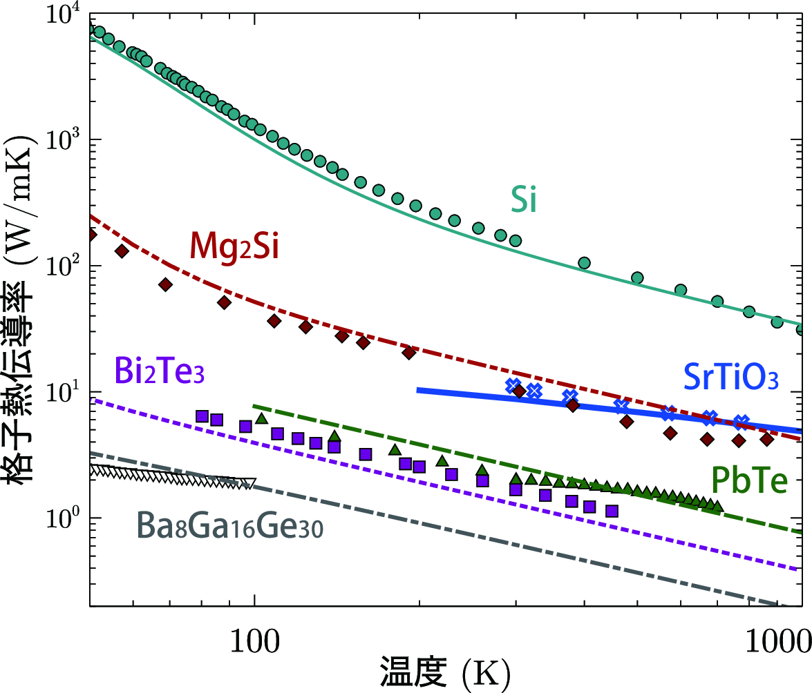

- ALAMODEを利用した計算例
- RTA
- 3フォノン散乱のみ

---

<style scoped>
section {
    font-size: 23px;
}
.columns {
    display: grid;
    grid-template-columns: 1fr 1fr; /* Adjust the fractions to set different widths */
    gap: 4rem;
}
</style>

# 有限温度フォノン計算

- これまではフォノン分散が温度に依存性しない前提だった (調和近似)
- しかし、実際のフォノン振動数は温度変化する
- 調和近似を使うと、イマジナリーフォノンが出てしまうケースが多い。(高温相など)

立方晶SrTiO<sub>3</sub>の例：

<div class="columns">

<div>

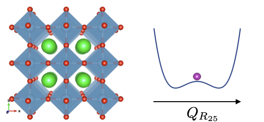

</div>

<div>

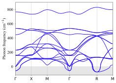

</div>

</div>

イマジナリーフォノンが出る場合は一体のハミルトニアン$\hat{H}_{0}=\sum_{\boldsymbol{q},j}\hbar\omega_{\boldsymbol{q}j}\left(b_{\boldsymbol{q}j}^{\dagger}b_{\boldsymbol{q}j}+\frac{1}{2} \right)$が定義できない。→ 熱伝導も計算出来ない

---

<style scoped>
section {
    font-size: 24px;
}
.columns {
    display: grid;
    grid-template-columns: 3fr 1fr; /* Adjust the fractions to set different widths */
    gap: 5rem;
}
img[alt~="top-right"] {
  position: absolute;
  top: 200px;
  right: 50px;
  width: 400px;
}
</style>

# 平均場によるばね定数の非調和"繰り込み"

<div class="columns">
<div>

有限温度でのeffectiveなばね定数$\tilde{\Phi}_{ij}$：
$$
\tilde{\Phi}_{ij}(T) = \Phi_{ij}+ \frac{1}{4}\sum_{kl} \Phi_{ijkl}\braket{u_{k}u_{l}}_{0}
$$

- $\Phi_{ij}$, $\Phi_{ijk\ell}$はそれぞれBOエネルギー曲面の2階、4階微分。
- $\tilde{\Phi}_{ij}$を用いて構築したDynamical matrix $\tilde{D}(\boldsymbol{q})$を対角化
→非調和振動数 $\Omega_{q}$.
- $\braket{u_{k}u_{l}}_{0}$は有効的な一体ハミルトニアン
$\hat{\mathcal{H}}_{0}=\sum_{\boldsymbol{q},j}\hbar\Omega_{\boldsymbol{q}j}\left(a_{\boldsymbol{q}j}^{\dagger}a_{\boldsymbol{q}j}+\frac{1}{2} \right)$を使って計算する
ensemble平均
</div>

<div>

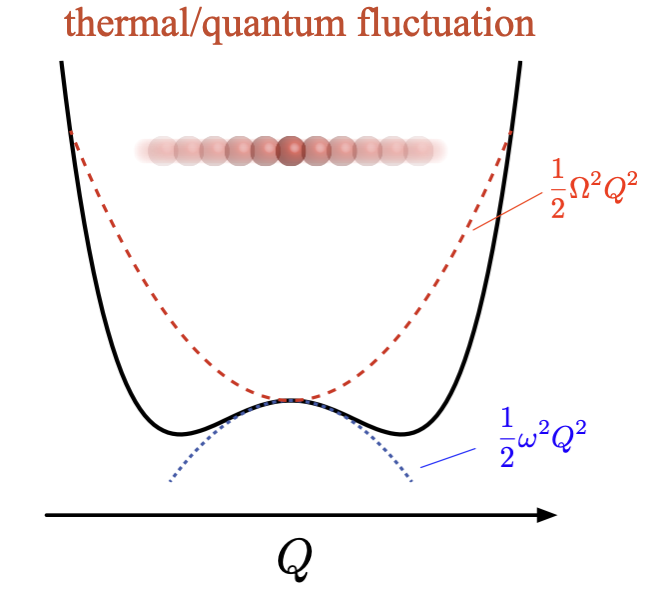

</div>
</div>

<br>

$\tilde{\Phi}_{ij}$を自己無撞着に決定する必要がある。→ **自己無撞着フォノン** (Self-consistent phonon: SCP)法

---

<style scoped>
section {
    font-size: 24px;
}
.columns {
    display: grid;
    grid-template-columns: 3fr 1fr; /* Adjust the fractions to set different widths */
    gap: 5rem;
}
img[alt~="top-right"] {
  position: absolute;
  top: 200px;
  right: 50px;
  width: 400px;
}
</style>

# 変分法による導出

#### 有効一体ハミルトニアン $\hat{\mathcal{H}}_{0}=\sum_{\boldsymbol{q},j}\hbar\Omega_{\boldsymbol{q}j}\left(a_{\boldsymbol{q}j}^{\dagger}a_{\boldsymbol{q}j}+\frac{1}{2} \right)$

#### 密度演算子 $\rho_{0} = \frac{e^{-\beta \hat{\mathcal{H}}_{0}}}{\mathrm{Tr}e^{-\beta \hat{\mathcal{H}}_{0}}}$

#### Gibbs–Bogoliubov-Feynman不等式 $F[\rho] = \tilde{F}_{0} + \braket{\hat{H}-\hat{\mathcal{H}}_{0}}_{0} \geq F$
- $F$はハミルトニアン$\hat{H}$に対応するExactな自由エネルギー。計算が極めて困難。
- $\braket{\hat{H}-\hat{\mathcal{H}}_{0}}_{0}=\mathrm{Tr}[\rho_{0}(\hat{H}-\hat{\mathcal{H}}_{0})]=\mathrm{Tr}[\rho_{0}(\hat{U}_2-\hat{\mathcal{U}}_{2})]+\mathrm{Tr}(\rho_0 \hat{U}_{4})+\mathrm{Tr}(\rho_0 \hat{U}_{6})+\cdots$. 
 ここでは偶数次の非調和項のみが繰り込まれる。

#### 自己無撞着方程式は$\frac{\delta F[\rho]}{\delta \rho} = 0$から得られる

SCP法はフォノン版ハートリーフォック法と言っても良い。

---

<style scoped>
section {
    font-size: 20px;
}
.columns {
    display: grid;
    grid-template-columns: 3fr 1fr; /* Adjust the fractions to set different widths */
    gap: 5rem;
}
img[alt~="top-right"] {
  position: absolute;
  top: 200px;
  right: 50px;
  width: 400px;
}
</style>

# 第一原理計算に基づく実装

### Stochastic method
- `SSCHA`, `QSCAILD`, `HiPhive`, `Phonopy`
- 実空間で$\Phi_{ij}$をアップデート。
- $\Phi_0$ &rarr; $\{\omega_{q}, \boldsymbol{e}_{q}\}_{0}$ &rarr; generate supercell structures at temperature $T$ &rarr; **DFT calculations** to get forces &rarr; $\Phi_1$ via fitting &rarr; $\{\omega_{q}, \boldsymbol{e}_{q}\}_{1}$ &rarr; generate supercell structures at temperature $T$ &rarr; ...
- 平均場レベルではあるがすべての非調和効果が入る
- 非調和IFCをあらわに計算しないで良い。
- 計算コストが高い

### Force-constantに基づく実装 `ALAMODE`
- 逆空間で$\Phi_{ij}$をアップデート。$
V_{\boldsymbol{q}ij}^{[n+1]} = \omega_{\boldsymbol{q}i}^{2}\delta_{ij}+\frac{1}{2}\sum_{\boldsymbol{q}_{1},k,\ell}F_{\boldsymbol{q}\boldsymbol{q}_{1},ijk\ell}(C^{[n]}_{\boldsymbol{q}} Q^{[n]}_{\boldsymbol{q}} C^{[n]\dagger}_{\boldsymbol{q}})_{k\ell}.
$
$Q_{\boldsymbol{q},ij}^{[n]}
= \frac{\hbar\big[1+2n(\omega_{\boldsymbol{q}i}^{[n]})\big]}{2\omega_{\boldsymbol{q}i}^{[n]}}\delta_{ij}$で$C_{\boldsymbol{q}}$はユニタリー行列。
- $\Phi_0$ &rarr; $\{\omega_{q}, \boldsymbol{e}_{q}\}_{0}$ &rarr; 4次非調和相互作用 $F_{\boldsymbol{q}\boldsymbol{q}_{1},ijk\ell}$ &rarr; $V_{\boldsymbol{q}}^{[1]}$ &rarr; $\{\omega_{q}, \boldsymbol{e}_{q}\}_{1}, C_{\boldsymbol{q}}^{[1]}$ &rarr; $V_{\boldsymbol{q}}^{[2]}$ &rarr; ...
- 計算が効率的だが4次IFCをあらかじめ計算する必要あり
- （現状では）Taylor展開を4次項で打ち切っている


---

<style scoped>
section {
    font-size: 24px;
}
.columns {
    display: grid;
    grid-template-columns: 1fr 3fr 3fr; /* Adjust the fractions to set different widths */
    gap: 3rem;
}
img[alt~="top-right"] {
  position: absolute;
  top: 200px;
  right: 50px;
  width: 400px;
}
</style>

# 計算例

<div class="columns">
<div>

立方晶 CsPbBr<sub>3</sub>

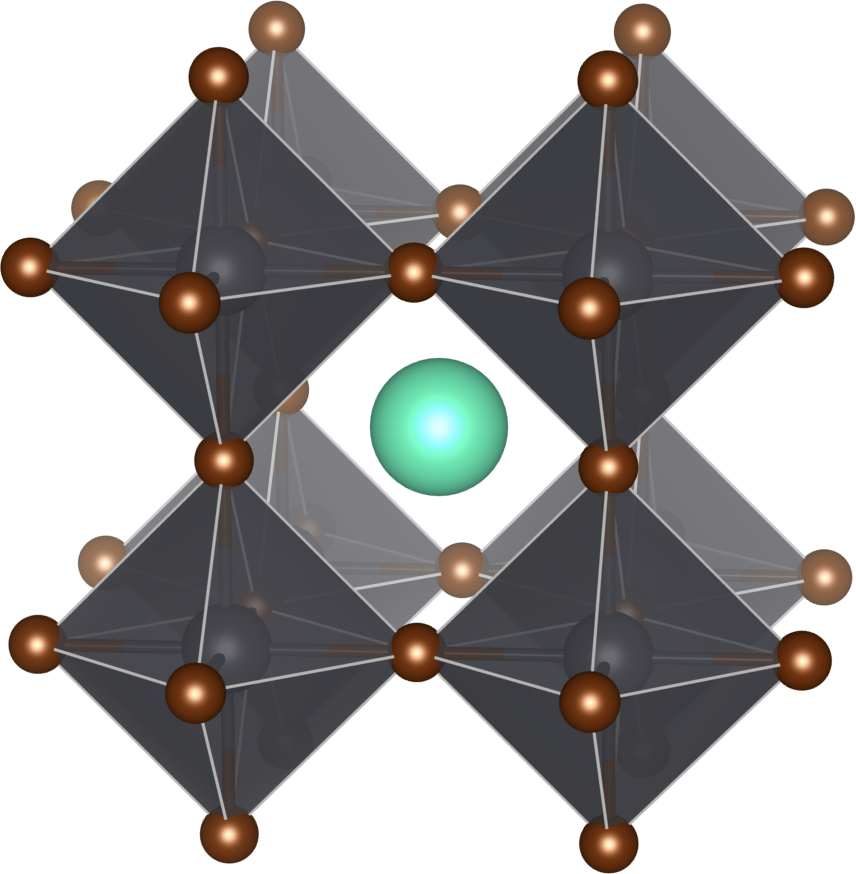

</div>

<div>

ソフトモード

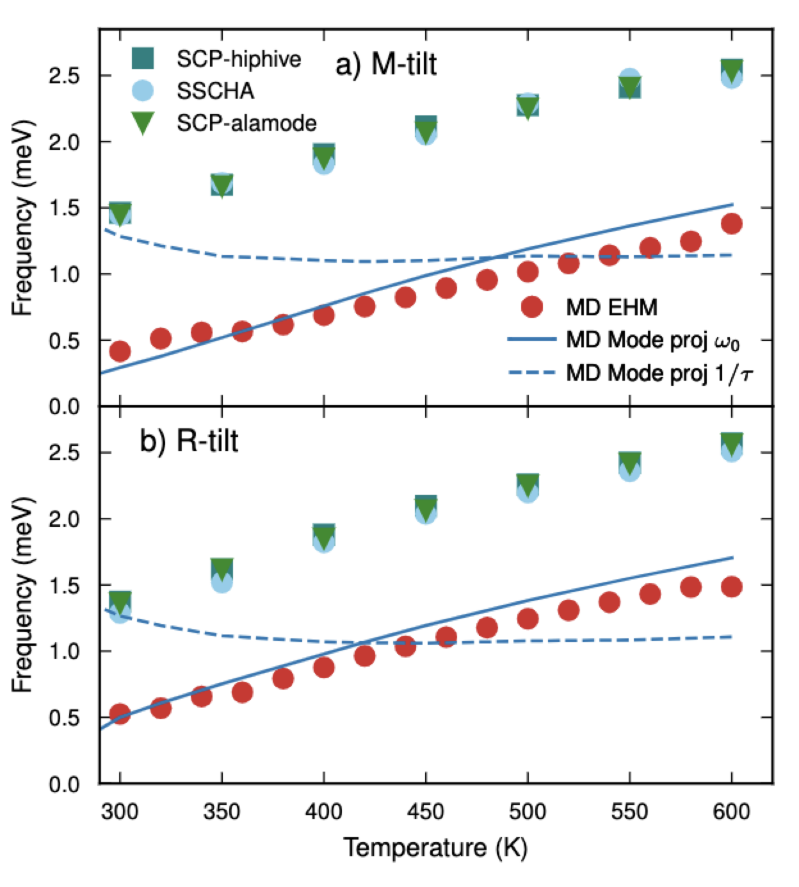

</div>

<div>

高エネルギー光学モード

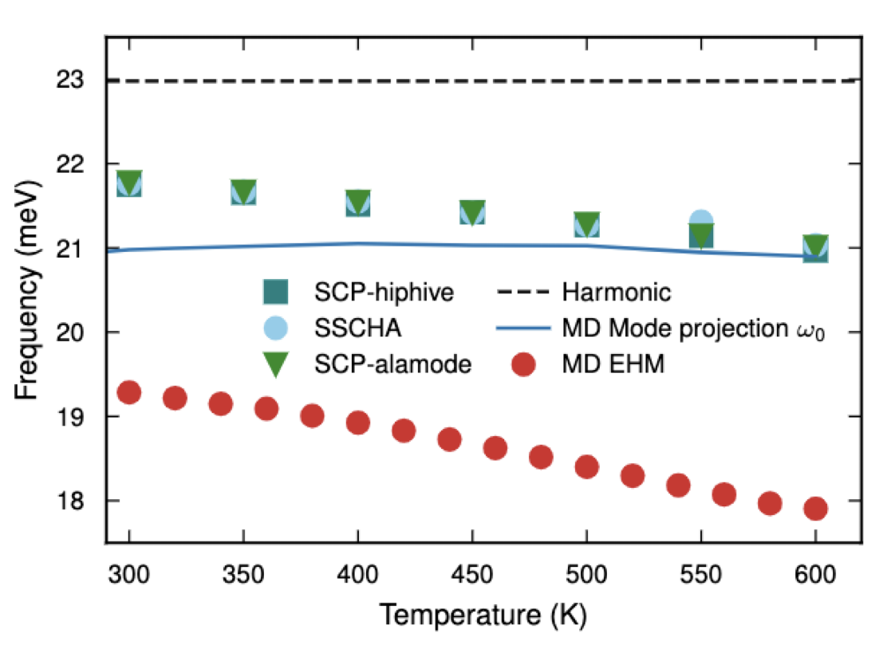

E. Fransson, P. Rosander, F. Eriksson, J. M. Rahm, TT, and P. Erhart, Commun. Phys. 6, 1 (2023).

</div>


</div>

Stochasticな方法と`ALAMODE`の実装は互いによく一致している。

---

<style scoped>
.centered-content {
    display: flex;
    justify-content: center;
    align-items: center;
    height: 70vh; /* ビューポートの高さを100%に設定 */
    text-align: center; /* テキストを中央揃え */
}
</style>

<div class="centered-content">
    <div>
        <h1>ハンズオンセッション</h1>
        <p>ここまでで質問があれば受け付けます</p>
    </div>
</div>

---

<style scoped>
section {
    font-size: 24px;
}    
</style>

# MateriApps LIVE!

0. Docker版を使っている場合

<div class="code-block-wrapper">
  <pre><code class="language-bash">curl -L -O https://sf.net/projects/materiappslive/files/docker/malive
chmod +x malive
bash ./malive remove 4.1
./malive</code></pre>
  <button class="copy-button">Copy</button>
</div>

1. ALAMODEの更新 (1.3.x &rarr; 1.5.0)

<div class="code-block-wrapper">
  <pre><code class="language-bash">curl -k -fsSL https://sf.net/projects/materiappslive/files/Debian/sources/update.sh | sudo bash
sudo apt-get install alamode</code></pre>
  <button class="copy-button">Copy</button>
</div>

---
<style scoped>
section {
    font-size: 20px;
}
details {
  font-size: 18px;
}
</style>

# ハンズオン用のファイル取得

<div class="code-block-wrapper">
  <pre><code class="language-bash">git clone -b CCMS2024 https://github.com/ttadano/alamode_tutorial.git
cd alamode_tutorial
tree -L 2</code></pre>
  <button class="copy-button">Copy</button>
</div>

<details open>
<summary>treeコマンドの出力</summary>

```bash
.
|-- 1_force_constant_silicon
|   |-- data
|   |-- hands-on_1.ipynb
|   |-- ref
|   `-- work
|-- 2_force_constant_graphene
|   |-- Extra_hands-on_1.ipynb
|   |-- data
|   |-- hands-on_2.ipynb
|   |-- ref
|   `-- work
|-- 3_thermal_conductivity_silicon
|   |-- hands-on_3.ipynb
|   `-- ref
|-- 4_thermal_conductivity_graphene
|   |-- hands-on_4.ipynb
|   `-- ref
|-- 5_self_consistent_phonon_STO
|   |-- data
|   |-- hands-on_5.ipynb
|   `-- ref
|-- 6_thermal_conductivity_STO
    |-- data
    |-- hands-on_6.ipynb
    `-- ref
```
</detail>

---

<style scoped>
section {
    font-size: 25px;
}
</style>

# Pythonライブラリのインストールと環境変数設定

#### pipコマンドで必要なライブラリをインストール（少し時間がかかります）
<div class="code-block-wrapper">
  <pre><code class="language-bash">pip install pymatgen numpy==1.26.4</code></pre>
  <button class="copy-button">Copy</button>
</div>

SSLErrorが出る場合は以下を試して下さい。
<div class="code-block-wrapper">
  <pre><code class="language-bash">pip --trusted-host pypi.python.org --trusted-host files.pythonhosted.org --trusted-host pypi.org install pymatgen numpy==1.26.4</code></pre>
  <button class="copy-button">Copy</button>
</div>

<br>

#### PYTHONPATHの設定
<div class="code-block-wrapper">
  <pre><code class="language-bash">echo "export PYTHONPATH=/usr/share/alamode/tools/" >> ~/.bashrc
source ~/.bashrc</code></pre>
  <button class="copy-button">Copy</button>
</div>


---

<style scoped>
section {
    font-size: 25px;
}    
</style>

# <span class='red-text'>Hands-on 1. </span> Force constants of Silicon

#### 目的
- バルクシリコンの2次IFC（調和）と3次IFC（非調和）を計算する。
- almの基本的な使い方を取得する。

#### 手順

1. <input type="checkbox" checked>プリミティブセルを使ってDFT計算で構造最適化を行う（今回はスキップ）
1. <input type="checkbox"> 最適化済みのプリミティブセル構造からスーパーセルを作る
1. <input type="checkbox"> 作ったスーパーセルの情報を使い、almの入力ファイルを作る
1. <input type="checkbox"> almをMODE=suggestで実行
1. <input type="checkbox"> 原子変位を与えたスーパーセル構造を生成
1. <input type="checkbox" checked> 変位構造における力を計算する（今回はスキップ）
1. <input type="checkbox"> 学習データを単一ファイルにまとめ、almの入力ファイルを編集する
1. <input type="checkbox"> almをMODE=optimizeで実行


---

<style scoped>
section {
    font-size: 22px;
}    
</style>

# 1.2. スーパーセルを作る

<div class="code-block-wrapper">
  <pre><code class="language-bash">cd 1_force_constant_silicon/work
cat primitive.POSCAR.vasp</code></pre>
  <button class="copy-button">Copy</button>
</div>

primitive.POSCAR.vaspはダイアモンド構造を持つシリコンのprimitive cell構造

```bash
Silicon primitive
   5.403
   0.0 0.5 0.5
   0.5 0.0 0.5
   0.5 0.5 0.0
   Si
     2
Direct
  0.0000000000000000  0.0000000000000000  0.0000000000000000
  0.2500000000000000  0.2500000000000000  0.2500000000000000
```

3x3行列$P$をかけてスーパーセルの格子ベクトルを作る。

$$
(\boldsymbol{a}_{s}, \boldsymbol{b}_s, \boldsymbol{c}_s) = (\boldsymbol{a}_{p}, \boldsymbol{b}_p, \boldsymbol{c}_p) P
$$

---

<style scoped>
section {
    font-size: 22px;
} 
.columns {
    display: grid;
    grid-template-columns: 1fr 1fr; /* Adjust the fractions to set different widths */
    gap: 3rem;
}
</style>

# 1.2. スーパーセルを作る（続き）

<div class="columns">
<div>

今回はconventional cellの2x2x2を作るので、$P$行列は以下の通り。
$$
P = {
  \small
  \begin{pmatrix}
-2 & 2 & 2 \\
2 & -2 & 2\\
2 & 2 & -2
\end{pmatrix}}
$$
#### 具体的な変換方法
- VESTAを利用する
- **pymatgen**やaseを利用する←今回はpymatgenを利用
- 自作スクリプトを作る
- ALAMODE内で変換する（ver. 2移行で対応）
</div>

<div>

<div class="code-block-wrapper">
  <pre><code class="language-bash">cp ../ref/makedisp_vasp.py
python3 makedisp_vasp.py</code></pre>
  <button class="copy-button">Copy</button>
</div>

<input type="checkbox"> makedisp_vasp.pyの中を確認し、行列$P$が上の通り定義されているのを確認。

<input type="checkbox"> SPOSCARが出来たのを確認。

<div class="code-block-wrapper">
  <pre><code class="language-bash">head SPOSCAR</code></pre>
  <button class="copy-button">Copy</button>
</div>

```
Si64
1.000
    10.8060000000000     0.0000000000000     0.0000000000000
     0.0000000000000    10.8060000000000     0.0000000000000
     0.0000000000000     0.0000000000000    10.8060000000000
Si
64
Direct
    0.50000000000000     0.00000000000000     0.00000000000000
    0.75000000000000     0.25000000000000     0.00000000000000
```

</div>


---

<style scoped>
section {
    font-size: 22px;
}    
.columns {
    display: grid;
    grid-template-columns: 1fr 3fr; /* Adjust the fractions to set different widths */
    gap: 1rem;
}
</style>

# 1.3. almの入力ファイルを作る

<div class="columns">

<div>

ALM0.inファイルを新規作成。
<div class="code-block-wrapper">
  <pre><code class="language-bash">vim ALM0.in</code></pre>
  <button class="copy-button">Copy</button>
</div>

emacsを使う場合は
<div class="code-block-wrapper">
  <pre><code class="language-bash">emacs -nw ALM0.in</code></pre>
  <button class="copy-button">Copy</button>
</div>

<br>

#### チェックリスト

<input type="checkbox"> MODE = suggestとする

<input type="checkbox"> &cellの格子定数はbohr単位とする


</div>

<div>

以下のように`&general`, `&interaction`, `&cutoff`, `&cell`, `&position`を作る。
<div class="code-block-wrapper">
  <pre><code class="language-bash">&general
 PREFIX = si222
 MODE = suggest 
 NAT = 64
 NKD = 1; KD = Si
/
&cutoff
 Si-Si None
/
&cell
    1.88972612545783 # Convetion unit from Angstrom to bohr
    10.8060000000000     0.0000000000000     0.0000000000000
     0.0000000000000    10.8060000000000     0.0000000000000
     0.0000000000000     0.0000000000000    10.8060000000000
/
&position
   1     0.50000000000000     0.00000000000000     0.00000000000000
   1     0.75000000000000     0.25000000000000     0.00000000000000
   (omitted)
/</code></pre>
  <button class="copy-button">Copy</button>
</div>

</div>
</div>


---

<style scoped>
section {
    font-size: 22px;
}    
.columns {
    display: grid;
    grid-template-columns: 1fr 3fr; /* Adjust the fractions to set different widths */
    gap: 1rem;
}
</style>

# 1.3. almの入力ファイルを作る（続き）

`&position`フィールドにはスーパーセルに含まれる64原子の内部座標を書く必要がある。

手で入力するのは面倒なので、スクリプトで追加します。

<div class="code-block-wrapper">
  <pre><code class="language-bash">echo "&positions" >> ALM0.in
tail -n 64 SPOSCAR | awk '{print 1, $0}' >> ALM0.in
echo "/" >> ALM.in
</code></pre>
  <button class="copy-button">Copy</button>
</div>

面倒な方はrefディレクトリにあるALM0.inをコピーしてください
<div class="code-block-wrapper">
  <pre><code class="language-bash">cp ../ref/ALM0.in .
</code></pre>
  <button class="copy-button">Copy</button>
</div>


---

<style scoped>
section {
    font-size: 22px;
}    
.columns {
    display: grid;
    grid-template-columns: 1fr 3fr; /* Adjust the fractions to set different widths */
    gap: 1rem;
}
</style>

# 1.4. almをMODE=suggestで実行

<div class="code-block-wrapper">
  <pre><code class="language-bash">alm ALM0.in > ALM0.log</code></pre>
  <button class="copy-button">Copy</button>
</div>

ALM0.logには
- 結晶構造の情報（格子定数、内部座標、対称性）
- 原子間距離
- 独立なIFCの数
- IFCを決めるために考慮するべき変位パターン数

などの情報が出力されている。
また、si222.pattern_HARMONICファイルが作成される。

#### チェックリスト
<input type="checkbox"> Space groupが正しく認識されているか。

---

<style scoped>
section {
    font-size: 22px;
}    
.columns {
    display: grid;
    grid-template-columns: 1fr 1fr; /* Adjust the fractions to set different widths */
    gap: 1rem;
}
</style>

# 非調和相互作用を考慮する場合


<input type="checkbox"> `NORDER`を1から2に変更する
<input type="checkbox"> `&cutoff`フィールドに3次IFCのカットオフを追加する

<div class="columns">

<div>

#### 3次項まで考慮する場合

<div class="code-block-wrapper">
  <pre><code class="language-bash">&interaction
 NORDER = 2
/
&cutoff
 Si-Si None 7.3
/
</code></pre>
  <button class="copy-button">Copy</button>
</div>
</div>
<div>

#### 4次項まで考慮する場合

<div class="code-block-wrapper">
  <pre><code class="language-bash">&interaction
 NORDER = 3
 NBODY = 2 3 3
/
&cutoff
 Si-Si None 7.3 7.3
/
</code></pre>
  <button class="copy-button">Copy</button>
</div>
</div>
</div>

- 今回は第2近接まで非調和相互作用を考慮する（$r_c = 7.3$ bohr）
- `NBODY`タグを使うと多体相互作用の上限を設定できる。
上の例では`NBODY = 2 3 3`として4体の4次相互作用を除いている。


---

<style scoped>
section {
    font-size: 22px;
}    
.columns {
    display: grid;
    grid-template-columns: 1fr 3fr; /* Adjust the fractions to set different widths */
    gap: 1rem;
}
</style>

# 1.5. 原子変位を与えたスーパーセル構造を生成

SPOSCARの構造から、原子を0.01 Å だけ微小変位させた構造を作る。
<div class="code-block-wrapper">
  <pre><code class="language-bash">python3 -m displace --VASP SPOSCAR --mag 0.01 --prefix harm -pf si222.pattern_HARMONIC
</code></pre>
  <button class="copy-button">Copy</button>
</div>

非調和項の計算には少し大きめな変位にするのが良い。
<div class="code-block-wrapper">
  <pre><code class="language-bash">python3 -m displace --VASP SPOSCAR --mag 0.04 --prefix cubic -pf si222.pattern_ANHARM3
</code></pre>
  <button class="copy-button">Copy</button>
</div>

<div class="code-block-wrapper">
  <pre><code class="language-bash">head harm1.POSCAR
</code></pre>
  <button class="copy-button">Copy</button>
</div>

```
Disp. Num. 1 ( 0.010000 Angstrom, 1 : +x)
1.0
  10.805999999999999    0.000000000000000    0.000000000000000
   0.000000000000000   10.805999999999999    0.000000000000000
   0.000000000000000    0.000000000000000   10.805999999999999
Si
64
Direct
   0.500925411808255   0.000000000000000   0.000000000000000
   0.750000000000000   0.250000000000000   0.000000000000000
```

---

<style scoped>
section {
    font-size: 22px;
}    
.columns {
    display: grid;
    grid-template-columns: 1fr 3fr; /* Adjust the fractions to set different widths */
    gap: 1rem;
}
</style>

# 1.6. 変位構造における力を計算する

今回は時間の都合上スキップする。

VASPを用いて計算した結果がdataディレクトリにあるのでコピーしてください。

#### 調和IFC用の計算結果
<div class="code-block-wrapper">
  <pre><code class="language-bash">cp ../data/vasprun_harmonic1.xml .
</code></pre>
  <button class="copy-button">Copy</button>
</div>

#### 3次非調和IFC用の計算結果
<div class="code-block-wrapper">
  <pre><code class="language-bash">cp ../data/vasprun_cubic*.xml .
</code></pre>
  <button class="copy-button">Copy</button>
</div>


---

<style scoped>
section {
    font-size: 22px;
}    
.columns {
    display: grid;
    grid-template-columns: 1fr 3fr; /* Adjust the fractions to set different widths */
    gap: 1rem;
}
</style>

# 1.8. 学習データを単一ファイルにまとめる

#### 調和項用データ

<div class="code-block-wrapper">
  <pre><code class="language-bash">python3 -m extract --VASP SPOSCAR vasprun_harmonic1.xml > DFSET_harmonic
</code></pre>
  <button class="copy-button">Copy</button>
</div>

#### 3次非調和項用データ

<div class="code-block-wrapper">
  <pre><code class="language-bash">python3 -m extract --VASP SPOSCAR vasprun_cubic*.xml > DFSET_cubic
</code></pre>
  <button class="copy-button">Copy</button>
</div>

---

<style scoped>
section {
    font-size: 18px;
}    
.columns {
    display: grid;
    grid-template-columns: 1fr 1fr; /* Adjust the fractions to set different widths */
    gap: 1rem;
}
</style>

# 1.9. alm用インプットファイルを編集

<div class="columns">

<div>

#### 調和項

<div class="code-block-wrapper">
  <pre><code class="language-bash">cp ALM0.in ALM1.in
vim ALM1.in
</code></pre>
  <button class="copy-button">Copy</button>
</div>

ALM1.in 
<div class="code-block-wrapper">
  <pre><code class="language-bash">&general
 PREFIX = si222
 MODE = opt # change to opt (or optimize)
 NAT = 64; NKD = 1
 KD = Si
/
&optimize
 DFSET = DFSET_harmonic
/
&interaction
 NORDER = 1
/
&cutoff
 Si-Si None 7.3
/
...
</code></pre>
  <button class="copy-button">Copy</button>
</div>

<input type="checkbox"> `MODE`をoptに変更
<input type="checkbox"> `&optimize`フィールドを作成

</div>

<div>

#### 3次非調和項

<div class="code-block-wrapper">
  <pre><code class="language-bash">cp ALM0.in ALM2.in
vim ALM2.in
</code></pre>
  <button class="copy-button">Copy</button>
</div>

ALM2.in
<div class="code-block-wrapper">
  <pre><code class="language-bash">&general
 PREFIX = si222_cubic
 MODE = opt # change to opt (or optimize)
 NAT = 64; NKD = 1
 KD = Si
/
&optimize
 DFSET = DFSET_cubic
 FC2XML = si222.xml
/
&interaction
 NORDER = 2
/
&cutoff
 Si-Si None 7.3
/
...
</code></pre>
  <button class="copy-button">Copy</button>
</div>

<input type="checkbox"> `&optimize`フィールドにFC2XMLを設定し、3次IFCフィットの時に調和項を固定する。

</div>
</div>

---

<style scoped>
section {
    font-size: 21px;
}    
.columns {
    display: grid;
    grid-template-columns: 1fr 1fr; /* Adjust the fractions to set different widths */
    gap: 1rem;
}
</style>

# 1.9. almをMODE=optで実行 

#### 調和項のフィット
<div class="code-block-wrapper">
  <pre><code class="language-bash">alm ALM1.in > ALM1.log
grep "Fitting error" ALM1.log</code></pre>
  <button class="copy-button">Copy</button>
</div>

<input type="checkbox"> フィッティングエラーは力の相対誤差。十分小さい事を確認
<input type="checkbox"> si222.xmlが出来ている事を確認


- 変位の大きさが0.01 Å程度の場合、フィッティングエラーは数％以下になることが多いです。それ以上に大きな場合は、初期の構造最適化が甘いかDFT計算の数値精度が足りていない可能性があります。


#### 3次非調和項のフィット
<div class="code-block-wrapper">
  <pre><code class="language-bash">alm ALM2.in > ALM2.log
grep "Fitting error" ALM2.log</code></pre>
  <button class="copy-button">Copy</button>
</div>

<input type="checkbox"> si222_cubic.xmlが出来ている事を確認


---

<style scoped>
.centered-content {
    display: flex;
    justify-content: center;
    align-items: center;
    height: 70vh; /* ビューポートの高さを100%に設定 */
    text-align: center; /* テキストを中央揃え */
}
</style>

<div class="centered-content">
    <div>
        <h1>Short break</h1>
    </div>
</div>


---

<style scoped>
section {
    font-size: 25px;
}
</style>

#  <span class="red-text"> Hands-on 2. </span> Phonon and thermal conductivity of Si

#### 目的
- バルクシリコンのフォノン計算、格子熱伝導率計算を行う
- anphonの基本的な使い方を取得する。

#### 手順

1. <input type="checkbox"> フォノン分散計算
1. <input type="checkbox"> フォノン状態密度（phDOS）計算
1. <input type="checkbox"> 熱力学量と平均自乗変位計算
1. <input type="checkbox"> 格子熱伝導率計算
1. <input type="checkbox"> 格子熱伝導率の解析


---

<style scoped>
section {
    font-size: 22px;
}
.columns {
    display: grid;
    grid-template-columns: 1fr 1fr; /* Adjust the fractions to set different widths */
    gap: 1rem;
}
</style>

# 2.1 フォノン分散

作業ディレクトリの移動とIFCファイルのコピー
<div class="code-block-wrapper">
  <pre><code class="language-bash">cd ../../2_thermal_conductivity_silicon/
mkdir work; cd work
cp ../../1_force_constant_silicon/work/si222_cubic.xml .
</code></pre>
  <button class="copy-button">Copy</button>
</div>

<div class="columns">

<div>

phband.inを新規作成し編集
<div class="code-block-wrapper">
  <pre><code class="language-bash">vim phband.in
</code></pre>
  <button class="copy-button">Copy</button>
</div>

右を参考にphband.inを作成し、anphonを実行
<div class="code-block-wrapper">
  <pre><code class="language-bash">anphon phband.in > phband.log
</code></pre>
  <button class="copy-button">Copy</button>
</div>

結果をプロット
<div class="code-block-wrapper">
  <pre><code class="language-bash">python3 -m plotband Si.bands --unit meV
</code></pre>
  <button class="copy-button">Copy</button>
</div>

<input type="checkbox"> anphonの&cellフィールドにはprimitive cellの格子定数を入力したか確認。almと異なるので注意。
<input type="checkbox"> &kpointフィールドにはprimitive cellのBrillouin zoneパスを指定。
<input type="checkbox"> フォノン分散に変な振動がないかチェック

</div>

<div>

phband.in 
<div class="code-block-wrapper">
  <pre><code class="language-bash">&general
 PREFIX = Si
 MODE = phonons
 NKD = 1; KD = Si
 FCSXML = si222_cubic.xml
/
&cell
 10.21019025584864572792
 0.0 0.5 0.5
 0.5 0.0 0.5
 0.5 0.5 0.0
/
&kpoint
1
 G  0.0 0.0 0.0  X  0.5 0.0 0.5  51
 X  0.5 0.0 0.5  G  0.0 0.0 0.0  51
 G  0.0 0.0 0.0  L  0.5 0.5 0.5  51
/
</code></pre>
  <button class="copy-button">Copy</button>
</div>
</div>

</div>


---


<style scoped>
section {
    font-size: 22px;
}
.columns {
    display: grid;
    grid-template-columns: 1fr 1fr; /* Adjust the fractions to set different widths */
    gap: 1rem;
}
</style>

# 2.2 フォノン状態密度 (phDOS)

<div class="columns">

<div>

phband.inをphdos.inにコピーして編集
<div class="code-block-wrapper">
  <pre><code class="language-bash">cp phband.in phdos.in
vim phdos.in
</code></pre>
  <button class="copy-button">Copy</button>
</div>

右を参考に編集したらanphonを実行
<div class="code-block-wrapper">
  <pre><code class="language-bash">anphon phdos.in > phdos.log
</code></pre>
  <button class="copy-button">Copy</button>
</div>

プロット
<div class="code-block-wrapper">
  <pre><code class="language-bash">python -m plotdos Si.dos --unit meV
</code></pre>
  <button class="copy-button">Copy</button>
</div>

<input type="checkbox"> &kpointフィールドの最初の数字を1 → 2に変更し、続く行にk点サンプリングのメッシュ数を設定

<input type="checkbox"> `ISMEAR`オプションによってDOSの見え方がどう変わるか確認

</div>

<div>

phdos.in 
<div class="code-block-wrapper">
  <pre><code class="language-bash">&general
 PREFIX = Si
 MODE = phonons
 NKD = 1; KD = Si
 FCSXML = si222_cubic.xml
 DELTA_E = 1.0 # energy spacing in unit of cm^-1
 # Tetrahedron method
 ISMEAR = -1
 # uncomment below to use Gaussian SMEARING
 # ISMEAR = 1; EPSILON = 7.0
/
&cell
 10.21019025584864572792
 0.0 0.5 0.5
 0.5 0.0 0.5
 0.5 0.5 0.0
/
&kpoint
 2
 20 20 20
/
</code></pre>
  <button class="copy-button">Copy</button>
</div>

</div>

</div>


---

<style scoped>
section {
    font-size: 22px;
}
.columns {
    display: grid;
    grid-template-columns: 1fr 1fr; /* Adjust the fractions to set different widths */
    gap: 1rem;
}
</style>

# 2.3 熱力学量、平均自乗変位

- フォノン定積比熱 $C_V(T)$、内部エネルギー $U(T)$、エントロピー $S(T)$、自由エネルギー $F(T)$は`PREFIX.thermo`ファイルに保存されている。


  <details>
  <summary>クリックしてSi.thermoを表示</summary>

  ```bash
  # Temperature [K], Heat capacity / kB, Entropy / kB, Internal energy [Ry], Free energy (QHA) [Ry]
         0.000000      0.000000e+00     -0.000000e+00      8.998551e-03      8.998551e-03
        10.000000      2.500214e-03      6.422432e-04      8.998584e-03      8.998543e-03
        20.000000      3.305335e-02      8.578358e-03      8.999410e-03      8.998324e-03
        30.000000      1.543377e-01      4.116429e-02      9.004756e-03      8.996935e-03
        40.000000      3.689070e-01      1.133297e-01      9.020970e-03      8.992259e-03
        50.000000      6.235207e-01      2.226980e-01      9.052313e-03      8.981789e-03
        60.000000      8.816295e-01      3.592790e-01      9.100008e-03      8.963476e-03
        70.000000      1.131871e+00      5.140856e-01      9.163817e-03      8.935895e-03
        80.000000      1.374837e+00      6.811505e-01      9.243230e-03      8.898098e-03
  ```
  </details>

  興味があればgnuplotでプロットしてみてください。

- 平均自乗変位 $\left< u_{\mu}^{2}(\kappa)\right> = \frac{\hbar}{M_{\kappa}N_{q}}\sum_{\boldsymbol{q},j}\frac{1}{\omega_{\boldsymbol{q}j}} |e_{\mu}(\kappa;\boldsymbol{q}j)|^{2}
\left(n_{\boldsymbol{q}j}+\frac{1}{2}\right)$
  
   以下をphdos.inに追記してanphonを再実行
    <div class="code-block-wrapper">
    <pre><code class="language-bash">&analysis
     MSD = 1; DOS = 0
  /    </code></pre>
    <button class="copy-button">Copy</button>
    </div>
  
  結果は`PREFIX.msd`に保存される

  <details>
  <summary>クリックしてSi.msdを表示</summary>

  ```bash
  # Mean Square Displacements at a function of temperature.
  # Temperature [K], <(u_{1}^{x})^{2}>, <(u_{1}^{y})^{2}>, <(u_{1}^{z})^{2}>, .... [Angstrom^2]
              0     0.00247137     0.00247137     0.00247137     0.00247137     0.00247137     0.00247137
             10     0.00247227     0.00247227     0.00247227     0.00247227     0.00247227     0.00247227
  ```
  </details>

<input type="checkbox"> これらの結果はISMEARに依存しない
<input type="checkbox"> 温度範囲や刻みを変える場合は`TMIN, TMAX, DT`を利用


---

<style scoped>
section {
    font-size: 22px;
}
.columns {
    display: grid;
    grid-template-columns: 1fr 1fr; /* Adjust the fractions to set different widths */
    gap: 1rem;
}
</style>

# 2.4 格子熱伝導率

シリコンの格子熱伝導率をRTAに基づき計算する。計算コストを下げるため、k点メッシュは10x10x10とする。

<div class="columns">

<div>

phdos.inをkappa.inにコピーして編集
<div class="code-block-wrapper">
  <pre><code class="language-bash">cp phdos.in kappa.in
vim kappa.in
</code></pre>
  <button class="copy-button">Copy</button>
</div>

右を参考に編集したらanphonを実行
<div class="code-block-wrapper">
  <pre><code class="language-bash">export OMP_NUM_THREADS=1
mpirun anphon kappa.in > kappa.log
</code></pre>
  <button class="copy-button">Copy</button>
</div>

結果を確認
<div class="code-block-wrapper">
  <pre><code class="language-bash">less Si_q10.kl
</code></pre>
  <button class="copy-button">Copy</button>
</div>

<input type="checkbox"> 300 Kでの熱伝導率がおよそ111 W/mKとなるか確認　（実験値は~155 W/mK）
<input type="checkbox"> 余力があればq点メッシュを変えて結果を比較

</div>

<div>

kappa.in 
<div class="code-block-wrapper">
  <pre><code class="language-bash">&general
 PREFIX = Si_q10
 MODE = RTA
 NKD = 1; KD = Si
 FCSXML = si222_cubic.xml
 ISMEAR = -1
/
&cell
 10.21019025584864572792
 0.0 0.5 0.5
 0.5 0.0 0.5
 0.5 0.5 0.0
/
&kpoint
 2
 10 10 10
/
</code></pre>
  <button class="copy-button">Copy</button>
</div>

</div>

</div>

---

<style scoped>
section {
    font-size: 22px;
}
.columns {
    display: grid;
    grid-template-columns: 1fr 1fr 1fr; /* Adjust the fractions to set different widths */
    gap: 1rem;
}
</style>

# 同位体散乱効果の解析

同位体不純物によるフォノン散乱強度は以下の式を用いて摂動的に計算出来る。
$$
\begin{aligned}
&\Gamma_{\boldsymbol{q}j}^{\mathrm{iso}}(\omega)= \frac{\pi}{4N_{q}} \omega_{\boldsymbol{q}j}^{2}\sum_{\boldsymbol{q}_{1},j_{1}}\delta(\omega-\omega_{\boldsymbol{q}_{1}j_{1}})
\sum_{\kappa}g_{2}(\kappa)|\boldsymbol{e}^{*}(\kappa;\boldsymbol{q}_{1}j_{1})\cdot\boldsymbol{e}(\kappa;\boldsymbol{q}j)|^{2}, \\
&g_{2}(\kappa)=\sum_{i}f_{i}(\kappa)\left(1 - \frac{m_{i}(\kappa)}{M_{\kappa}}\right)^{2}
\end{aligned}
$$


<div class="columns">

<div>

kappa.inに下記を追記
<div class="code-block-wrapper">
  <pre><code class="language-bash">&analysis
 ISOTOPE = 2
/
</code></pre>
  <button class="copy-button">Copy</button>
</div>

anphonを再実行。
<div class="code-block-wrapper">
  <pre><code class="language-bash">cp Si_q10.kl Si_q10_pure.kl
mpirun anphon kappa.in
</code></pre>
  <button class="copy-button">Copy</button>
</div>

</div>

<div>

<br>

<input type="checkbox"> Si_q10_pure.klとSi_q10.klをプロットして変化を確認

</div>

<div>

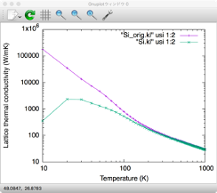

</div>
</div>

---

<style scoped>
section {
    font-size: 22px;
}
</style>

# 粒界散乱の現象論的な取込み
実材料では粒界でのフォノン散乱効果が無視できない。この効果は現象論的に考慮する。
散乱強度 　$\tau_{\boldsymbol{q}j,\mathrm{ph-b}}^{-1} = \frac{2|\boldsymbol{v}_{\boldsymbol{q}j}|}{L}$：ここで$L$は粒径サイズ

#### 3-フォノン散乱 + 粒界散乱 $\tau_{\boldsymbol{q}j}^{-1} = \tau_{\boldsymbol{q}j,\mathrm{anh}}^{-1} + \tau_{\boldsymbol{q}j,\mathrm{ph-b}}^{-1}$

<div class="code-block-wrapper">
  <pre><code class="language-bash">python -m analyze_phonons --calc kappa_boundary --size 1.0e+5 Si_q10.result > Si_boundary.kl
</code></pre>
  <button class="copy-button">Copy</button>
</div>

#### 3-フォノン散乱 + 同位体散乱 + 粒界散乱 $\tau_{\boldsymbol{q}j}^{-1} = \tau_{\boldsymbol{q}j,\mathrm{anh}}^{-1} + \tau_{\boldsymbol{q}j,\mathrm{ph-iso}}^{-1}+ \tau_{\boldsymbol{q}j,\mathrm{ph-b}}^{-1}$

<div class="code-block-wrapper">
  <pre><code class="language-bash">python -m analyze_phonons --calc kappa_boundary --isotope Si.self_isotpe --size 1.0e+5 Si_q10.result > Si_iso_boundary.kl
</code></pre>
  <button class="copy-button">Copy</button>
</div>

- `--size`で長さ$L$を指定（単位はnm）。上の例では$L = 100 \; \mu$mとしている。

<input type="checkbox"> Si_q10_pure.kl, Si_boundary.kl, Si_iso_boundary.klをプロットして比較


---

<style scoped>
section {
    font-size: 22px;
}
.columns {
    display: grid;
    grid-template-columns: 1fr 1fr; /* Adjust the fractions to set different widths */
    gap: 1rem;
}
img[alt~="left-bottom"] {
  position: relative;
  bottom: 0px;
  left: 100px;
  width: 300px;
}
img[alt~="right-bottom"] {
  position: absolute;
  bottom: 10px;
  right: 200px;
  width: 300px;
}
</style>

# 熱伝導のスペクトル分解

熱伝導率の絶対値を予測するだけでなく、どのフォノンが熱伝導への寄与が大きいか解析することが出来る。

<div class="columns">
<div>

#### フォノン振動数について分解
$$
\kappa_{\mathrm{ph}}^{\mu\mu}(\omega) = \frac{1}{\Omega N_{q}}\sum_{\boldsymbol{q},j}c_{\boldsymbol{q}j}v_{\boldsymbol{q}j}^{\mu}v_{\boldsymbol{q}j}^{\mu}\tau_{\boldsymbol{q}j} \delta(\omega-\omega_{\boldsymbol{q}j})
$$

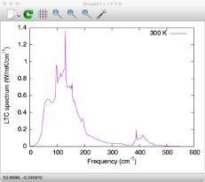
</div>


<div>

#### フォノン平均自由行程について分解
$$
\kappa_{\mathrm{ph,accum}}^{\mu\mu}(L) = \frac{1}{\Omega N_{q}} \sum_{\boldsymbol{q},j}c_{\boldsymbol{q}j}v_{\boldsymbol{q}j}^{\mu}v_{\boldsymbol{q}j}^{\mu}\tau_{\boldsymbol{q}j}\Theta (L-|\boldsymbol{v}_{\boldsymbol{q}j}|\tau_{\boldsymbol{q}j})
$$
- $\Theta(x)$はHevisideのstep function

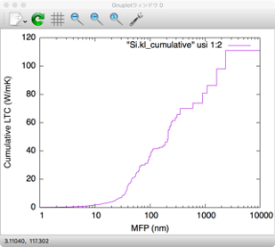

</div>

</div>


---

<style scoped>
section {
    font-size: 22px;
}
</style>

# 熱伝導のスペクトル分解

<div class="columns">
<div>

#### フォノン振動数について分解

kappa.inに`DELTA_E`と`KAPPA_SPEC`を追加して再計算
<div class="code-block-wrapper">
  <pre><code class="language-bash">&general
 PREFIX = Si_q10
 MODE = RTA
 NKD = 1; KD = Si
 FCSXML = si222_cubic.xml
 ISMEAR = -1
 DELTA_E = 1
/
...
&analysis
 KAPPA_SPEC = 1
 #ISOTOPE = 2
/
</code></pre>
  <button class="copy-button">Copy</button>
</div>

Si_q10.kl_specをプロット (コマンドが続くのでスクロールしてください)
<div class="code-block-wrapper">
  <pre><code class="language-bash">gnuplot> plot "< awk '{if ($1 == 300) print $2, $3}' Si_q10.kl_spec" usi 1:2 w lp
</code></pre>
  <button class="copy-button">Copy</button>
</div>

</div>

<div>

#### フォノン平均自由行程について分解
analyze_phononsに`--length`オプションを追加。温度は`--temp`で指定
<div class="code-block-wrapper">
  <pre><code class="language-bash">python -m analyze_phonons --calc cumulative --temp 300 --length 10000:1 Si.result > Si.kl_cumulative
</code></pre>
  <button class="copy-button">Copy</button>
</div>

Si.kl_cumulativeをプロット
<div class="code-block-wrapper">
  <pre><code class="language-bash">gnuplot> plot "Si.kl_cumulative" usi 1:2 w lp
gnuplot> set logscale x
gnuplot> replot
</code></pre>
  <button class="copy-button">Copy</button>
</div>

</div>


---

<style scoped>
section {
    font-size: 24px;
}
.columns {
    display: grid;
    grid-template-columns: 1fr 1fr; /* Adjust the fractions to set different widths */
    gap: 2rem;
}
img[alt~="left-bottom"] {
  position: relative;
  bottom: 20px;
  left: 50px;
  width: 400px;
}
img[alt~="right-bottom"] {
  position: relative;
  bottom: 20px;
  right: 0px;
  width: 400px;
}
</style>

# フォノンの寿命、平均自由行程

<div class="code-block-wrapper">
  <pre><code class="language-bash">python -m analyze_phonons --calc tau --temp 300 Si_q10.result > tau_300K.dat
head tau_300K.dat
</code></pre>
  <button class="copy-button">Copy</button>
</div>

<details>
  <summary>クリックしてtau_300K.datを表示</summary>

  ```bash
# Result analyzer ver. 1.0.5
# Input file : Si_q10.result
# Phonon lifetime at temperature 300 K.
# kpoint range 1 47
# mode   range 1 6
#  ik,  is, Frequency [cm^{-1}], Lifetime [ps], |Velocity| [m/s], MFP [nm], Multiplicity, Thermal conductivity par mode (xx, xy, ...) [W/mK]
    1    1    1.09737e-10              0              0              0    1              0              0              0              0              0              0              0              0              0
    1    2    1.09737e-10              0              0              0    1              0              0              0              0              0              0              0              0              0
    1    3    1.09737e-10              0              0              0    1              0              0              0              0              0              0              0              0              0
    1    4        512.569        1.65431              0              0    1              0              0              0              0              0              0              0              0              0
    1    5        512.569        1.65431              0              0    1              0              0              0              0              0              0              0              0              0
    1    6        512.569        1.65431              0              0    1              0              0              0              0              0              0              0              0              0
    2    1          45.18        412.002        3916.77        1613.72    8       0.734523    2.50372e-07    2.50372e-07    2.50372e-07       0.734523    2.50372e-07    2.50372e-07    2.50372e-07       0.734523
    2    2          45.18        412.002        3916.77        1613.72    8       0.735095    2.50372e-07    2.50372e-07    2.50372e-07       0.735095    2.50372e-07    2.50372e-07    2.50372e-07       0.735095
    2
  ```
  </details>


<div class="columns">
<div>

#### フォノン寿命

3列目と4列目のデータでプロット

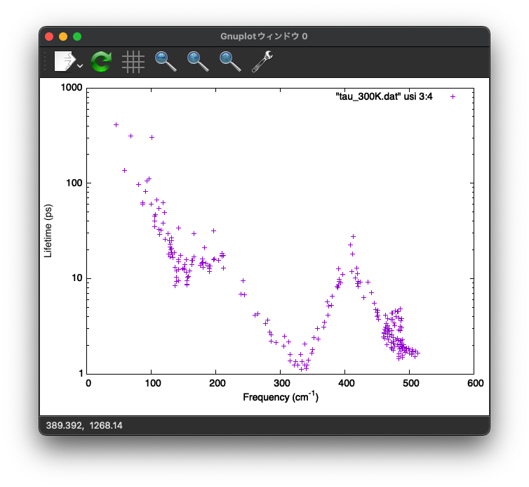

</div>

<div>

#### フォノンの平均自由行程

3列目と6列目のデータでプロット

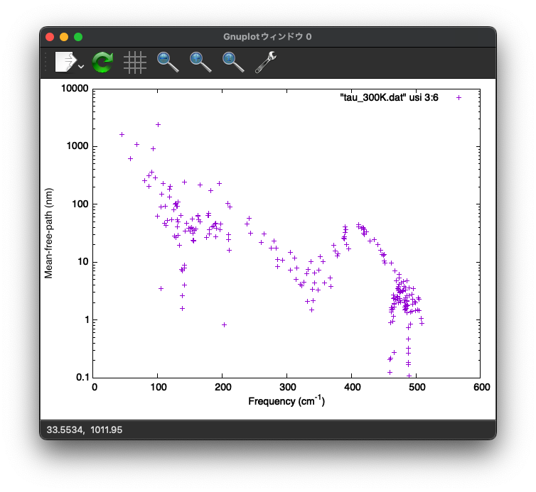

</div>
</div>

---

<style scoped>
section {
    font-size: 25px;
}
</style>

#  <span class="red-text"> Hands-on 3. </span> SrTiO<sub>3</sub>の自己無撞着フォノン計算

#### 目的
- 立方晶SrTiO<sub>3</sub>の有限温度フォノン計算を行う
- 自己無撞着フォノン計算の基礎を取得する

#### 手順

1. <input type="checkbox" checked> 調和・非調和IFCの第一原理計算 (今回はひとまずスキップ)
1. <input type="checkbox"> 調和近似に基づくフォノン計算
1. <input type="checkbox"> 自己無撞着フォノン(SCP)法によるフォノン計算
1. <input type="checkbox"> SCPの結果を用いた熱伝導計算


---

<style scoped>
section {
    font-size: 24px;
}
</style>

# 提供するファイル

今回提供するデータは以下の条件で計算したもの。
- VASPコードを利用、PBEsol汎関数、ENCUT=550 eV
- 2x2x2スーパーセル (40原子)
- 元論文はT. Tadano and S. Tsuneyuki, Phys. Rev. B 92, 054301 (2015); J. Phys. Soc. Jpn. 87, 041015 (2018).


提供するデータは下記の通り
- `data/DFSET_harmonic`: 調和IFC用の学習データ
- `data/DFSET_AIMD+random`: 非調和IFC用の学習データ。今回は使わない予定。
- `ref/STO_anharm.xml.bz2`: 上の学習データを使って計算した非調和IFC。LASSOを使って推定した。今回はこちらをコピーして進める。


---

<style scoped>
section {
    font-size: 24px;
}
.columns {
    display: grid;
    grid-template-columns: 1fr 1fr; /* Adjust the fractions to set different widths */
    gap: 2rem;
}
img[alt~="right-center"] {
  position: relative;
  bottom: 1px;
  left: 100px;
  width: 400px;
}
</style>

# 調和IFC・調和フォノン計算

<div class="columns">

<div>

ディレクトリ移動、ファイルコピー
<div class="code-block-wrapper">
  <pre><code class="language-bash">cd ../../3_self_consistent_phonon_STO
mkdir work
cd work
cp ../ref/ALM1.in .
cp ../ref/phband.in .
</code></pre>
  <button class="copy-button">Copy</button>
</div>

<input type="checkbox"> ALM1.inを開き、DFSET=../data/DFSET_harmonicとなっていること確認

almとanphonの実行
<div class="code-block-wrapper">
  <pre><code class="language-bash">alm ALM1.in > ALM1.log
anphon phband.in > phband.log
</code></pre>
  <button class="copy-button">Copy</button>
</div>

結果をプロット
<div class="code-block-wrapper">
  <pre><code class="language-bash">python3 -m plotband STO222.bands --unit meV
</code></pre>
  <button class="copy-button">Copy</button>
</div>

</div>

<div>

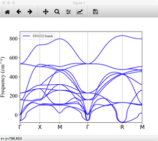

<input type="checkbox"> 不安定モードが存在するのを確認。

</div>

</div>

---

<style scoped>
section {
    font-size: 23px;
}

.small-font {
  font-size: 12px;
}
img[alt~="right-center"] {
  position: relative;
  bottom: 1px;
  left: 100px;
  width: 400px;
}
</style>

# LO-TO splitting

SrTiO$_3$のような極性物質では長距離相互作用によって、Brillouin zoneのΓ点付近で縦波光学フォノンと横波光学フォノンがsplitする。

<div class="columns">

<div>

1\. 誘電テンソルとBorn有効電荷をVASPの計算結果から取得する。
<div class="code-block-wrapper">
  <pre><code class="language-bash">python3 -m extract --VASP ../data/POSCAR --get born ../data/vasprun_epsilon.xml > BORN
cat BORN
</code></pre>
  <button class="copy-button">Copy</button>
</div>

BORNファイルの最初の3行に$\epsilon_{\infty}$、続けて各原子のBorn有効電荷を書く

<details class='small-font'>
  <summary>クリックしてBORNを表示</summary>

  ```
      6.35138992       0.00000000      -0.00000000
      0.00000000       6.35138992       0.00000000
     -0.00000000       0.00000000       6.35138992
      2.55278475       0.00000000      -0.00000000
      0.00000000       2.55278475      -0.00000000
     -0.00000000       0.00000000       2.55278475
      7.34879226       0.00000000       0.00000000
      0.00000000       7.34879226      -0.00000000
     -0.00000000       0.00000000       7.34879226
     -5.82123327      -0.00000000       0.00000000
      0.00000000      -2.04017187       0.00000000
      0.00000000       0.00000000      -2.04017187
     -2.04017187       0.00000000       0.00000000
     -0.00000000      -5.82123327       0.00000000
     -0.00000000       0.00000000      -2.04017187
     -2.04017187      -0.00000000       0.00000000
      0.00000000      -2.04017187       0.00000000
      0.00000000      -0.00000000      -5.82123327
  ```
</details>

2\. phband.inを編集
<div class="code-block-wrapper">
  <pre><code class="language-bash">&general
 PREFIX = STO222_NA
 NONANALYTIC = 3; BORNINFO = BORN
 ...
/
</code></pre>
  <button class="copy-button">Copy</button>
</div>
</div>

<div>

3\. anphonを再度実行し、フォノンバンドの変化を確認する

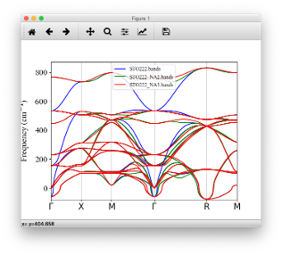

</div>
</div>


---

<style scoped>
section {
    font-size: 24px;
}
.columns {
    display: grid;
    grid-template-columns: 1fr 1fr; /* Adjust the fractions to set different widths */
    gap: 2rem;
}
.small-font {
  font-size: 12px;
}
img[alt~="right-center"] {
  position: relative;
  bottom: 1px;
  left: 100px;
  width: 400px;
}
</style>

# 非調和IFCファイルのコピー

<br>

<div class="code-block-wrapper">
  <pre><code class="language-bash">cp ../ref/STO_anharm.xml.bz2 .
bunzip2 STO_anharm.xml.bz2
</code></pre>
  <button class="copy-button">Copy</button>
</div>
</div>


---

<style scoped>
section {
    font-size: 20px;
}
.columns {
    display: grid;
    grid-template-columns: 1fr 1fr; /* Adjust the fractions to set different widths */
    gap: 2rem;
}
.small-font {
  font-size: 12px;
}
img[alt~="right-center"] {
  position: relative;
  bottom: 1px;
  left: 100px;
  width: 400px;
}
</style>

# 自己無撞着フォノン計算

<div class="columns">

<div>

phband.inを元にSCP計算用のインプットを作成

<div class="code-block-wrapper">
  <pre><code class="language-bash">cp phband.in scph.in
vim scph.in
</code></pre>
  <button class="copy-button">Copy</button>
</div>

scph.in
<div class="code-block-wrapper">
  <pre><code class="language-bash">&general
 PREFIX = STO_scph2-2
 MODE = SCPH
 NKD = 3; KD = Sr Ti O
 FCSXML = STO_anharm.xml
 NONANALYTIC = 3; BORNINFO = BORN
 TMIN = 0; TMAX = 1000; DT = 50
/
&scph
 SELF_OFFDIAG = 0
 MAXITER = 500
 MIXALPHA = 0.2
 KMESH_INTERPOLATE = 2 2 2
 KMESH_SCPH = 2 2 2
/
</code></pre>
  <button class="copy-button">Copy</button>
</div>

<input type="checkbox"> MODE = SCPHに変更
<input type="checkbox"> FCSXMLをSTO_anharm.xmlに変更
<input type="checkbox"> &scphフィールドを追加
</div>

<div>

- `SELF_OFFDIAG`

  SCPH計算で考慮する自己エネルギー（4次非調和性に起因するloop diagram）で非対角成分を考慮するオプション。SELF_OFFDIAG = 1にすると非対角成分が考慮されるため、より高い精度で計算出来るが、コストも高い。

- `KMESH_INTERPOLATE`

  フォノン振動数の自己無撞着方程式を解く際に使うk点メッシュ。<span class='red-text'>調和IFCを決定したスーパーセルとcommensurateなk点にする必要がある。</span>今の場合、調和・非調和IFCともに2x2x2スーパーセルを使っているので、KMESH_INTERPOLATEは2 2 2となる。(KMESH_INTERPOLATE = 1 1 1でも良いが、その場合R点のソフトフォノンが安定化しない。)

- `KMESH_SCPH`

  フォノン−フォノン相互作用を計算するk点メッシュ。KMESH_INTERPOLATEの倍数であれば、数字を大きく出来る。

</div>
</div>


---

<style scoped>
section {
    font-size: 21px;
}
.columns {
    display: grid;
    grid-template-columns: 1fr 1fr; /* Adjust the fractions to set different widths */
    gap: 2rem;
}
.small-font {
  font-size: 16px;
}
img[alt~="right-center"] {
  position: relative;
  bottom: 1px;
  left: 100px;
  width: 400px;
}
</style>

# SCPH計算の実行

- 今回はpure OpenMP並列で計算

  <div class="code-block-wrapper">
    <pre><code class="language-bash">export OMP_NUM_THREADS=
  mpirun -np 1 anphon scph.in > scph.log  
  </code></pre>
    <button class="copy-button">Copy</button>
  </div>

  計算時間は数分程度。MateriApps LIVE!で計算する場合は、仮想環境のスペックに依存する。

- SCPH計算が収束したかチェック
  <div class="code-block-wrapper">
    <pre><code class="language-bash">grep "conv" scph.log
  </code></pre>
    <button class="copy-button">Copy</button>
  </div>

  <details class='small-font'>
    <summary>クリックして出力結果を表示</summary>

    ```
    Temp = 1.000000e+03 : convergence achieved in    58 iterations.
    Temp = 9.500000e+02 : convergence achieved in    30 iterations.
    Temp = 9.000000e+02 : convergence achieved in    30 iterations.
    Temp = 8.500000e+02 : convergence achieved in    30 iterations.
    Temp = 8.000000e+02 : convergence achieved in    30 iterations.
    Temp = 7.500000e+02 : convergence achieved in    30 iterations.
    Temp = 7.000000e+02 : convergence achieved in    31 iterations.
    Temp = 6.500000e+02 : convergence achieved in    31 iterations.
    Temp = 6.000000e+02 : convergence achieved in    31 iterations.
    Temp = 5.500000e+02 : convergence achieved in    31 iterations.
    Temp = 5.000000e+02 : convergence achieved in    31 iterations.
    Temp = 4.500000e+02 : convergence achieved in    31 iterations.
    Temp = 4.000000e+02 : convergence achieved in    32 iterations.
    Temp = 3.500000e+02 : convergence achieved in    32 iterations.
    Temp = 3.000000e+02 : convergence achieved in    32 iterations.
    Temp = 2.500000e+02 : convergence achieved in    33 iterations.
    Temp = 2.000000e+02 : convergence achieved in    33 iterations.
    Temp = 1.500000e+02 : convergence achieved in    34 iterations.
    Temp = 1.000000e+02 : convergence achieved in    50 iterations.
    Temp = 5.000000e+01 : convergence achieved in    59 iterations.
    Temp = 0.000000e+00 : not converged.   
    ```

  </details>

#### Tips

- 温度刻み`DT`を小さくしたりmixing parameter`MIXALPHA`を小さくすると、低温での収束性が改善することが多い
- SCPH計算が収束した場合、必ず振動数はpositiveになる。
- SCPH計算が収束しなかった場合でも、計算結果はファイルに出力される。
収束していない場合、その温度で計算した物理量が信頼できないので注意。


---

<style scoped>
section {
    font-size: 18px;
}
.small-font {
  font-size: 16px;
}
img[alt~="right-center"] {
  position: relative;
  bottom: 1px;
  left: 100px;
  width: 400px;
}
</style>

# 計算結果の解析

<div class="columns">

<div>

#### フォノン分散

scph.inの&kpointフィールドにBrilloun zoneパスを入力した場合、`PREFIX.scph_bands`ファイルが生成される。

プロットしてみる
<div class="code-block-wrapper">
  <pre><code class="language-bash">gnuplot
gnuplot> set terminal qt font “Helvetica,20”
gnuplot> set ylabel “Frequency (cm^{-1})”
gnuplot> unset key
gnuplot> plot for [col=3:17] “STO_scph2-2.scph_bands” usi 2:col w l lt 1
gnuplot> replot for [col=2:16] “STO222_NA2.bands” usi 1:col w l lt 2
</code></pre>
  <button class="copy-button">Copy</button>
</div>

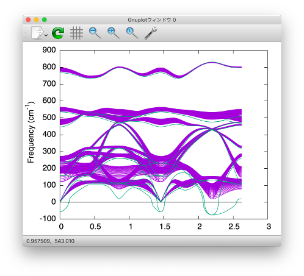

</div>

<div>

#### フォノンDOS, 自由エネルギー

scph.inの&kpointフィールドを
```
&kpoint
  2
  10 10 10
/
```
に変更し、anphonを再実行。すると`PREFIX.scph_dos`, `PREFIX.scph_thermo`ファイルが出来る。

- anphon実行時に`PREFIX.scph_dymat`ファイルが存在する場合、restartモードが有効になる。もしscratchから計算したい場合は`RESTART_SCPH = 0`を追加する。

DOSをプロット
<div class="code-block-wrapper">
  <pre><code class="language-bash">gnuplot
gnuplot> plot “STO_scph2-2.scph_dos” usi 1:4 w l ti "100 K"
gnuplot> replot “STO_scph2-2.scph_dos” usi 1:8 w l ti "300 K"
gnuplot> replot “STO_scph2-2.scph_dos” usi 1:22 w l ti "1000 K"
</code></pre>
  <button class="copy-button">Copy</button>
</div>
</div>
</div>

---

<style scoped>
section {
    font-size: 23px;
}
.columns {
    display: grid;
    grid-template-columns: 1fr 1fr; /* Adjust the fractions to set different widths */
    gap: 2rem;
}
.small-font {
  font-size: 16px;
}
img[alt~="right-center"] {
  position: relative;
  bottom: 1px;
  left: 100px;
  width: 400px;
}
</style>

# SCPH計算による自由エネルギー


フォノンの自由エネルギーは`PREFIX.scph_thermo`ファイルに格納されている。

<div class="code-block-wrapper">
  <pre><code class="language-bash">head STO_scph2-2.scph_thermo  
</code></pre>
  <button class="copy-button">Copy</button>
</div>

```
# Temperature [K], Cv [in kB unit], F_{vib} (QHA term) [Ry], F_{vib} (SCPH correction) [Ry]
        0.000000      0.000000e+00      2.166400e-02     -3.384717e-04
       50.000000      2.060112e+00      2.163279e-02     -3.627344e-04
      100.000000      5.468752e+00      2.109916e-02     -4.712068e-04
      150.000000      8.024919e+00      1.978083e-02     -6.337171e-04
      200.000000      9.843806e+00      1.767606e-02     -8.305727e-04
      250.000000      1.110867e+01      1.484677e-02     -1.053896e-03
      300.000000      1.199315e+01      1.136495e-02     -1.299248e-03
      350.000000      1.262303e+01      7.298030e-03     -1.563621e-03
      400.000000      1.308168e+01      2.705152e-03     -1.844789e-03
```

$$
F^{\mathrm{SCP}} = \frac{1}{N_{q}}\sum_{\boldsymbol{q},j}\left[ \frac{\hbar\Omega_{\boldsymbol{q}j}}{2} + kT\log{\left( 1 - e^{-\hbar\Omega_{\boldsymbol{q}j}/kT}\right)} \right] 
 - \frac{1}{N_{q}}\sum_{\boldsymbol{q},j}\left[ \Omega_{\boldsymbol{q}j}^{2} - (C_{\boldsymbol{q}}^{\dagger}\Lambda_{\boldsymbol{q}}^{(\mathrm{HA})}C_{\boldsymbol{q}})_{jj} \right]
 \times \frac{\hbar [1 + 2n_{\boldsymbol{q}j} ]}{2\Omega_{\boldsymbol{q}j}}
$$

この式の第1項が"QHA term"、第2項が"SCPH correction"に対応する。この2つを足したものがSCPHにおける自由エネルギー。

---

<style scoped>
section {
    font-size: 20px;
}
.columns {
    display: grid;
    grid-template-columns: 3fr 2fr; /* Adjust the fractions to set different widths */
    gap: 2rem;
}
.small-font {
  font-size: 16px;
}
img[alt~="right-center"] {
  position: relative;
  bottom: 1px;
  left: 100px;
  width: 400px;
}
</style>

# SCPHの結果を用いた熱伝導計算

<div class='columns'>

<div>

1. `dfc2`コマンドを使い、非調和効果が繰り込まれた2次IFCを計算する。

    <div class="code-block-wrapper">
      <pre><code class="language-bash">dfc2 STO222.xml STO222_scph_300K.xml STO_scph2-2.scph_dfc2 300</code></pre>
      <button class="copy-button">Copy</button>
    </div>

    - `STO222.xml`: オリジナルの2次IFC
    - `STO222_scph_300K.xml`: 新たに作るIFCのファイル名
    - `STO222_scph2-2.scph_dfc2`: SCPH計算から得られたファイル。


2. kappa.inを作る
    <div class="code-block-wrapper">
      <pre><code class="language-bash">cp scph.in kappa.in
   vim kappa.in</code></pre>
      <button class="copy-button">Copy</button>
    </div>
    
    右を参考にkappa.inを編集する

3. anphonを実行
    <div class="code-block-wrapper">
      <pre><code class="language-bash">export OMP_NUM_THREADS=1
   mpirun anphon kappa.in > kappa_300K.log</code></pre>
      <button class="copy-button">Copy</button>
    </div>

    <input type="checkbox"> STO_scph_300K.klに300 Kでの熱伝導率が出力されているか確認

</div>

<div>
    kappa.in
    <div class="code-block-wrapper">
      <pre><code class="language-bash">&general
 PREFIX = STO_scph_300K
 MODE = RTA
 FCSXML = STO_anharm.xml;
 FC2XML = STO222_scph_300K.xml
 TMIN = 300; TMAX = 300
 NONANALYTIC = 3; BORNINFO = BORN
/
&cell
 7.363
 1.0 0.0 0.0
 0.0 1.0 0.0
 0.0 0.0 1.0
/
&kpoint
  2
  9 9 9
/
      </code></pre>
      <button class="copy-button">Copy</button>
    </div> 

</div>
</div>

---

<style scoped>
section {
    font-size: 20px;
}
.small-font {
  font-size: 15px;
}
img[alt~="right-center"] {
  position: relative;
  bottom: 1px;
  left: 100px;
  width: 400px;
}
</style>

# 熱伝導の温度依存性

SCPHを用いて熱伝導率の温度依存性を計算するには、前ページの手続きをさまざまな温度で繰り返し実行し、結果を単一ファイルにまとめれば良い。

<div class="columns">

<div>

1. 繰り返し実行用のスクリプトをコピーし、編集

    <div class="code-block-wrapper">
      <pre><code class="language-bash">cp ../ref/autocalc.sh .
   vim autocalc.sh</code></pre>
      <button class="copy-button">Copy</button>
    </div>


2. スクリプトを実行
    <div class="code-block-wrapper">
      <pre><code class="language-bash">bash ./autocalc.sh &</code></pre>
      <button class="copy-button">Copy</button>
    </div>

3. 結果をプロット

    <div class="code-block-wrapper">
      <pre><code class="language-bash">gnuplot
   gnuplot> plot "kappa_STO.dat" usi 1:2 w lp ti "SCPH+BTE"
   gnuplot> replot "../data/kappa_STO_Martelli.txt" usi 1:2 w p ti "Expt."
   gnuplot> replot "../data/kappa_STO_popuri.txt" usi 1:2 w p ti "Expt."</code></pre>
      <button class="copy-button">Copy</button>
    </div>

</div>


<div class='small-font'>
autocalc.sh

```
#!/bin/bash
if [ -e kappa_STO.dat ]; then
rm kappa_STO.dat
fi
export OMP_NUM_THREADS=1
for ((temp=200; temp<=800; temp+=100))
 do 
 dfc2 STO222.xml STO222_scph_${temp}K.xml STO_scph2-2.scph_dfc2 ${temp}
cat << EOF > kappa${temp}.in
&general
 PREFIX = STO_scph_${temp}K
 MODE = RTA;
 NKD = 3; KD = Sr Ti O
 FCSXML = STO_anharm.xml
 FC2XML = STO222_scph_${temp}K.xml
 TMIN = ${temp}; TMAX = ${temp}
 NONANALYTIC = 3; BORNINFO = BORN
/
&cell
 7.363
 1.0 0.0 0.0
 0.0 1.0 0.0
 0.0 0.0 1.0
/
&kpoint
 2
 9 9 9
/
EOF
 echo "Running kappa calculation at T = " $temp
 mpirun anphon kappa${temp}.in > kappa${temp}.log
 echo "Done"
 tail -n 1 STO_scph_${temp}K.kl >> kappa_STO.dat
done
```

</div>

</div>


---

# 今後の展望


<script>
// Custom JavaScript for copy-to-clipboard functionality
document.addEventListener("DOMContentLoaded", function () {
  // Debug message to ensure script runs
  console.log("DOM fully loaded and parsed");

  // Event listener for dynamically added content
  document.addEventListener("click", function(event) {
    if (event.target.matches(".copy-button")) {
      // Debug message to ensure button is clicked
      console.log("Copy button clicked");

      var button = event.target;
      var codeBlock = button.previousElementSibling.querySelector("code");
      var codeText = codeBlock.innerText;

      navigator.clipboard.writeText(codeText).then(
        function () {
          button.innerText = "Copied!";
          setTimeout(function () {
            button.innerText = "Copy";
          }, 2000);
        },
        function (error) {
          console.error("Failed to copy text: ", error);
          button.innerText = "Error";
          setTimeout(function () {
            button.innerText = "Copy";
          }, 2000);
        }
      );
    }
  });
});
</script>