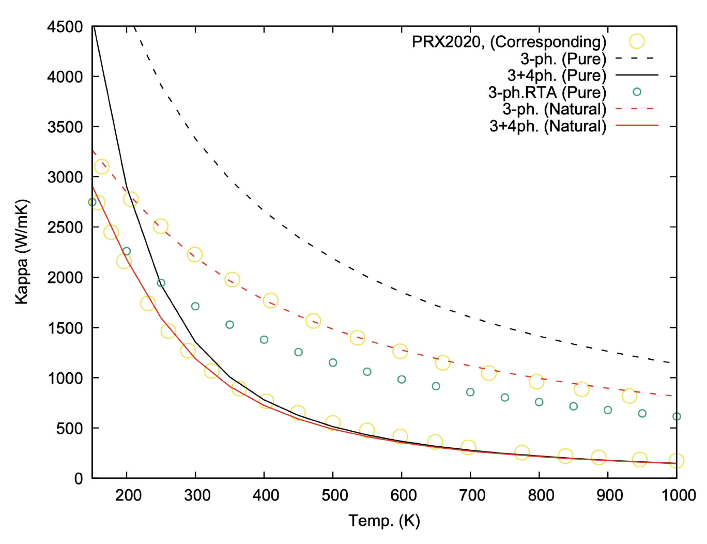

<style>
section {
    font-size: 30px;
}
.red-text {
  color: #ad0c0c;
}
/* Custom CSS for the copy button */
.copy-button {
  position: absolute;
  background-color: white; /* Change this to desired background color */
  color: black; /* Change this to desired text color */
  z-index: 10;
  transition: background-color 0.3s ease; /* Smooth transition */
  top: 0;
  right: 0;
  /* padding: 5px; */
  background: #f5f5f5;
  border: 1px solid #ccc;
  cursor: pointer;
  font-size: 12px;
}

/* Change color on hover */
.copy-button:hover {
  background-color: skyblue; /* Change this to desired hover background color */
}

/* Styling for code block and wrapper */
.code-block-wrapper {
  position: relative;
  display: block;
  width: 100%;
  margin: 0;
  padding: 0;
  overflow-x: auto;
}
pre {
    white-space: pre-wrap; /* This will wrap long lines */
    word-wrap: break-word; /* This will break long words */
    margin-top: 5px;
    overflow-x: auto;
}
input[type="checkbox"] {
  transform: scale(1.5);
  margin-right: 10px;
}
</style>

# ALAMODE Hands-on Workshop – CCMS Workshop –

#### August 5, 2024

<br><br><br>

### Instructor: Terumasa Tadano (NIMS)

### TA: Ryota Masuki (The University of Tokyo)

### Acknowledgments: CCMS staff, Supercomputer resources at the Institute of Solid State Physics

---

# Today's Schedule

- Overview of ALAMODE (**60** minutes)
- Hands-on using MateriApps LIVE! (Calculation of force constants) (**45** minutes)
- Hands-on using the supercomputer at the Institute of Solid State Physics (Thermal conductivity, finite temperature phonon calculations) (**45** minutes)
- Future prospects (**10** minutes)

If possible, I would like to keep the overview brief and allocate more time for hands-on activities.

---

# ALAMODE


- An open-source application for calculating anharmonic effects of phonons
- MIT License
- The latest version is 1.5.0 (released in February 2024)
- Primarily written in C++. Python is used as a supplementary tool.
- https://alamode.readthedocs.io

---

# Key Features

1. Estimation of harmonic and anharmonic force constants using linear regression (Hands-on 1)
1. Calculation of lattice thermal conductivity (Hands-on 2)
1. Finite temperature phonon calculations using the Self-Consistent Phonon (SCP) method (Hands-on 2)
1. Finite temperature structure optimization based on quasi-harmonic approximation or SCP method

---

# Requirements

1. An external tool capable of calculating forces for the given crystal structure (DFT codes, empirical potentials, ML potentials, etc.)
   - Provides interface tools for `VASP`, `Quantum ESPRESSO`, `OpenMX`, `xTAPP`, `LAMMPS`.
   - Creating a new interface is relatively straightforward.
1. Compilers and libraries
   - Boost, Eigen, LAPACK, MPI
1. Python analysis tools
   - numpy, scipy, matplotlib, libxml, spglib, pymatgen, h5py, etc.

---

# ALAMODE Calculation Flow


- alm code: Calculation of force constants
- anphon code: Phonon, thermal conductivity, SCPH calculations

---

# Taylor Expansion of Potential Energy

<style scoped>
section {
    font-size: 24px;
}
</style>

<style>
img[alt~="top-right"] {
  position: absolute;
  top: 150px;
  right: 100px;
  width: 300px;
}
</style>

#### Assumptions

- Born–Oppenheimer (BO) approximation
- BO energy surface is an analytic function of atomic displacements
- Atomic displacements are small


$$
\begin{aligned}
U - U_{0} &= U_{2} + U_{3} + U_{4} + \cdots \\
& = \frac{1}{2}\sum_{\{\ell,\kappa,\mu\}} \Phi_{\mu_{1}\mu_{2}}(\ell_{1}\kappa_{1};\ell_{2}\kappa_{2}) \times u_{\mu_{1}}(\ell_{1}\kappa_{1}) u_{\mu_{2}}(\ell_{2}\kappa_{2}) \\
& + \frac{1}{3!}\sum_{\{\ell,\kappa,\mu\}} \Phi_{\mu_{1}\mu_{2}\mu_{3}}(\ell_{1}\kappa_{1};\ell_{2}\kappa_{2};\ell_{3}\kappa_{3}) \times u_{\mu_{1}}(\ell_{1}\kappa_{1}) u_{\mu_{2}}(\ell_{2}\kappa_{2})u_{\mu_{3}}(\ell_{3}\kappa_{3}) \\
& + \frac{1}{4!}\sum_{\{\ell,\kappa,\mu\}} \Phi_{\mu_{1}\mu_{2}\mu_{3}\mu_{4}}(\ell_{1}\kappa_{1};\ell_{2}\kappa_{2};\ell_{3}\kappa_{3};\ell_{4}\kappa_{4}) \times u_{\mu_{1}}(\ell_{1}\kappa_{1}) u_{\mu_{2}}(\ell_{2}\kappa_{2})u_{\mu_{3}}(\ell_{3}\kappa_{3}) u_{\mu_{4}}(\ell_{4}\kappa_{4}) + \cdots
\end{aligned}
$$

---

<style scoped>
section {
    font-size: 24px;
}
</style>

# Interatomic Force Constants (IFC)

$n$th order force constants
$$
\Phi_{\mu_{1}\dots\mu_{n}}(\ell_{1}\kappa_{1};\dots;\ell_{n}\kappa_{n}) 
= \frac{\partial^{n} U}{\partial u_{\mu_{1}}(\ell_{1}\kappa_{1})\cdots \partial u_{\mu_{n}}(\ell_{n}\kappa_{n})}\bigg|_{\{u\}=0}
$$
<br>

- 2nd order (harmonic) term &rarr; Phonon dispersion (0 K)
- 3rd order term &rarr; Phonon-phonon scattering, thermal expansion, ...
- 4th order term &rarr; Finite temperature phonons, higher-order phonon scattering

---

# Harmonic Approximation

<style scoped>
section {
    font-size: 24px;
}
img[alt~="bottom-left"] {
  position: absolute;
  bottom: 50px;
  left: 100px;
  width: 400px;
}
</style>

<div class="columns">
<div>

#### Ignoring Anharmonic Terms

$$
U - U_{0} = U_{2} + U_{3} + U_{4} + \cdots \approx U_{2}
$$


</div>

<div>

#### Hamiltonian

$$
\begin{aligned}
H_{0}&=T + U_{2}\\
&= \sum_{\ell_1,\kappa_1,\mu_1}\frac{\{p_{\mu_{1}}(\ell_{1}\kappa_{1})\}^{2}}{2M_{\kappa_{1}}} + \frac{1}{2}\sum_{\{\ell,\kappa,\mu\}}\Phi_{\mu_{1}\mu_{2}}(\ell_1\kappa_1;\ell_2\kappa_2) u_{\mu_{1}}(\ell_{1}\kappa_1)u_{\mu_2}(\ell_2\kappa_2) \\
&= \sum_{\boldsymbol{q},\kappa}\frac{\boldsymbol{p}^{*}(\kappa;\boldsymbol{q})\cdot\boldsymbol{p}(\kappa;\boldsymbol{q})}{2M_{\kappa}}+ \frac{1}{2}\sum_{\boldsymbol{q},\kappa,\kappa'} \boldsymbol{u}^{*}(\kappa;\boldsymbol{q})\cdot \Phi (\kappa\kappa';\boldsymbol{q})\boldsymbol{u}(\kappa';\boldsymbol{q}) \\
&=\frac{1}{2}\sum_{\boldsymbol{q},j}P_{\boldsymbol{q}j}^{*}P_{\boldsymbol{q}j} + \frac{1}{2}\sum_{\boldsymbol{q},j}\omega_{\boldsymbol{q}j}^{2}Q_{\boldsymbol{q}j}^{*}Q_{\boldsymbol{q}j} \\
& =\sum_{\boldsymbol{q},j}\hbar\omega_{\boldsymbol{q}j}\left(b_{\boldsymbol{q}j}^{\dagger}b_{\boldsymbol{q}j}+\frac{1}{2} \right).
\end{aligned}
$$

<br>

#### Dynamical Matrix

$$
D_{\mu\nu}(\kappa\kappa';\boldsymbol{q}) = \frac{1}{\sqrt{M_{\kappa}M_{\kappa'}}}
\sum_{\ell'}\Phi_{\mu\nu}(0\kappa;\ell'\kappa')e^{i\boldsymbol{q}\cdot\boldsymbol{r}(\ell)}
$$

$$
\omega_{\boldsymbol{q}j}^{2} = (\boldsymbol{e}_{\boldsymbol{q}j}^{*})^{\mathrm{T}} D(\boldsymbol{q})\boldsymbol{e}_{\boldsymbol{q}j}.
$$

</div>

---

# First-Principles Calculations of IFC

<style scoped>
section {
    font-size: 23px;
}
</style>

<table>
  <thead>
    <tr>
      <th></th>
      <th> DFPT </th>
      <th> Direct method</th>
    </tr>
  </thead>
  <tbody>
    <tr>
      <th>Pros.</th>
      <td style="width: 450px; word-wrap: break-word;">
      <ul style="font-size: 18px;">
      <li> Phonons with q≠0 can be calculated in the primitive cell. Efficient.</li>
      <li> Dielectric tensor, Born effective charges, and electron-phonon interactions can also be calculated.</li>
      </ul>
      </td>
      <td style="width: 450px; word-wrap: break-word;">
      <ul style="font-size: 18px;">
      <li> Implementation is relatively straightforward.</li>
      <li> Higher-order terms can also be estimated.</li>
      <li> As long as forces can be calculated, many functionals can be combined.</li>
      </ul>
      </td>
    </tr>
    <tr>
      <th>Cons.</th>
      <td style="width: 400px; word-wrap: break-word;">
      <ul style="font-size: 18px;">
      <li> Up to third-order terms. Higher-order terms require the use of finite difference methods.</li>
      <li> Calculations combined with Meta-GGA or hybrid functionals are not supported.</li>
      </ul>
      </td>
      <td style="width: 400px; word-wrap: break-word;">
      <ul style="font-size: 18px;">
      <li> It is necessary to use supercells.</li>
      </ul>
      </td>
    </tr>
    <tr>
      <th>Software</th>
      <td style="width: 400px; word-wrap: break-word;">
      <ul style="font-size: 20px;">
      <li> Quantum ESPRESSO </li>
      <li> Abinit </li>
      <li> VASP (only q=0) </li>
      </ul>
      </td>
      <td style="width: 400px; word-wrap: break-word;">
      <ul style="font-size: 20px;">
      <li> Phonopy </li>
      <li> thirdorder.py, fourthorder.py </li>
      <li style="color: red">ALAMODE</li>
      <li> HiPhive </li>
      </ul>
      </td>
    </tr>
  </tbody>
</table>

---

<style scoped>
.columns {
    display: grid;
    grid-template-columns: 1fr 2fr; /* Adjust the fractions to set different widths */
    gap: 0rem;
}
section {
    font-size: 24px;
}
</style>

# Direct Method 1 (Difference Method)

<div class="columns">
<div>


</div>

<div>

### Harmonic Terms

$$
\begin{aligned}
&\Phi_{\mu_{1}\mu_{2}}(\ell_{1}\kappa_{1};\ell_{2}\kappa_{2}) = \Phi(1;2)\\
& = \frac{\partial^{2} U}{\partial u_1\partial u_2} = -\frac{\partial F_2}{\partial u_1}
\approx - \frac{F_{2}(u_1 = +\Delta u) - F_{2}(u_1 = -\Delta u)}{2\Delta u}
\end{aligned}
$$

<br>

### 3rd-order Anharmonic Terms

$$
\begin{aligned}
\Phi(1;2;3) &= \frac{\partial^{3} U}{\partial u_1\partial u_2 \partial u_3} = -\frac{\partial F_3}{\partial u_1 \partial u_2} \\
&\approx -\frac{1}{4(\Delta u)^{2}} [F_3 (u_1 = u_2 = \Delta u) + F_3 (u_1 = u_2 = -\Delta u) \\
& \hspace{10mm}  - F_3 (u_1 = \Delta u, u_2 = -\Delta u) -F_3 (u_1 = -\Delta u, u_2 = \Delta u) ]
\end{aligned}
$$

<br>

This method is implemented in `phonopy` and `thirdorder.py`.
</div>

---

<style scoped>
section {
    font-size: 23px;
}
</style>

# Direct Method 2 (Linear Regression)

$$
\begin{aligned}
U_{\mathrm{ALM}}-U_{0} &= U_{2} + U_{3} + U_{4} + \cdots\\
&= \frac{1}{2}\sum_{1,2}\Phi(1;2)u_1 u_2 + \frac{1}{3!}\sum_{1,2,3}\Phi(1;2;3)u_1 u_2 u_3 + \frac{1}{4!}\sum_{1,2,3,4}\Phi(1;2;3;4)u_1 u_2 u_3 u_4 + \cdots \\
&= \boldsymbol{\Phi}\cdot\boldsymbol{b}
\end{aligned}
$$

The force calculated from this model is written as $\boldsymbol{F}_{\mathrm{ALM}}=-\frac{\partial U_{\mathrm{ALM}}}{\partial \boldsymbol{u}} = -\frac{\partial \boldsymbol{b}^{T}}{\partial \boldsymbol{u}}\boldsymbol{\Phi} = A\boldsymbol{\Phi}$.

Thus, the force constants $\boldsymbol{\Phi}$ can be calculated using the least squares method.

$$
\boldsymbol{\Phi}_{\mathrm{OLS}}
= \underset{\boldsymbol{\Phi}}{\mathrm{argmin}} \frac{1}{2N_{d}}\| \mathbb{A}\boldsymbol{\Phi} - \mathscr{F}_{\mathrm{DFT}} \|_{2}^{2}
$$

The matrix $\mathbb{A}$ is formed by vertically concatenating the matrix $A$ calculated for a single atomic displacement pattern.
$$
A = \begin{pmatrix}
- u_{1}^{x} & -\frac{1}{2}u_{1}^{x}u_{2}^{x} & -\frac{1}{3!}u_{1}^{x}u_{2}^{x}u_{3}^{x} & \cdots \\
 \vdots & \vdots & \vdots & \vdots \\
- u_{N_s}^{z} & -\frac{1}{2}u_{N_{s}}^{z}u_{N_{s}-1}^{z} & -\frac{1}{3!}u_{N_{s}}^{z}u_{N_{s}-1}^{z}u_{N_{s}-2}^{z}& \cdots \\
\end{pmatrix}
$$

--- 

<style scoped>
section {
    font-size: 24px;
}
</style>

# Direct Method 2 (Linear Regression)

#### Least Squares Method

$$
\boldsymbol{\Phi}_{\mathrm{OLS}}
= \underset{\boldsymbol{\Phi}}{\mathrm{argmin}}  \frac{1}{2N_{d}}\| \mathbb{A}\boldsymbol{\Phi} - \mathscr{F}_{\mathrm{DFT}} \|_{2}^{2}
$$

- To uniquely determine $\boldsymbol{\Phi}_{\mathrm{OLS}}$, it is necessary for $\mathbb{A}^{\intercal}\mathbb{A}$ to be full-rank. The more elements $\boldsymbol{\Phi}_{\mathrm{OLS}}$ has, the more training data is required.

<br>

#### Regression with Penalty Term (Here, Elastic Net)
$$
\boldsymbol{\Phi}_{\mathrm{enet}} = \mathop{\rm argmin}\limits_{\boldsymbol{\Phi}} \frac{1}{2N_{d}}   \|\mathbb{A} \boldsymbol{\Phi} - \boldsymbol{\mathscr{F}}_{\mathrm{DFT}}\|^{2}_{2} + \alpha \beta \| \boldsymbol{\Phi}  \|_{1} + \frac{1}{2} \alpha (1-\beta) \| \boldsymbol{\Phi}  \|_{2}^{2}
$$

- $\boldsymbol{\Phi}_{\mathrm{enet}}$ can be computed even if $\mathbb{A}^{\intercal}\mathbb{A}$ is not full-rank.
- $\alpha$ is a hyperparameter that controls the strength of the penalty, which can be determined through methods like cross-validation.
- There are various types of penalty terms (e.g., adaptive LASSO).

---

<style scoped>
section {
    font-size: 24px;
}
</style>

# Symmetry and Sum Rule of IFC

- Permutation 

$$
\Phi_{\mu_{1}\mu_{2}\mu_{3}}(\ell_{1}\kappa_{1};\ell_{2}\kappa_{2};\ell_{3}\kappa_{3})=\Phi_{\mu_{1}\mu_{3}\mu_{2}}(\ell_{1}\kappa_{1};\ell_{3}\kappa_{3};\ell_{2}\kappa_{2})=\dots.
$$

- Periodicity

$$
\Phi_{\mu_{1}\mu_{2}\dots\mu_{n}}(\ell_{1}\kappa_{1};\ell_{2}\kappa_{2};\dots;\ell_{n}\kappa_{n})=\Phi_{\mu_{1}\mu_{2}\dots\mu_{n}}(0\kappa_{1};\ell_{2}-\ell_{1}\kappa_{2};\dots;\ell_{n}-\ell_{1}\kappa_{n}).
$$

- Space Group Symmetry

$$
\sum_{\nu_{1},\dots,\nu_{n}}\Phi_{\nu_{1}\dots\nu_{n}}(L_{1}K_{1};\dots;L_{n}K_{n}) O_{\nu_{1}\mu_{1}}\cdots O_{\nu_{n}\mu_{n}} = \Phi_{\mu_{1}\dots\mu_{n}}(\ell_{1}\kappa_{1};\dots;\ell_{n}\kappa_{n}),
$$

- Acoustic Sum Rule (Translational Symmetry)

$$
\sum_{\ell_{1}\kappa_{1}}\Phi_{\mu_{1}\mu_{2}\dots\mu_{n}}(\ell_{1}\kappa_{1};\ell_{2}\kappa_{2};\dots;\ell_{n}\kappa_{n}) = 0
$$

All of these are automatically taken into account. Rotational symmetry can be considered optionally, but there are limitations.

---

<style scoped>
section {
    font-size: 23px;
}
</style>

# About the Dynamical Matrix

#### Dynamical Matrix in Infinite Size Crystals

$$
\bar{D}_{\mu\nu}(\kappa\kappa';\boldsymbol{q}) = \frac{1}{\sqrt{M_{\kappa}M_{\kappa'}}}\sum_{L}^{\infty}\bar{\Phi}_{\mu\nu}(0\kappa;L\kappa')e^{i\boldsymbol{q}\cdot\boldsymbol{r}(L)} 
= \frac{1}{\sqrt{M_{\kappa}M_{\kappa'}}}\sum_{\ell'}\sum_{L_{s}}^{\infty}\bar{\Phi}_{\mu\nu}(0\kappa;L_s+\ell'\kappa')e^{i\boldsymbol{q}\cdot(\boldsymbol{r}(L_s) + \boldsymbol{r}(\ell'))}
$$

#### Dynamical Matrix Obtained from IFC Calculated Under Periodic Boundary Conditions

$$
D_{\mu\nu}(\kappa\kappa';\boldsymbol{q}) = \frac{1}{\sqrt{M_{\kappa}M_{\kappa'}}}\sum_{\ell'}\Phi_{\mu\nu}(0\kappa;\ell'\kappa')e^{i\boldsymbol{q}\cdot\boldsymbol{r}(\ell')} 
=\frac{1}{\sqrt{M_{\kappa}M_{\kappa'}}}\sum_{\ell'}\big[\sum_{L_s}^{\infty}\bar{\Phi}_{\mu\nu}(0\kappa;L_s+\ell'\kappa')\big]e^{i\boldsymbol{q}\cdot\boldsymbol{r}(\ell')} 
$$

In general, the two above are different, but they completely coincide at $\boldsymbol{q}$ points where $e^{i\boldsymbol{q}\cdot\boldsymbol{r}(L_s)}=1$ is satisfied for all $L_s$. This $\boldsymbol{q}$ point is referred to as a <span class="red-text">commensurate $\boldsymbol{q}$ point with the supercell size</span>.

---

<style scoped>
section {
    font-size: 24px;
}
img[alt~="top-right"] {
  position: absolute;
  top: 100px;
  right: 100px;
  width: 400px;
}
</style>

# Lattice Thermal Conductivity

#### Fourier's Law  $\boldsymbol{j} = -\kappa \nabla T$

#### Phonon Gas Model  $\boldsymbol{j}\approx\boldsymbol{j}_{\mathrm{QP}}=\frac{1}{NV}\sum_{q}\hbar\omega_q \boldsymbol{v}_{q}\mathfrak{n}_{q}$.

- Here, $\mathfrak{n}_{q}$ is the phonon distribution function in a non-equilibrium state. 
By linearizing $\mathfrak{n}_{q} \simeq n_{q} + \boldsymbol{f}_{q}\cdot\nabla T \beta n_q (n_{q} + 1)$ and numerically solving the linearized Boltzmann equation, we can obtain $\boldsymbol{f}_q$.

#### Linearized Boltzmann Equation

$$
-\beta^{-1}\boldsymbol{v}_{q} \left( \frac{\partial n_{q}}{\partial T}\right) 
= \bigg\{ \sum_{q'} (\boldsymbol{f}_{q} - \boldsymbol{f}_{q'}) \Lambda_{q}^{q'}  
+ \sum_{q',q''} \left[ (\boldsymbol{f}_{q} + \boldsymbol{f}_{q'} - \boldsymbol{f}_{q''})\Lambda_{qq'}^{q''} + \frac{1}{2} (\boldsymbol{f}_{q} - \boldsymbol{f}_{q'} - \boldsymbol{f}_{q''})\Lambda_{q}^{q'q''} \right] +\cdots \bigg\}
$$

#### Lattice Thermal Conductivity

$$
\kappa = -\frac{\hbar}{NV k_{\mathrm{B}}T} \sum_{q} \omega_{q} \boldsymbol{v}_{q}\otimes\boldsymbol{f}_{q} n_{q}(n_{q} + 1).
$$

---

<style scoped>
section {
    font-size: 24px;
}
</style>

# Relaxation Time Approximation (RTA)

In ALAMODE, the relaxation time approximation is further used in the calculation of thermal conductivity.

#### Relaxation Time Approximation

$$
\begin{aligned}
\kappa_{\mathrm{RTA}} & = \frac{\hbar^{2}}{NV k_{\mathrm{B}}T^{2}} \sum_{q} \omega_{q}^{2} \boldsymbol{v}_{q}\otimes\boldsymbol{v}_{q} n_{q}(n_{q} + 1) \tau_{q} \\
& =\frac{1}{NV} \sum_{q}c_{q}\boldsymbol{v}_{q}\otimes\boldsymbol{v}_{q}\tau_{q}
\end{aligned}
$$

- The transport relaxation time $\tau_{q}^{\mathrm{transport}}$ is approximated by the quasiparticle lifetime $\tau_{q}$.
- Since $\tau_{q}^{\mathrm{transport}} > \tau_{q}$, RTA tends to underestimate the thermal conductivity.
- RTA is particularly poor for high thermal conductivity materials. Conversely, for materials with low thermal conductivity, there is little difference between the full solution of the Boltzmann equation and RTA.

#### Full solution

- Iterative solution (`ShengBTE`), Direct solution (`Phono3py`)

---

<style scoped>
section {
    font-size: 20px;
}
</style>

# First-principles calculation of phonon lifetime

#### Phonon-phonon scattering

- Three-phonon scattering: the main term of phonon scattering, calculated from third-order anharmonic IFC

$$
\begin{aligned}
\Gamma_{q}^{(B)}=\mathrm{Im} \Sigma_{q}^{(B)}(\omega_{q})
&= \frac{\pi}{2N}\sum_{q',q''} \frac{\hbar|\Phi_{3}(-q,q',q'')|^{2}}{8\omega_{q}\omega_{q'}\omega_{q''}} \times \Delta(-\boldsymbol{q}+\boldsymbol{q}'+\boldsymbol{q}'') \\
& \hspace{15mm} \times [(n_{q'}+n_{q''} +1) \delta(\omega_{q}-\omega_{q'}-\omega_{q''}) \\
& \hspace{20mm} -2(n_{q'}-n_{q''}) \delta(\omega_{q}-\omega_{q'}+\omega_{q''})]
\end{aligned}
$$

- Four-phonon scattering: higher-order phonon-phonon scattering, not supported in ALAMODE (ver. 1.5)

#### Phonon-electron scattering

- Zero in cases where electronic excitations do not occur (wide-gap systems)
- May be significant in metals or highly doped semiconductors
- Supported by codes such as `EPW`

#### Phonon-impurity scattering

- The effect of isotope impurities can be considered in ALAMODE
- Treatment of more general impurities (chemical substitution or defects) is difficult.

---

<style scoped>
section {
    font-size: 23px;
}
img[alt~="top-right"] {
  position: absolute;
  top: 150px;
  right: 100px;
  width: 600px;
}
</style>

<div class="columns">
<div>


# Example of lattice thermal conductivity prediction


- Calculation example using ALAMODE
- RTA
- Three-phonon scattering only

</div>
<div>


</div>
</div>

---

<style scoped>
section {
    font-size: 23px;
}
.columns {
    display: grid;
    grid-template-columns: 1fr 1fr; /* Adjust the fractions to set different widths */
    gap: 4rem;
}
</style>

# Finite temperature phonon calculations

- Until now, it was assumed that phonon dispersion does not depend on temperature (harmonic approximation)
- However, actual phonon frequencies change with temperature
- Using the harmonic approximation often leads to the emergence of imaginary phonons (e.g., in high-temperature phases)

Example of cubic SrTiO<sub>3</sub>:

<div class="columns">

<div>


</div>

<div>


</div>

</div>

When imaginary phonons appear, a well-defined Hamiltonian $\hat{H}_{0}=\sum_{\boldsymbol{q},j}\hbar\omega_{\boldsymbol{q}j}\left(b_{\boldsymbol{q}j}^{\dagger}b_{\boldsymbol{q}j}+\frac{1}{2} \right)$ cannot be defined. &rarr; Thermal conductivity cannot be calculated either.

---

<style scoped>
section {
    font-size: 24px;
}
.columns {
    display: grid;
    grid-template-columns: 3fr 1fr; /* Adjust the fractions to set different widths */
    gap: 5rem;
}
img[alt~="top-right"] {
  position: absolute;
  top: 200px;
  right: 50px;
  width: 400px;
}
</style>

# Anharmonic "Renormalization" of Spring Constants by Mean Field

<div class="columns">
<div>

Effective spring constant at finite temperature $\tilde{\Phi}_{ij}$:
$$
\tilde{\Phi}_{ij}(T) = \Phi_{ij}+ \frac{1}{4}\sum_{kl} \Phi_{ijkl}\braket{u_{k}u_{l}}_{0}
$$

- $\Phi_{ij}$, $\Phi_{ijk\ell}$ are the second and fourth derivatives of the BO energy surface, respectively.
- Diagonalize the Dynamical matrix $\tilde{D}(\boldsymbol{q})$ constructed using $\tilde{\Phi}_{ij}$ 
&rarr; anharmonic frequency $\Omega_{q}$.
- $\braket{u_{k}u_{l}}_{0}$ is calculated using the effective single-body Hamiltonian $\hat{\mathcal{H}}_{0}=\sum_{\boldsymbol{q},j}\hbar\Omega_{\boldsymbol{q}j}\left(a_{\boldsymbol{q}j}^{\dagger}a_{\boldsymbol{q}j}+\frac{1}{2} \right)$ for ensemble average.

</div>

<div>


</div>
</div>

<br>

It is necessary to self-consistently determine $\tilde{\Phi}_{ij}$. &rarr; **Self-consistent phonon** (SCP) method

---

<style scoped>
section {
    font-size: 24px;
}
.columns {
    display: grid;
    grid-template-columns: 3fr 1fr; /* Adjust the fractions to set different widths */
    gap: 5rem;
}
img[alt~="top-right"] {
  position: absolute;
  top: 200px;
  right: 50px;
  width: 400px;
}
</style>

# Derivation by Variational Method

#### Effective single-body Hamiltonian $\hat{\mathcal{H}}_{0}=\sum_{\boldsymbol{q},j}\hbar\Omega_{\boldsymbol{q}j}\left(a_{\boldsymbol{q}j}^{\dagger}a_{\boldsymbol{q}j}+\frac{1}{2} \right)$

#### Density operator $\rho_{0} = \frac{e^{-\beta \hat{\mathcal{H}}_{0}}}{\mathrm{Tr}e^{-\beta \hat{\mathcal{H}}_{0}}}$

#### Gibbs–Bogoliubov-Feynman inequality $F[\rho] = \tilde{F}_{0} + \braket{\hat{H}-\hat{\mathcal{H}}_{0}}_{0} \geq F$

- $F$ is the exact free energy corresponding to the Hamiltonian $\hat{H}$. The calculation is extremely difficult.
- $\braket{\hat{H}-\hat{\mathcal{H}}_{0}}_{0}=\mathrm{Tr}[\rho_{0}(\hat{H}-\hat{\mathcal{H}}_{0})]=\mathrm{Tr}[\rho_{0}(\hat{U}_2-\hat{\mathcal{U}}_{2})]+\mathrm{Tr}(\rho_0 \hat{U}_{4})+\mathrm{Tr}(\rho_0 \hat{U}_{6})+\cdots$. 
  Here, only even-order anharmonic terms are renormalized.

#### The self-consistent equation is obtained from $\frac{\delta F[\rho]}{\delta \rho} = 0$

The SCP method can be considered as a phonon version of the Hartree-Fock method.

---

<style scoped>
section {
    font-size: 20px;
}
.columns {
    display: grid;
    grid-template-columns: 3fr 1fr; /* Adjust the fractions to set different widths */
    gap: 5rem;
}
img[alt~="top-right"] {
  position: absolute;
  top: 200px;
  right: 50px;
  width: 400px;
}
</style>

# Implementation Based on First-Principles Calculations

### Stochastic method

- `SSCHA`, `QSCAILD`, `HiPhive`, `Phonopy`
- Update $\Phi_{ij}$ in real space.
- $\Phi_0$ &rarr; $\{\omega_{q}, \boldsymbol{e}_{q}\}_{0}$ &rarr; generate supercell structures at temperature $T$ &rarr; **DFT calculations** to get forces &rarr; $\Phi_1$ via fitting &rarr; $\{\omega_{q}, \boldsymbol{e}_{q}\}_{1}$ &rarr; generate supercell structures at temperature $T$ &rarr; ...
- Although at the mean-field level, all anharmonic effects are included.
- No need to explicitly calculate the anharmonic IFC.
- High computational cost.

### Force-constant Based Implementation `ALAMODE`

- Update $\Phi_{ij}$ in reciprocal space. $
V_{\boldsymbol{q}ij}^{[n+1]} = \omega_{\boldsymbol{q}i}^{2}\delta_{ij}+\frac{1}{2}\sum_{\boldsymbol{q}_{1},k,\ell}F_{\boldsymbol{q}\boldsymbol{q}_{1},ijk\ell}(C^{[n]}_{\boldsymbol{q}} Q^{[n]}_{\boldsymbol{q}} C^{[n]\dagger}_{\boldsymbol{q}})_{k\ell}.
$
$Q_{\boldsymbol{q},ij}^{[n]}
= \frac{\hbar\big[1+2n(\omega_{\boldsymbol{q}i}^{[n]})\big]}{2\omega_{\boldsymbol{q}i}^{[n]}}\delta_{ij}$ where $C_{\boldsymbol{q}}$ is a unitary matrix.
- $\Phi_0$ &rarr; $\{\omega_{q}, \boldsymbol{e}_{q}\}_{0}$ &rarr; 4th-order anharmonic interaction $F_{\boldsymbol{q}\boldsymbol{q}_{1},ijk\ell}$ &rarr; $V_{\boldsymbol{q}}^{[1]}$ &rarr; $\{\omega_{q}, \boldsymbol{e}_{q}\}_{1}, C_{\boldsymbol{q}}^{[1]}$ &rarr; $V_{\boldsymbol{q}}^{[2]}$ &rarr; ...
- Efficient computation, but requires prior calculation of 4th-order IFC.
- (Currently) truncating the Taylor expansion at the 4th order.

---

<style scoped>
section {
    font-size: 24px;
}
.columns {
    display: grid;
    grid-template-columns: 1fr 3fr 3fr; /* Adjust the fractions to set different widths */
    gap: 3rem;
}
img[alt~="top-right"] {
  position: absolute;
  top: 200px;
  right: 50px;
  width: 400px;
}
</style>

# Calculation Examples

<div class="columns">
<div>

Cubic CsPbBr<sub>3</sub>


</div>

<div>

Soft Mode


</div>

<div>

High-Energy Optical Mode


E. Fransson, P. Rosander, F. Eriksson, J. M. Rahm, TT, and P. Erhart, Commun. Phys. 6, 1 (2023).

</div>

</div>

The stochastic method and the implementation of `ALAMODE` are well aligned with each other.

---

<style scoped>
.centered-content {
    display: flex;
    justify-content: center;
    align-items: center;
    height: 70vh; /* Set the viewport height to 100% */
    text-align: center; /* Center the text */
}
</style>

<div class="centered-content">
    <div>
        <h1>Hands-on Session</h1>
        <p>If you have any questions so far, please feel free to ask.</p>
    </div>
</div>

---

<style scoped>
section {
    font-size: 24px;
}
</style>

# MateriApps LIVE!

0. If you are using the Docker version

<div class="code-block-wrapper">
  <pre><code class="language-bash">curl -L -O https://sf.net/projects/materiappslive/files/docker/malive
chmod +x malive
bash ./malive remove 4.1
./malive</code></pre>
  <button class="copy-button">Copy</button>
</div>

1. Updating ALAMODE (1.3.x &rarr; 1.5.0)

<div class="code-block-wrapper">
  <pre><code class="language-bash">curl -k -fsSL https://sf.net/projects/materiappslive/files/Debian/sources/update.sh | sudo bash
sudo apt-get install alamode</code></pre>
  <button class="copy-button">Copy</button>
</div>

---
<style scoped>
section {
    font-size: 20px;
}
details {
  font-size: 18px;
}
</style>

# Obtaining Files for the Hands-on Session

<div class="code-block-wrapper">
  <pre><code class="language-bash">git clone -b CCMS2024 https://github.com/ttadano/alamode_tutorial.git
cd alamode_tutorial
tree -L 2</code></pre>
  <button class="copy-button">Copy</button>
</div>

<details open>
<summary>Output of the tree command</summary>

```bash
.
├── 1_force_constant_silicon
│   ├── data
│   ├── ref
│   └── work
├── 2_thermal_conductivity_silicon
│   └── ref
├── 3_self_consistent_phonon_STO
│   ├── data
│   └── ref
```

</details>

- `work` is the working directory
- `ref` is the storage for reference input and output files
- `data` is the data storage provided by us

Please proceed while referring to the manual page. https://alamode.readthedocs.io/en/latest/

---

<style scoped>
section {
    font-size: 25px;
}
</style>

# Installing Python Libraries and Setting Environment Variables

#### Install the required libraries using pip (this may take some time)

<div class="code-block-wrapper">
  <pre><code class="language-bash">pip install pymatgen numpy==1.26.4</code></pre>
  <button class="copy-button">Copy</button>
</div>

If you encounter an SSLError, please try the following.
<div class="code-block-wrapper">
  <pre><code class="language-bash">pip --trusted-host pypi.python.org --trusted-host files.pythonhosted.org --trusted-host pypi.org install pymatgen numpy==1.26.4</code></pre>
  <button class="copy-button">Copy</button>
</div>

<br>

#### Setting PYTHONPATH

<div class="code-block-wrapper">
  <pre><code class="language-bash">echo "export PYTHONPATH=/usr/share/alamode/tools/" >> ~/.bashrc
source ~/.bashrc</code></pre>
  <button class="copy-button">Copy</button>
</div>

---

<style scoped>
section {
    font-size: 25px;
}
</style>

# <span class='red-text'>Hands-on 1. </span> Force constants of Silicon

#### Purpose

- Calculate the 2nd IFC (harmonic) and 3rd IFC (anharmonic) of bulk silicon.
- Acquire basic usage of alm.

#### Steps

1. <input type="checkbox" checked> Perform structure optimization using DFT calculations with the primitive cell (skipped this time)
1. <input type="checkbox"> Create a supercell from the optimized primitive cell structure
1. <input type="checkbox"> Use the information from the created supercell to create the alm input file
1. <input type="checkbox"> Run alm with MODE=suggest
1. <input type="checkbox"> Generate the supercell structure with atomic displacements
1. <input type="checkbox" checked> Calculate forces in the displaced structure (skipped this time)
1. <input type="checkbox"> Consolidate the training data into a single file and edit the alm input file
1. <input type="checkbox"> Run alm with MODE=optimize

---

<style scoped>
section {
    font-size: 22px;
}
</style>

# 1.2. Create a Supercell

<div class="code-block-wrapper">
  <pre><code class="language-bash">cd 1_force_constant_silicon/work
cat primitive.POSCAR.vasp</code></pre>
  <button class="copy-button">Copy</button>
</div>

primitive.POSCAR.vasp is the primitive cell structure of silicon with a diamond structure.

```bash
Silicon primitive
   5.403
   0.0 0.5 0.5
   0.5 0.0 0.5
   0.5 0.5 0.0
   Si
     2
Direct
  0.0000000000000000  0.0000000000000000  0.0000000000000000
  0.2500000000000000  0.2500000000000000  0.2500000000000000
```

Multiply the 3x3 matrix $P$ to create the lattice vectors of the supercell.

$$
(\boldsymbol{a}_{s}, \boldsymbol{b}_s, \boldsymbol{c}_s) = (\boldsymbol{a}_{p}, \boldsymbol{b}_p, \boldsymbol{c}_p) P
$$

---

<style scoped>
section {
    font-size: 22px;
}
.columns {
    display: grid;
    grid-template-columns: 1fr 1fr; /* Adjust the fractions to set different widths */
    gap: 3rem;
}
</style>

# 1.2. Create a Supercell (Continued)

<div class="columns">
<div>

Since we are creating a 2x2x2 conventional cell this time, the matrix $P$ is as follows.
$$
P = {
  \small
  \begin{pmatrix}
-2 & 2 & 2 \\
2 & -2 & 2\\
2 & 2 & -2
\end{pmatrix}}
$$

#### Specific Transformation Methods

- Use VESTA
- Use **pymatgen** or ase &larr; this time we will use pymatgen
- Create a custom script
- Convert within ALAMODE (supported from version 2 onwards)

</div>

<div>

<div class="code-block-wrapper">
  <pre><code class="language-bash">cp ../ref/makesupercell.py
python3 makesupercell.py</code></pre>
  <button class="copy-button">Copy</button>
</div>

<input type="checkbox"> Check the contents of makesupercell.py and confirm that the matrix $P$ is defined as above.

<input type="checkbox"> Confirm that SPOSCAR has been created.

<div class="code-block-wrapper">
  <pre><code class="language-bash">head SPOSCAR</code></pre>
  <button class="copy-button">Copy</button>
</div>

```bash
1.000
    10.8060000000000     0.0000000000000     0.0000000000000
     0.0000000000000    10.8060000000000     0.0000000000000
     0.0000000000000     0.0000000000000    10.8060000000000
Si
64
Direct
    0.50000000000000     0.00000000000000     0.00000000000000
    0.75000000000000     0.25000000000000     0.00000000000000
```

</div>
</div>

---

<style scoped>
section {
    font-size: 22px;
}
.columns {
    display: grid;
    grid-template-columns: 1fr 3fr; /* Adjust the fractions to set different widths */
    gap: 1rem;
}
</style>

# 1.3. Create the input file for alm

<div class="columns">

<div>

Create a new ALM0.in file.
<div class="code-block-wrapper">
  <pre><code class="language-bash">vim ALM0.in</code></pre>
  <button class="copy-button">Copy</button>
</div>

If using emacs
<div class="code-block-wrapper">
  <pre><code class="language-bash">emacs -nw ALM0.in</code></pre>
  <button class="copy-button">Copy</button>
</div>

<br>

#### Checklist

<input type="checkbox"> Set MODE = suggest

<input type="checkbox"> Use bohr units for the cell's lattice constants

</div>

<div>

Create `&general`, `&interaction`, `&cutoff`, `&cell`, and `&position` as follows.
<div class="code-block-wrapper">
  <pre><code class="language-bash">&general
 PREFIX = si222
 MODE = suggest 
 NAT = 64
 NKD = 1; KD = Si
/
&cutoff
 Si-Si None
/
&cell
    1.88972612545783 # Convetion unit from Angstrom to bohr
    10.8060000000000     0.0000000000000     0.0000000000000
     0.0000000000000    10.8060000000000     0.0000000000000
     0.0000000000000     0.0000000000000    10.8060000000000
/
&position
   1     0.50000000000000     0.00000000000000     0.00000000000000
   1     0.75000000000000     0.25000000000000     0.00000000000000
   (omitted)
/</code></pre>
  <button class="copy-button">Copy</button>
</div>

</div>
</div>

---

<style scoped>
section {
    font-size: 22px;
}
.columns {
    display: grid;
    grid-template-columns: 1fr 3fr; /* Adjust the fractions to set different widths */
    gap: 1rem;
}
</style>

# 1.3. Create the input file for alm (continued)

In the `&position` field, you need to write the internal coordinates of the 64 atoms included in the supercell.

Since it is tedious to enter manually, we will add them with a script.

<div class="code-block-wrapper">
  <pre><code class="language-bash">echo "&positions" >> ALM0.in
tail -n 64 SPOSCAR | awk '{print 1, $0}' >> ALM0.in
echo "/" >> ALM0.in
</code></pre>
  <button class="copy-button">Copy</button>
</div>

If you find it cumbersome, you can copy the ALM0.in file located in the ref directory.
<div class="code-block-wrapper">
  <pre><code class="language-bash">cp ../ref/ALM0.in .
</code></pre>
  <button class="copy-button">Copy</button>
</div>

---

<style scoped>
section {
    font-size: 22px;
}
.columns {
    display: grid;
    grid-template-columns: 1fr 3fr; /* Adjust the fractions to set different widths */
    gap: 1rem;
}
</style>

# 1.4. Run alm with MODE=suggest

<div class="code-block-wrapper">
  <pre><code class="language-bash">alm ALM0.in > ALM0.log</code></pre>
  <button class="copy-button">Copy</button>
</div>

ALM0.log contains

- Information about the crystal structure (lattice constants, internal coordinates, symmetry)
- Interatomic distances
- Number of independent IFCs
- Number of displacement patterns to consider for determining the IFCs

and other information is output. Additionally, the si222.pattern_HARMONIC file will be created.

#### Checklist

<input type="checkbox"> Check if the space group is recognized correctly.

---

<style scoped>
section {
    font-size: 22px;
}
.columns {
    display: grid;
    grid-template-columns: 1fr 1fr; /* Adjust the fractions to set different widths */
    gap: 1rem;
}
</style>

# Considering anharmonic interactions

<input type="checkbox" /> Change `NORDER` from 1 to 2
<input type="checkbox" /> Add the cutoff for the third-order IFC in the `&cutoff` field

<div class="columns">

<div>

#### Considering up to third-order terms

<div class="code-block-wrapper">
  <pre><code class="language-bash">&interaction
 NORDER = 2
/
&cutoff
 Si-Si None 7.3
/
</code></pre>
  <button class="copy-button">Copy</button>
</div>
</div>

<div>

#### Considering up to fourth-order terms

<div class="code-block-wrapper">
  <pre><code class="language-bash">&interaction
 NORDER = 3
 NBODY = 2 3 3
/
&cutoff
 Si-Si None 7.3 7.3
/
</code></pre>
  <button class="copy-button">Copy</button>
</div>
</div>
</div>

- In this case, we consider anharmonic interactions up to the second nearest neighbor (r_c = 7.3 bohr)
- The `NBODY` tag can be used to set the upper limit for many-body interactions. In the example above, `NBODY = 2 3 3` excludes the four-body fourth-order interactions.

---

<style scoped>
section {
    font-size: 22px;
}
.columns {
    display: grid;
    grid-template-columns: 1fr 3fr; /* Adjust the fractions to set different widths */
    gap: 1rem;
}
</style>

# 1.5. Generate supercell structure with atomic displacements

From the structure of SPOSCAR, create a structure with atomic displacements of 0.01 Å.
<div class="code-block-wrapper">
  <pre><code class="language-bash">python3 -m displace --VASP SPOSCAR --mag 0.01 --prefix harm -pf si222.pattern_HARMONIC
</code></pre>
  <button class="copy-button">Copy</button>
</div>

For the calculation of anharmonic terms, it is better to use a slightly larger displacement.
<div class="code-block-wrapper">
  <pre><code class="language-bash">python3 -m displace --VASP SPOSCAR --mag 0.04 --prefix cubic -pf si222.pattern_ANHARM3
</code></pre>
  <button class="copy-button">Copy</button>
</div>

<div class="code-block-wrapper">
  <pre><code class="language-bash">head harm1.POSCAR
</code></pre>
  <button class="copy-button">Copy</button>
</div>

```bash
Disp. Num. 1 ( 0.010000 Angstrom, 1 : +x)
1.0
  10.805999999999999    0.000000000000000    0.000000000000000
   0.000000000000000   10.805999999999999    0.000000000000000
   0.000000000000000    0.000000000000000   10.805999999999999
Si
64
Direct
   0.500925411808255   0.000000000000000   0.000000000000000
   0.750000000000000   0.250000000000000   0.000000000000000
```

---

<style scoped>
section {
    font-size: 22px;
}
.columns {
    display: grid;
    grid-template-columns: 1fr 3fr; /* Adjust the fractions to set different widths */
    gap: 1rem;
}
</style>

# 1.6. Calculate Forces in Displacement Structures

This time, we will skip it due to time constraints.

Please copy the results calculated using VASP from the data directory.

#### Results for Harmonic IFC

<div class="code-block-wrapper">
  <pre><code class="language-bash">cp ../data/vasprun_harmonic1.xml .
</code></pre>
  <button class="copy-button">Copy</button>
</div>

#### Results for Cubic Anharmonic IFC

<div class="code-block-wrapper">
  <pre><code class="language-bash">cp ../data/vasprun_cubic*.xml .
</code></pre>
  <button class="copy-button">Copy</button>
</div>

---

<style scoped>
section {
    font-size: 22px;
}
.columns {
    display: grid;
    grid-template-columns: 1fr 3fr; /* Adjust the fractions to set different widths */
    gap: 1rem;
}
</style>

# 1.8. Merge Learning Data into a Single File

#### Data for Harmonic Terms

<div class="code-block-wrapper">
  <pre><code class="language-bash">python3 -m extract --VASP SPOSCAR vasprun_harmonic1.xml > DFSET_harmonic
</code></pre>
  <button class="copy-button">Copy</button>
</div>

#### Data for 3rd-order Anharmonic Terms

<div class="code-block-wrapper">
  <pre><code class="language-bash">python3 -m extract --VASP SPOSCAR vasprun_cubic*.xml > DFSET_cubic
</code></pre>
  <button class="copy-button">Copy</button>
</div>

---

<style scoped>
section {
    font-size: 18px;
}
.columns {
    display: grid;
    grid-template-columns: 1fr 1fr; /* Adjust the fractions to set different widths */
    gap: 1rem;
}
</style>

# 1.9. Edit Input Files for alm

<div class="columns">

<div>

#### Harmonic Terms

<div class="code-block-wrapper">
  <pre><code class="language-bash">cp ALM0.in ALM1.in
vim ALM1.in
</code></pre>
  <button class="copy-button">Copy</button>
</div>

ALM1.in
<div class="code-block-wrapper">
  <pre><code class="language-bash">&general
 PREFIX = si222
 MODE = opt # change to opt (or optimize)
 NAT = 64; NKD = 1
 KD = Si
/
&optimize
 DFSET = DFSET_harmonic
/
&interaction
 NORDER = 1
/
&cutoff
 Si-Si None 7.3
/
...
</code></pre>
  <button class="copy-button">Copy</button>
</div>

<input type="checkbox"> Change `MODE` to opt
<input type="checkbox"> Create `&optimize` field

</div>

<div>

#### 3rd-order Anharmonic Term

<div class="code-block-wrapper">
  <pre><code class="language-bash">cp ALM0.in ALM2.in
vim ALM2.in
</code></pre>
  <button class="copy-button">Copy</button>
</div>

ALM2.in
<div class="code-block-wrapper">
  <pre><code class="language-bash">&general
 PREFIX = si222_cubic
 MODE = opt # change to opt (or optimize)
 NAT = 64; NKD = 1
 KD = Si
/
&optimize
 DFSET = DFSET_cubic
 FC2XML = si222.xml
/
&interaction
 NORDER = 2
/
&cutoff
 Si-Si None 7.3
/
...
</code></pre>
  <button class="copy-button">Copy</button>
</div>

<input type="checkbox"> Set FC2XML in `&optimize` field and fix harmonic terms during 3rd IFC fit.

</div>
</div>

---

<style scoped>
section {
    font-size: 21px;
}
.columns {
    display: grid;
    grid-template-columns: 1fr 1fr; /* Adjust the fractions to set different widths */
    gap: 1rem;
}
</style>

# 1.9. Run alm with MODE=opt

#### Fitting of Harmonic Terms

<div class="code-block-wrapper">
  <pre><code class="language-bash">alm ALM1.in > ALM1.log
grep "Fitting error" ALM1.log</code></pre>
  <button class="copy-button">Copy</button>
</div>

<input type="checkbox"> Confirm that the fitting error is the relative error of the forces. Ensure it is sufficiently small.
<input type="checkbox"> Confirm that si222.xml has been created.

- When the displacement magnitude is around 0.01 Å, the fitting error is often below a few percent. If it is larger than that, it may indicate that the initial structure optimization is insufficient or that the numerical precision of the DFT calculation is inadequate.

#### Fitting of 3rd Anharmonic Term

<div class="code-block-wrapper">
  <pre><code class="language-bash">alm ALM2.in > ALM2.log
grep "Fitting error" ALM2.log</code></pre>
  <button class="copy-button">Copy</button>
</div>

<input type="checkbox"> Confirm that si222_cubic.xml has been created.

---

<style scoped>
.centered-content {
    display: flex;
    justify-content: center;
    align-items: center;
    height: 70vh; /* Set viewport height to 100% */
    text-align: center; /* Center the text */
}
</style>

<div class="centered-content">
    <div>
        <h1>Short break</h1>
    </div>
</div>

---

<style scoped>
section {
    font-size: 25px;
}
</style>

# <span class="red-text"> Hands-on 2. </span> Phonon and thermal conductivity of Si

#### Objective

- Perform phonon calculations and lattice thermal conductivity calculations for bulk silicon.
- Acquire basic usage of anphon.

#### Steps

1. <input type="checkbox"> Phonon dispersion calculation
1. <input type="checkbox"> Phonon density of states (phDOS) calculation
1. <input type="checkbox"> Thermodynamic quantities and mean square displacement calculation
1. <input type="checkbox"> Lattice thermal conductivity calculation
1. <input type="checkbox"> Analysis of lattice thermal conductivity

---

<style scoped>
section {
    font-size: 20px;
}
.columns {
    display: grid;
    grid-template-columns: 1fr 1fr; /* Adjust the fractions to set different widths */
    gap: 1rem;
}
</style>

# 2.1 Phonon Dispersion

Moving to the working directory and copying the IFC file
<div class="code-block-wrapper">
  <pre><code class="language-bash">cd ../../2_thermal_conductivity_silicon/
mkdir work; cd work
cp ../../1_force_constant_silicon/work/si222_cubic.xml .
</code></pre>
  <button class="copy-button">Copy</button>
</div>

<div class="columns">
<div>

Create and edit phband.in
<div class="code-block-wrapper">
  <pre><code class="language-bash">vim phband.in
</code></pre>
  <button class="copy-button">Copy</button>
</div>

Create phband.in with reference to the right and run anphon
<div class="code-block-wrapper">
  <pre><code class="language-bash">anphon phband.in > phband.log
</code></pre>
  <button class="copy-button">Copy</button>
</div>

Plot the results
<div class="code-block-wrapper">
  <pre><code class="language-bash">python3 -m plotband Si.bands --unit meV
</code></pre>
  <button class="copy-button">Copy</button>
</div>

<input type="checkbox"> Confirm that the &cell field of anphon has the lattice constant of the primitive cell entered. Note that it is different from alm.
<input type="checkbox"> Specify the Brillouin zone path of the primitive cell in the &kpoint field.
<input type="checkbox"> Check for any strange vibrations in the phonon dispersion.

</div>

<div>

phband.in
<div class="code-block-wrapper">
  <pre><code class="language-bash">&general
 PREFIX = Si
 MODE = phonons
 NKD = 1; KD = Si
 FCSXML = si222_cubic.xml
/
&cell
 10.21019025584864572792
 0.0 0.5 0.5
 0.5 0.0 0.5
 0.5 0.5 0.0
/
&kpoint
1
 G  0.0 0.0 0.0  X  0.5 0.0 0.5  51
 X  0.5 0.0 0.5  G  0.0 0.0 0.0  51
 G  0.0 0.0 0.0  L  0.5 0.5 0.5  51
/
</code></pre>
  <button class="copy-button">Copy</button>
</div>
</div>

</div>
</div>

---

<style scoped>
section {
    font-size: 22px;
}
.columns {
    display: grid;
    grid-template-columns: 1fr 1fr; /* Adjust the fractions to set different widths */
    gap: 1rem;
}
</style>

# 2.2 Phonon Density of States (phDOS)

<div class="columns">

<div>

Copy phband.in to phdos.in and edit
<div class="code-block-wrapper">
  <pre><code class="language-bash">cp phband.in phdos.in
vim phdos.in
</code></pre>
  <button class="copy-button">Copy</button>
</div>

After editing with reference to the right, run anphon
<div class="code-block-wrapper">
  <pre><code class="language-bash">anphon phdos.in > phdos.log
</code></pre>
  <button class="copy-button">Copy</button>
</div>

Plot
<div class="code-block-wrapper">
  <pre><code class="language-bash">python3 -m plotdos Si.dos --unit meV
</code></pre>
  <button class="copy-button">Copy</button>
</div>

<input type="checkbox"> Change the first number in the &kpoint field from 1 to 2, and set the mesh size for k-point sampling in the following lines.

<input type="checkbox"> Check how the appearance of DOS changes with the `ISMEAR` option.

</div>

<div>

phdos.in
<div class="code-block-wrapper">
  <pre><code class="language-bash">&general
 PREFIX = Si
 MODE = phonons
 NKD = 1; KD = Si
 FCSXML = si222_cubic.xml
 DELTA_E = 1.0 # energy spacing in unit of cm^-1
 # Tetrahedron method
 ISMEAR = -1
 # uncomment below to use Gaussian SMEARING
 # ISMEAR = 1; EPSILON = 7.0
/
&cell
 10.21019025584864572792
 0.0 0.5 0.5
 0.5 0.0 0.5
 0.5 0.5 0.0
/
&kpoint
 2
 20 20 20
/
</code></pre>
  <button class="copy-button">Copy</button>
</div>

</div>

</div>


---

<style scoped>
section {
    font-size: 22px;
}
.columns {
    display: grid;
    grid-template-columns: 1fr 1fr; /* Adjust the fractions to set different widths */
    gap: 1rem;
}
</style>

# 2.3 Thermodynamic Quantities, Mean Square Displacement

- The phonon constant volume heat capacity $C_V(T)$, internal energy $U(T)$, entropy $S(T)$, and free energy $F(T)$ are stored in the `PREFIX.thermo` file.

  <details>
  <summary>Click to display Si.thermo</summary>

  ```bash
  # Temperature [K], Heat capacity / kB, Entropy / kB, Internal energy [Ry], Free energy (QHA) [Ry]
         0.000000      0.000000e+00     -0.000000e+00      8.998551e-03      8.998551e-03
        10.000000      2.500214e-03      6.422432e-04      8.998584e-03      8.998543e-03
        20.000000      3.305335e-02      8.578358e-03      8.999410e-03      8.998324e-03
        30.000000      1.543377e-01      4.116429e-02      9.004756e-03      8.996935e-03
        40.000000      3.689070e-01      1.133297e-01      9.020970e-03      8.992259e-03
        50.000000      6.235207e-01      2.226980e-01      9.052313e-03      8.981789e-03
        60.000000      8.816295e-01      3.592790e-01      9.100008e-03      8.963476e-03
        70.000000      1.131871e+00      5.140856e-01      9.163817e-03      8.935895e-03
        80.000000      1.374837e+00      6.811505e-01      9.243230e-03      8.898098e-03
  ```

  </details>

  If you are interested, please try plotting with gnuplot.

- The mean square displacement $\left< u_{\mu}^{2}(\kappa)\right> = \frac{\hbar}{M_{\kappa}N_{q}}\sum_{\boldsymbol{q},j}\frac{1}{\omega_{\boldsymbol{q}j}} |e_{\mu}(\kappa;\boldsymbol{q}j)|^{2}
\left(n_{\boldsymbol{q}j}+\frac{1}{2}\right)$
  
   Add the following to phdos.in and rerun anphon
    <div class="code-block-wrapper">
    <pre><code class="language-bash">&analysis
     PRINTMSD = 1; DOS = 0
  /    </code></pre>
    <button class="copy-button">Copy</button>
    </div>

  
  The results are saved in `PREFIX.msd`

  <details>
  <summary>Click to display Si.msd</summary>

  ```bash
  # Mean Square Displacements at a function of temperature.
  # Temperature [K], <(u_{1}^{x})^{2}>, <(u_{1}^{y})^{2}>, <(u_{1}^{z})^{2}>, .... [Angstrom^2]
              0     0.00247137     0.00247137     0.00247137     0.00247137     0.00247137     0.00247137
             10     0.00247227     0.00247227     0.00247227     0.00247227     0.00247227     0.00247227
  ```

  </details>

<input type="checkbox"> These results are independent of ISMEAR
<input type="checkbox"> If changing the temperature range or steps, use `TMIN, TMAX, DT`

---

<style scoped>
section {
    font-size: 20px;
}
.columns {
    display: grid;
    grid-template-columns: 1fr 1fr; /* Adjust the fractions to set different widths */
    gap: 1rem;
}
</style>

# 2.4 Lattice Thermal Conductivity

Calculate the lattice thermal conductivity of silicon based on RTA. To reduce computational cost, the k-point mesh is set to 10x10x10.

<div class="columns">

<div>

Copy and edit phdos.in to kappa.in
<div class="code-block-wrapper">
  <pre><code class="language-bash">cp phdos.in kappa.in
vim kappa.in
</code></pre>
  <button class="copy-button">Copy</button>
</div>

Edit based on the reference on the right and then run anphon
<div class="code-block-wrapper">
  <pre><code class="language-bash">export OMP_NUM_THREADS=1
mpirun anphon kappa.in > kappa.log
</code></pre>
  <button class="copy-button">Copy</button>
</div>

Check the results
<div class="code-block-wrapper">
  <pre><code class="language-bash">less Si_q10.kl
</code></pre>
  <button class="copy-button">Copy</button>
</div>

<input type="checkbox"> Confirm that the thermal conductivity at 300 K is approximately 111 W/mK (experimental value is ~155 W/mK)
<input type="checkbox"> If possible, change the q-point mesh and compare the results

</div>

<div>

kappa.in
<div class="code-block-wrapper">
  <pre><code class="language-bash">&general
 PREFIX = Si_q10
 MODE = RTA
 NKD = 1; KD = Si
 FCSXML = si222_cubic.xml
 ISMEAR = -1
/
&cell
 10.21019025584864572792
 0.0 0.5 0.5
 0.5 0.0 0.5
 0.5 0.5 0.0
/
&kpoint
 2
 10 10 10
/
</code></pre>
  <button class="copy-button">Copy</button>
</div>

</div>

</div>

---

<style scoped>
section {
    font-size: 22px;
}
.columns {
    display: grid;
    grid-template-columns: 1fr 1fr 1fr; /* Adjust the fractions to set different widths */
    gap: 1rem;
}
</style>

# Analysis of Isotope Scattering Effects

The phonon scattering intensity due to isotope impurities can be calculated perturbatively using the following equation.
$$
\begin{aligned}
&\Gamma_{\boldsymbol{q}j}^{\mathrm{iso}}(\omega)= \frac{\pi}{4N_{q}} \omega_{\boldsymbol{q}j}^{2}\sum_{\boldsymbol{q}_{1},j_{1}}\delta(\omega-\omega_{\boldsymbol{q}_{1}j_{1}})
\sum_{\kappa}g_{2}(\kappa)|\boldsymbol{e}^{*}(\kappa;\boldsymbol{q}_{1}j_{1})\cdot\boldsymbol{e}(\kappa;\boldsymbol{q}j)|^{2}, \\
&g_{2}(\kappa)=\sum_{i}f_{i}(\kappa)\left(1 - \frac{m_{i}(\kappa)}{M_{\kappa}}\right)^{2}
\end{aligned}
$$

<div class="columns">
<div>

Add the following to kappa.in
<div class="code-block-wrapper">
  <pre><code class="language-bash">&analysis
 ISOTOPE = 2
/
</code></pre>
  <button class="copy-button">Copy</button>
</div>

Re-run anphon.
<div class="code-block-wrapper">
  <pre><code class="language-bash">cp Si_q10.kl Si_q10_pure.kl
mpirun anphon kappa.in
</code></pre>
  <button class="copy-button">Copy</button>
</div>
</div>

<div>
<br>
<input type="checkbox"> Plot Si_q10_pure.kl and Si_q10.kl to check the changes
</div>
<div>


</div>
</div>

---

<style scoped>
section {
    font-size: 22px;
}
</style>

# Phenomenological Incorporation of Grain Boundary Scattering

In real materials, the phonon scattering effect at grain boundaries cannot be ignored. This effect is considered phenomenologically.
Scattering intensity $\tau_{\boldsymbol{q}j,\mathrm{ph-b}}^{-1} = \frac{2|\boldsymbol{v}_{\boldsymbol{q}j}|}{L}$: where $L$ is the grain size

#### 3-Phonon Scattering + Grain Boundary Scattering $\tau_{\boldsymbol{q}j}^{-1} = \tau_{\boldsymbol{q}j,\mathrm{anh}}^{-1} + \tau_{\boldsymbol{q}j,\mathrm{ph-b}}^{-1}$

<div class="code-block-wrapper">
  <pre><code class="language-bash">python3 -m analyze_phonons --calc kappa_boundary --size 1.0e+5 Si_q10.result > Si_boundary.kl
</code></pre>
  <button class="copy-button">Copy</button>
</div>

#### 3-Phonon Scattering + Isotope Scattering + Grain Boundary Scattering $\tau_{\boldsymbol{q}j}^{-1} = \tau_{\boldsymbol{q}j,\mathrm{anh}}^{-1} + \tau_{\boldsymbol{q}j,\mathrm{ph-iso}}^{-1}+ \tau_{\boldsymbol{q}j,\mathrm{ph-b}}^{-1}$

<div class="code-block-wrapper">
  <pre><code class="language-bash">python3 -m analyze_phonons --calc kappa_boundary --isotope Si_q10.self_isotope --size 1.0e+5 Si_q10.result > Si_iso_boundary.kl
</code></pre>
  <button class="copy-button">Copy</button>
</div>

- Specify the length $L$ with `--size` (unit is nm). In the above example, $L = 100 \; \mu$m is used.

<input type="checkbox"> Plot and compare Si_q10_pure.kl, Si_boundary.kl, Si_iso_boundary.kl

---

<style scoped>
section {
    font-size: 22px;
}
.columns {
    display: grid;
    grid-template-columns: 1fr 1fr; /* Adjust the fractions to set different widths */
    gap: 1rem;
}
img[alt~="left-bottom"] {
  position: relative;
  bottom: 0px;
  left: 100px;
  width: 300px;
}
img[alt~="right-bottom"] {
  position: absolute;
  bottom: 10px;
  right: 200px;
  width: 300px;
}
</style>

# Spectral Decomposition of Thermal Conductivity

Not only can we predict the absolute value of thermal conductivity, but we can also analyze which phonons contribute significantly to thermal conductivity.

<div class="columns">
<div>

#### Decomposition by Phonon Frequency

$$
\kappa_{\mathrm{ph}}^{\mu\mu}(\omega) = \frac{1}{\Omega N_{q}}\sum_{\boldsymbol{q},j}c_{\boldsymbol{q}j}v_{\boldsymbol{q}j}^{\mu}v_{\boldsymbol{q}j}^{\mu}\tau_{\boldsymbol{q}j} \delta(\omega-\omega_{\boldsymbol{q}j})
$$


</div>

<div>

#### Decomposition by Phonon Mean Free Path

$$
\kappa_{\mathrm{ph,accum}}^{\mu\mu}(L) = \frac{1}{\Omega N_{q}} \sum_{\boldsymbol{q},j}c_{\boldsymbol{q}j}v_{\boldsymbol{q}j}^{\mu}v_{\boldsymbol{q}j}^{\mu}\tau_{\boldsymbol{q}j}\Theta (L-|\boldsymbol{v}_{\boldsymbol{q}j}|\tau_{\boldsymbol{q}j})
$$

- $\Theta(x)$ is the Heaviside step function


</div>
</div>

---

<style scoped>
section {
    font-size: 22px;
}
</style>

# Spectral Decomposition of Thermal Conductivity

<div class="columns">
<div>

#### Decomposition by Phonon Frequency

Add `DELTA_E` and `KAPPA_SPEC` to kappa.in and recalculate
<div class="code-block-wrapper">
  <pre><code class="language-bash">&general
 PREFIX = Si_q10
 MODE = RTA
 NKD = 1; KD = Si
 FCSXML = si222_cubic.xml
 ISMEAR = -1
 DELTA_E = 1
/
...
&analysis
 KAPPA_SPEC = 1
 #ISOTOPE = 2
/
</code></pre>
  <button class="copy-button">Copy</button>
</div>

Plot Si_q10.kl_spec (scroll down as the command continues)
<div class="code-block-wrapper">
  <pre><code class="language-bash">gnuplot> plot "< awk '{if ($1 == 300) print $2, $3}' Si_q10.kl_spec" usi 1:2 w lp
</code></pre>
  <button class="copy-button">Copy</button>
</div>

</div>

<div>

#### Decomposition by Phonon Mean Free Path

Add the `--length` option to analyze_phonons. Specify the temperature with `--temp`
<div class="code-block-wrapper">
  <pre><code class="language-bash">python3 -m analyze_phonons --calc cumulative --temp 300 --length 10000:1 Si.result > Si.kl_cumulative
</code></pre>
  <button class="copy-button">Copy</button>
</div>

Plot Si.kl_cumulative
<div class="code-block-wrapper">
  <pre><code class="language-bash">gnuplot> plot "Si.kl_cumulative" usi 1:2 w lp
gnuplot> set logscale x
gnuplot> replot
</code></pre>
  <button class="copy-button">Copy</button>
</div>

</div>
</div>

---

<style scoped>
section {
    font-size: 18px;
}
.columns {
    display: grid;
    grid-template-columns: 1fr 1fr; /* Adjust the fractions to set different widths */
    gap: 2rem;
}
img[alt~="left-bottom"] {
  position: relative;
  bottom: 0px;
  left: 50px;
  width: 350px;
}
img[alt~="right-bottom"] {
  position: relative;
  bottom: 0px;
  right: 0px;
  width: 350px;
}
</style>

# Phonon Lifetime and Mean Free Path

<div class="code-block-wrapper">
  <pre><code class="language-bash">python3 -m analyze_phonons --calc tau --temp 300 Si_q10.result > tau_300K.dat
head tau_300K.dat
</code></pre>
  <button class="copy-button">Copy</button>
</div>


<div class="columns">
<div>

#### Phonon Lifetime

Plot using data from the 3rd and 4th columns


</div>

<div>

#### Mean Free Path of Phonons

Plot using data from the 3rd and 6th columns


</div>
</div>

---

<style scoped>
section {
    font-size: 25px;
}
</style>

# <span class="red-text"> Hands-on 3. </span> Self-consistent Phonon Calculation of SrTiO<sub>3</sub>

#### Objective

- Perform finite temperature phonon calculations for cubic SrTiO<sub>3</sub>
- Acquire the basics of self-consistent phonon calculations

#### Procedure

1. <input type="checkbox" checked> First-principles calculation of harmonic and anharmonic IFCs (skipped for now)
1. <input type="checkbox"> Phonon calculation based on harmonic approximation
1. <input type="checkbox"> Phonon calculation using self-consistent phonon (SCP) method
1. <input type="checkbox"> Thermal conductivity calculation using SCP results

---

<style scoped>
section {
    font-size: 24px;
}
</style>

# Provided Files

The data provided this time was calculated under the following conditions.

- Using VASP code, PBEsol functional, ENCUT=550 eV
- 2x2x2 supercell (40 atoms)
- Original papers are T. Tadano and S. Tsuneyuki, Phys. Rev. B 92, 054301 (2015); J. Phys. Soc. Jpn. 87, 041015 (2018).

The provided data is as follows:

- `data/DFSET_harmonic`: Training data for harmonic IFC
- `data/DFSET_AIMD+random`: Training data for anharmonic IFC. This will not be used this time.
- `ref/STO_anharm.xml.bz2`: Anharmonic IFC calculated using the above training data. Estimated using LASSO. We will copy this to proceed.

---

<style scoped>
section {
    font-size: 24px;
}
.columns {
    display: grid;
    grid-template-columns: 1fr 1fr; /* Adjust the fractions to set different widths */
    gap: 2rem;
}
img[alt~="right-center"] {
  position: relative;
  bottom: 1px;
  left: 100px;
  width: 400px;
}
</style>

# Harmonic IFC and Harmonic Phonon Calculation

<div class="columns">

<div>


Directory Navigation and File Copying
<div class="code-block-wrapper">
  <pre><code class="language-bash">cd ../../3_self_consistent_phonon_STO
mkdir work
cd work
cp ../ref/ALM1.in .
cp ../ref/phband.in .
</code></pre>
  <button class="copy-button">Copy</button>
</div>

<input type="checkbox"> Open ALM1.in and confirm that DFSET=../data/DFSET_harmonic is set.

Running alm and anphon
<div class="code-block-wrapper">
  <pre><code class="language-bash">alm ALM1.in > ALM1.log
anphon phband.in > phband.log
</code></pre>
  <button class="copy-button">Copy</button>
</div>

Plotting the Results
<div class="code-block-wrapper">
  <pre><code class="language-bash">python3 -m plotband STO222.bands --unit meV
</code></pre>
  <button class="copy-button">Copy</button>
</div>

</div>

<div>


<input type="checkbox"> Confirm that unstable modes exist.

</div>

</div>

---

<style scoped>
section {
    font-size: 23px;
}

.small-font {
  font-size: 12px;
}
img[alt~="right-center"] {
  position: relative;
  bottom: 1px;
  left: 100px;
  width: 400px;
}
</style>

# LO-TO Splitting

In polar materials like SrTiO$_3$, long-range interactions cause longitudinal optical phonons and transverse optical phonons to split near the $\Gamma$ point of the Brillouin zone.

<div class="columns">

<div>

1\. Obtain the dielectric tensor and Born effective charges from the VASP calculation results.
<div class="code-block-wrapper">
  <pre><code class="language-bash">python3 -m extract --VASP ../data/POSCAR --get born ../data/vasprun_epsilon.xml > BORN
cat BORN
</code></pre>
  <button class="copy-button">Copy</button>
</div>

Write $\epsilon_{\infty}$ in the first three lines of the BORN file, followed by the Born effective charges for each atom.

<details class='small-font'>
  <summary>Click to display BORN</summary>

  ```bash
      6.35138992       0.00000000      -0.00000000
      0.00000000       6.35138992       0.00000000
     -0.00000000       0.00000000       6.35138992
      2.55278475       0.00000000      -0.00000000
      0.00000000       2.55278475      -0.00000000
     -0.00000000       0.00000000       2.55278475
      7.34879226       0.00000000       0.00000000
      0.00000000       7.34879226      -0.00000000
     -0.00000000       0.00000000       7.34879226
     -5.82123327      -0.00000000       0.00000000
      0.00000000      -2.04017187       0.00000000
      0.00000000       0.00000000      -2.04017187
     -2.04017187       0.00000000       0.00000000
     -0.00000000      -5.82123327       0.00000000
     -0.00000000       0.00000000      -2.04017187
     -2.04017187      -0.00000000       0.00000000
      0.00000000      -2.04017187       0.00000000
      0.00000000      -0.00000000      -5.82123327
  ```

</details>

2\. Edit phband.in
<div class="code-block-wrapper">
  <pre><code class="language-bash">&general
 PREFIX = STO222_NA
 NONANALYTIC = 3; BORNINFO = BORN
 ...
/
</code></pre>
  <button class="copy-button">Copy</button>
</div>
</div>

<div>

3\. Run anphon again and check the changes in the phonon bands.


</div>
</div>

---

<style scoped>
section {
    font-size: 24px;
}
.columns {
    display: grid;
    grid-template-columns: 1fr 1fr; /* Adjust the fractions to set different widths */
    gap: 2rem;
}
.small-font {
  font-size: 12px;
}
img[alt~="right-center"] {
  position: relative;
  bottom: 1px;
  left: 100px;
  width: 400px;
}
</style>

# Anharmonic IFC File Copy

<br>

<div class="code-block-wrapper">
  <pre><code class="language-bash">cp ../ref/STO_anharm.xml.bz2 .
bunzip2 STO_anharm.xml.bz2
</code></pre>
  <button class="copy-button">Copy</button>
</div>
</div>

---

<style scoped>
section {
    font-size: 18px;
}
.columns {
    display: grid;
    grid-template-columns: 1fr 1fr; /* Adjust the fractions to set different widths */
    gap: 2rem;
}
.small-font {
  font-size: 12px;
}
img[alt~="right-center"] {
  position: relative;
  bottom: 1px;
  left: 100px;
  width: 400px;
}
</style>

# Self-Consistent Phonon Calculation

<div class="columns">

<div>

Create input for SCP calculation based on phband.in

<div class="code-block-wrapper">
  <pre><code class="language-bash">cp phband.in scph.in
vim scph.in
</code></pre>
  <button class="copy-button">Copy</button>
</div>

scph.in
<div class="code-block-wrapper">
  <pre><code class="language-bash">&general
 PREFIX = STO_scph2-2
 MODE = SCPH
 NKD = 3; KD = Sr Ti O
 FCSXML = STO_anharm.xml
 NONANALYTIC = 3; BORNINFO = BORN
 TMIN = 0; TMAX = 1000; DT = 50
/
&scph
 SELF_OFFDIAG = 0
 MAXITER = 500
 MIXALPHA = 0.2
 KMESH_INTERPOLATE = 2 2 2
 KMESH_SCPH = 2 2 2
/
</code></pre>
  <button class="copy-button">Copy</button>
</div>

<input type="checkbox"> Change MODE to SCPH
<input type="checkbox"> Change FCSXML to STO_anharm.xml
<input type="checkbox"> Add &scph field
</div>

<div>

- `SELF_OFFDIAG`

  An option to consider the off-diagonal components of the self-energy (due to 4th-order anharmonicity) in the SCPH calculation. Setting SELF_OFFDIAG = 1 allows for the consideration of off-diagonal components, enabling calculations with higher accuracy, but at a higher cost.

- `KMESH_INTERPOLATE`

  The k-point mesh used when solving the self-consistent phonon equations. <span class="red-text">It is necessary to use a supercell that determines the harmonic IFC and commensurate k-points.</span> In this case, both harmonic and anharmonic IFCs use a 2x2x2 supercell, so KMESH_INTERPOLATE is set to 2 2 2. (KMESH_INTERPOLATE = 1 1 1 is also acceptable, but in that case, the soft phonon at the R point will not be stabilized.)

- `KMESH_SCPH`

  The k-point mesh used to calculate phonon-phonon interactions. It can be increased as long as it is a multiple of KMESH_INTERPOLATE.

</div>
</div>

---

<style scoped>
section {
    font-size: 20px;
}
.columns {
    display: grid;
    grid-template-columns: 1fr 1fr; /* Adjust the fractions to set different widths */
    gap: 2rem;
}
.small-font {
  font-size: 16px;
}
img[alt~="right-center"] {
  position: relative;
  bottom: 1px;
  left: 100px;
  width: 400px;
}
</style>

# Running SCPH Calculations

- This time, calculations are performed using pure OpenMP parallelism.

  <div class="code-block-wrapper">
    <pre><code class="language-bash">export OMP_NUM_THREADS=4
  mpirun -np 1 anphon scph.in > scph.log  
  </code></pre>
    <button class="copy-button">Copy</button>
  </div>

  The calculation time is on the order of a few minutes. When calculating on MateriApps LIVE!, it depends on the specifications of the virtual environment.

- Check if the SCPH calculation has converged.
  <div class="code-block-wrapper">
    <pre><code class="language-bash">grep "conv" scph.log
  </code></pre>
    <button class="copy-button">Copy</button>
  </div>

  <details class='small-font'>
    <summary>Click to display the output result</summary>

    ```bash
    Temp = 1.000000e+03 : convergence achieved in    58 iterations.
    Temp = 9.500000e+02 : convergence achieved in    30 iterations.
    Temp = 9.000000e+02 : convergence achieved in    30 iterations.
    Temp = 8.500000e+02 : convergence achieved in    30 iterations.
    Temp = 8.000000e+02 : convergence achieved in    30 iterations.
    Temp = 7.500000e+02 : convergence achieved in    30 iterations.
    Temp = 7.000000e+02 : convergence achieved in    31 iterations.
    Temp = 6.500000e+02 : convergence achieved in    31 iterations.
    Temp = 6.000000e+02 : convergence achieved in    31 iterations.
    Temp = 5.500000e+02 : convergence achieved in    31 iterations.
    Temp = 5.000000e+02 : convergence achieved in    31 iterations.
    Temp = 4.500000e+02 : convergence achieved in    31 iterations.
    Temp = 4.000000e+02 : convergence achieved in    32 iterations.
    Temp = 3.500000e+02 : convergence achieved in    32 iterations.
    Temp = 3.000000e+02 : convergence achieved in    32 iterations.
    Temp = 2.500000e+02 : convergence achieved in    33 iterations.
    Temp = 2.000000e+02 : convergence achieved in    33 iterations.
    Temp = 1.500000e+02 : convergence achieved in    34 iterations.
    Temp = 1.000000e+02 : convergence achieved in    50 iterations.
    Temp = 5.000000e+01 : convergence achieved in    59 iterations.
    Temp = 0.000000e+00 : not converged.   
    ```

  </details>

#### Tips

- Reducing the temperature step `DT` or the mixing parameter `MIXALPHA` often improves convergence at low temperatures.
- If the SCPH calculation converges, the frequency will always be positive.
- Even if the SCPH calculation does not converge, the results will still be output to a file. If it has not converged, be cautious as the physical quantities calculated at that temperature are unreliable.

---

<style scoped>
section {
    font-size: 17px;
}
.small-font {
  font-size: 16px;
}
img[alt~="right-center"] {
  position: relative;
  bottom: 1px;
  left: 100px;
  width: 400px;
}
</style>

# Analysis of Calculation Results

<div class="columns">

<div>

#### Phonon Dispersion

When the Brillouin zone path is entered in the &kpoint field of scph.in, the `PREFIX.scph_bands` file is generated.

Let's plot it.
<div class="code-block-wrapper">
  <pre><code class="language-bash">gnuplot
gnuplot> set terminal qt font "Helvetica,20"
gnuplot> set ylabel "Frequency (cm^{-1})"
gnuplot> unset key
gnuplot> plot for [col=3:17] "STO_scph2-2.scph_bands" usi 2:col w l lt 1
gnuplot> replot for [col=2:16] "STO222_NA.bands" usi 1:col w l lt 2
</code></pre>
  <button class="copy-button">Copy</button>
</div>


</div>

<div>

#### Phonon DOS, Free Energy

Change the &kpoint field in scph.in to
```bash
&kpoint
  2
  10 10 10
/
```

and rerun anphon. This will create the `PREFIX.scph_dos` and `PREFIX.scph_thermo` files.

- If the `PREFIX.scph_dymat` file exists during the execution of anphon, restart mode will be enabled. If you want to calculate from scratch, add `RESTART_SCPH = 0`.

Plotting the DOS.
<div class="code-block-wrapper">
  <pre><code class="language-bash">gnuplot
gnuplot> plot "STO_scph2-2.scph_dos" usi 1:4 w l ti "100 K"
gnuplot> replot "STO_scph2-2.scph_dos" usi 1:8 w l ti "300 K"
gnuplot> replot "STO_scph2-2.scph_dos" usi 1:22 w l ti "1000 K"
</code></pre>
  <button class="copy-button">Copy</button>
</div>
</div>
</div>

---

<style scoped>
section {
    font-size: 23px;
}
.columns {
    display: grid;
    grid-template-columns: 1fr 1fr; /* Adjust the fractions to set different widths */
    gap: 2rem;
}
.small-font {
  font-size: 16px;
}
img[alt~="right-center"] {
  position: relative;
  bottom: 1px;
  left: 100px;
  width: 400px;
}
</style>

# Free Energy from SCPH Calculation

The free energy of phonons is stored in the `PREFIX.scph_thermo` file.

<div class="code-block-wrapper">
  <pre><code class="language-bash">head STO_scph2-2.scph_thermo  
</code></pre>
  <button class="copy-button">Copy</button>
</div>

```bash
# Temperature [K], Cv [in kB unit], F_{vib} (QHA term) [Ry], F_{vib} (SCPH correction) [Ry], F_{total} [Ry]
        0.000000      0.000000e+00      2.167144e-02     -3.517342e-04      2.131970e-02
       50.000000      1.986175e+00      2.159430e-02     -3.584697e-04      2.123583e-02
      100.000000      5.495786e+00      2.108377e-02     -4.631215e-04      2.062065e-02
      150.000000      8.074389e+00      1.978476e-02     -6.215724e-04      1.916319e-02
      200.000000      9.884093e+00      1.769259e-02     -8.136751e-04      1.687891e-02
      250.000000      1.113703e+01      1.487106e-02     -1.031527e-03      1.383953e-02
      300.000000      1.201263e+01      1.139369e-02     -1.270777e-03      1.012291e-02
```

$$
F^{\mathrm{SCP}} = \frac{1}{N_{q}}\sum_{\boldsymbol{q},j}\left[ \frac{\hbar\Omega_{\boldsymbol{q}j}}{2} + kT\log{\left( 1 - e^{-\hbar\Omega_{\boldsymbol{q}j}/kT}\right)} \right] 
 - \frac{1}{N_{q}}\sum_{\boldsymbol{q},j}\left[ \Omega_{\boldsymbol{q}j}^{2} - (C_{\boldsymbol{q}}^{\dagger}\Lambda_{\boldsymbol{q}}^{(\mathrm{HA})}C_{\boldsymbol{q}})_{jj} \right]
 \times \frac{\hbar [1 + 2n_{\boldsymbol{q}j} ]}{2\Omega_{\boldsymbol{q}j}}
$$

The first term of this equation corresponds to the "QHA term," and the second term corresponds to the "SCPH correction." The sum of these two gives the free energy in SCPH.

---

<style scoped>
section {
    font-size: 18px;
}
.columns {
    display: grid;
    grid-template-columns: 3fr 2fr; /* Adjust the fractions to set different widths */
    gap: 2rem;
}
.small-font {
  font-size: 16px;
}
img[alt~="right-center"] {
  position: relative;
  bottom: 1px;
  left: 100px;
  width: 400px;
}
</style>

# Thermal Conductivity Calculation Using SCPH Results

<div class='columns'>

<div>

1. Use the `dfc2` command to calculate the second-order IFC with anharmonic effects included.

    <div class="code-block-wrapper">
      <pre><code class="language-bash">dfc2 STO222.xml STO222_scph_300K.xml STO_scph2-2.scph_dfc2 300</code></pre>
      <button class="copy-button">Copy</button>
    </div>

    - `STO222.xml`: Original second-order IFC
    - `STO222_scph_300K.xml`: Filename for the newly created IFC
    - `STO222_scph2-2.scph_dfc2`: File obtained from the SCPH calculation.

2. Create kappa.in
    <div class="code-block-wrapper">
      <pre><code class="language-bash">cp scph.in kappa.in
   vim kappa.in</code></pre>
      <button class="copy-button">Copy</button>
    </div>

Edit kappa.in referring to the right

3. Run anphon
    <div class="code-block-wrapper">
      <pre><code class="language-bash">export OMP_NUM_THREADS=1
   mpirun anphon kappa.in > kappa_300K.log</code></pre>
      <button class="copy-button">Copy</button>
    </div>


</div>

<div>
    kappa.in
    <div class="code-block-wrapper">
      <pre><code class="language-bash">&general
 PREFIX = STO_scph_300K
 MODE = RTA
 FCSXML = STO_anharm.xml;
 FC2XML = STO222_scph_300K.xml
 TMIN = 300; TMAX = 300
 NONANALYTIC = 3; BORNINFO = BORN
/
&cell
 7.363
 1.0 0.0 0.0
 0.0 1.0 0.0
 0.0 0.0 1.0
/
&kpoint
  2
  9 9 9
/
  </code></pre>
  <button class="copy-button">Copy</button>
</div>

  <input type="checkbox"> Check if the thermal conductivity at 300 K is output in STO_scph_300K.kl

</div>
</div>

---

<style scoped>
section {
    font-size: 20px;
}
.small-font {
  font-size: 15px;
}
img[alt~="right-center"] {
  position: relative;
  bottom: 1px;
  left: 100px;
  width: 400px;
}
</style>

# Temperature Dependence of Thermal Conductivity

To calculate the temperature dependence of thermal conductivity using SCPH, you can repeat the procedure from the previous page at various temperatures and compile the results into a single file.

<div class="columns">

<div>

1. Copy and edit the script for repeated execution

    <div class="code-block-wrapper">
      <pre><code class="language-bash">cp ../ref/autocalc.sh .
   vim autocalc.sh</code></pre>
      <button class="copy-button">Copy</button>
    </div>

2. Execute the script
    <div class="code-block-wrapper">
      <pre><code class="language-bash">bash ./autocalc.sh >& log &</code></pre>
      <button class="copy-button">Copy</button>
    </div>

3. Plot the results

    <div class="code-block-wrapper">
      <pre><code class="language-bash">gnuplot
   gnuplot> plot "kappa_STO.dat" usi 1:2 w lp ti "SCPH+BTE"
   gnuplot> replot "../data/kappa_STO_Martelli.txt" usi 1:2 w p ti "Expt."
   gnuplot> replot "../data/kappa_STO_popuri.txt" usi 1:2 w p ti "Expt."</code></pre>
      <button class="copy-button">Copy</button>
    </div>

</div>

<div class='small-font'>
autocalc.sh

```bash
#!/bin/bash
if [ -e kappa_STO.dat ]; then
rm kappa_STO.dat
fi
export OMP_NUM_THREADS=1
for ((temp=200; temp<=800; temp+=100))
 do 
 dfc2 STO222.xml STO222_scph_${temp}K.xml STO_scph2-2.scph_dfc2 ${temp}
cat << EOF > kappa${temp}.in
&general
 PREFIX = STO_scph_${temp}K
 MODE = RTA;
 NKD = 3; KD = Sr Ti O
 FCSXML = STO_anharm.xml
 FC2XML = STO222_scph_${temp}K.xml
 TMIN = ${temp}; TMAX = ${temp}
 NONANALYTIC = 3; BORNINFO = BORN
/
&cell
 7.363
 1.0 0.0 0.0
 0.0 1.0 0.0
 0.0 0.0 1.0
/
&kpoint
 2
 9 9 9
/
EOF
 echo "Running kappa calculation at T = " $temp
 mpirun anphon kappa${temp}.in > kappa${temp}.log
 echo "Done"
 tail -n 1 STO_scph_${temp}K.kl >> kappa_STO.dat
done
```

</div>
</div>

---

<style scoped>
section {
    font-size: 24px;
}
</style>

# <span class="red-text"> Extra hands-on. </span> Anharmonic IFC calculation using compressed sensing

#### For Those with Extra Time

#### Purpose

- Estimate the anharmonic IFC of cubic SrTiO<sub>3</sub> using compressed sensing.

#### Procedure

1. <input type="checkbox"> Perform cross-validation with compressed sensing to determine the penalty term $\alpha$.
1. <input type="checkbox"> Estimate parameters with the determined $\alpha$ and output the results to an XML file.

---

<style scoped>
section {
    font-size: 24px;
}
</style>

# LASSO

#### Elastic net

$$
\boldsymbol{\Phi}_{\mathrm{enet}} = \mathop{\rm argmin}\limits_{\boldsymbol{\Phi}} \frac{1}{2N_{d}}   \|\mathbb{A} \boldsymbol{\Phi} - \boldsymbol{\mathscr{F}}_{\mathrm{DFT}}\|^{2}_{2} + \alpha \beta \| \boldsymbol{\Phi}  \|_{1} + \frac{1}{2} \alpha (1-\beta) \| \boldsymbol{\Phi}  \|_{2}^{2}
$$

Setting $\beta=1$ gives LASSO:
$$
\boldsymbol{\Phi}_{\mathrm{lasso}} = \mathop{\rm argmin}\limits_{\boldsymbol{\Phi}} \frac{1}{2N_{d}}   \|\mathbb{A} \boldsymbol{\Phi} - \boldsymbol{\mathscr{F}}_{\mathrm{DFT}}\|^{2}_{2} + \alpha \| \boldsymbol{\Phi}  \|_{1}
$$

The optimal size of the penalty term $\alpha$ depends on the model and training data, so it must be determined each time. This time, we will determine $\alpha_{\mathrm{opt}}$ through cross-validation.

---

<style scoped>
section {
    font-size: 24px;
}
</style>

# Cross-Validation (CV)

- Split the training data into $n$ subsets, using $n-1$ of them for training and the remaining 1 subset to evaluate the validation error. Repeat this process $n$ times with different combinations of training and validation, and calculate the average validation error.

- Perform this task with various $\alpha$ values, and take the $\alpha$ that minimizes the average validation error as $\alpha_{\mathrm{opt}}$.

- The CV performed with $n$ splits is called $n$-fold CV.

#### Calculation Conditions for This Time

- Training data is `../data/DFSET_AIMD+random`
- Number of training data (number of structures) is 40
- Use 4-fold CV

---
<style scoped>
section {
    font-size: 22px;
}
</style>

# Executing CV

<div class="columns">

<div>

1. Copy the input file
    <div class="code-block-wrapper">
      <pre><code class="language-bash">cp ../ref/CV.in .</code></pre>
      <button class="copy-button">Copy</button>
    </div>

    <input type="checkbox"> Check the contents and confirm that it looks like the one on the right.

2. Run alm (takes about 5-10 minutes)
    <div class="code-block-wrapper">
      <pre><code class="language-bash">alm CV.in > CV.log &
   tail -f CV.log</code></pre>
      <button class="copy-button">Copy</button>
    </div>

</div>

<div>
Important sections in CV.in
    <div class="code-block-wrapper">
      <pre><code class="language-bash">&interaction
 NORDER = 5
 NBODY = 2 3 3 2 2
/
&cutoff
*-* None None 12.0 12.0 12.0
/
&optimize
 LMODEL = enet
 DFSET = ../data/DFSET_AIMD+random
 FC2XML = STO222.xml
 CV = 4　# 4-fold CV
 L1_RATIO = 1.0 # LASSO
/</code></pre>
      <button class="copy-button">Copy</button>
    </div>

</div>
</div>

3. Check the CV score
    <div class="code-block-wrapper">
      <pre><code class="language-bash">gnuplot>
   gnuplot> plot "STO_anharm.cvscore" u 1:2:3 w yerr ti "training"
   gnuplot> replot "STO_anharm.cvscore" u 1:4:5 w yerr ti "Validation"</code></pre>
      <button class="copy-button">Copy</button>
    </div>
  
   <input type="checkbox"> Check the value of $\alpha_{\mathrm{opt}}$

---
<style scoped>
section {
    font-size: 22px;
}
</style>

# Estimation of IFC at $\alpha=\alpha_{\mathrm{opt}}$

<div class="columns">

<div>

1. Create opt.in
    <div class="code-block-wrapper">
      <pre><code class="language-bash">cp CV.in opt.in
   vim opt.in</code></pre>
      <button class="copy-button">Copy</button>
    </div>

2. Run alm after editing as shown on the right
    <div class="code-block-wrapper">
      <pre><code class="language-bash">alm opt.in > opt.log</code></pre>
      <button class="copy-button">Copy</button>
    </div>

<input type="checkbox"> Confirm that STO_anharm.xml has been created

</div>

<div>

Changes in opt.in
    <div class="code-block-wrapper">
      <pre><code class="language-bash">&optimize
      LMODEL = enet
      DFSET = ../data/DFSET_AIMD+random
      FC2XML = STO222.xml
      CV = 0　# No Cross-validation
      L1_RATIO = 1.0 # LASSO
      L1_ALPHA = xxxxx # Enter the estimated alpha here
/</code></pre>
      <button class="copy-button">Copy</button>
</div>

</div>

</div>

---
<style scoped>
section {
    font-size: 26px;
}
</style>

# Advanced topics not covered this time

- Structure optimization calculations at finite temperature based on the SCP method (`RELAX_STR > 0`)

  - There is a tutorial at https://alamode.readthedocs.io/en/latest/tutorial_pages/bto_scph_relax.html

- Method for calculating phonons considering Bubble diagram correction in SCP (`BUBBLE > 0`)

- ALM Python API https://github.com/ttadano/ALM
  - There is an API that allows you to use ALM in Python.

---

# Future Prospects

#### Updates in ALAMODE ver.2

The next major release is planned to include the following feature updates and additions.

- Simplification of input file creation

- Support for supercell calculations with anphon

- Calculation of 4-phonon scattering processes

- Change in IFC storage format (XML &rarr; HDF5)

Although the manual is not yet complete, you can check the work history at https://github.com/ttadano/alamode/tree/2.0dev.

---

<style scoped>
section {
    font-size: 20px;
}
</style>

# Simplification of input files

<div class="columns">
<div>

#### Current Status (ver.1.x)

<div class="code-block-wrapper">
  <pre><code class="language-bash">&general
 PREFIX = si222
 MODE = suggest 
 NAT = 64
 NKD = 1; KD = Si
/
&cutoff
 Si-Si None
/
&cell
    1.88972612545783 # Convetion unit from Angstrom to bohr
    10.8060000000000     0.0000000000000     0.0000000000000
     0.0000000000000    10.8060000000000     0.0000000000000
     0.0000000000000     0.0000000000000    10.8060000000000
/
&position
   1     0.50000000000000     0.00000000000000     0.00000000000000
   1     0.75000000000000     0.25000000000000     0.00000000000000
   (omitted)
/</code></pre>
  <button class="copy-button">Copy</button>
</div>

</div>

<div>

#### ver. 2.x

<div class="code-block-wrapper">
  <pre><code class="language-bash">&general
 PREFIX = si222
 MODE = suggest 
 STRUCTURE_FILE = primitive.POSCAR.vasp
 SUPERCELL = -2 2 2 2 -2 2 2 2 -2
/
&cutoff
 Si-Si None
/</code></pre>
  <button class="copy-button">Copy</button>
</div>
</div>

</div>

---

<style scoped>
section {
    font-size: 18px;
}
</style>

# Calculation of 4-Phonon Scattering Processes

<div class="columns">
<div>

$$
\begin{aligned}
  \Gamma_{q}^{\mathrm{4ph}} &= \mathrm{Im}\Sigma_{q}^{\mathrm{4ph}}[G,\Phi_{4}](\omega_{q}) \notag \\
    & = \frac{\pi\hbar^4}{96}\sum_{q_1,q_2,q_3}
        \frac{|\Phi_4(-q;q_1;q_2;q_3)|^{2}}{\omega_q\omega_{q_1}\omega_{q_2}\omega_{q_3}} \Delta (-\boldsymbol{q}+\boldsymbol{q}_1+\boldsymbol{q}_2+\boldsymbol{q}_3)\notag \\
        & \times  \bigg\{ (n_1 n_2 + n_2 n_3 + n_3 n_1 + n_1 + n_2 + n_3 + 1) \delta(\omega_q-\omega_{q_1}-\omega_{q_2}-\omega_{q_3})  \notag  \\
        & + 3 (n_1 n_2 + n_1 n_3 + n_1 - n_2 n_3) [\delta(\omega_q-\omega_{q_1}+\omega_{q_2}+\omega_{q_3}) - \delta(\omega_q+\omega_{q_1}-\omega_{q_2}-\omega_{q_3})]  \bigg\}
 \end{aligned}
$$
</div>

<div>


</div>
</div>

--- 

# Others

- If you have any bug reports or feature requests, please feel free to email or visit https://github.com/ttadano/alamode/discussions

- Although we did not discuss physics this time, there are many examples of condensed matter physics and materials research using ALAMODE.

- We are also actively seeking contributions in method development and software engineering.

<script>
// Custom JavaScript for copy-to-clipboard functionality
document.addEventListener("DOMContentLoaded", function () {
  // Debug message to ensure script runs
  console.log("DOM fully loaded and parsed");

  // Event listener for dynamically added content
  document.addEventListener("click", function(event) {
    if (event.target.matches(".copy-button")) {
      // Debug message to ensure button is clicked
      console.log("Copy button clicked");

      var button = event.target;
      var codeBlock = button.previousElementSibling.querySelector("code");
      var codeText = codeBlock.innerText;

      navigator.clipboard.writeText(codeText).then(
        function () {
          button.innerText = "Copied!";
          setTimeout(function () {
            button.innerText = "Copy";
          }, 2000);
        },
        function (error) {
          console.error("Failed to copy text: ", error);
          button.innerText = "Error";
          setTimeout(function () {
            button.innerText = "Copy";
          }, 2000);
        }
      );
    }
  });
});
</script>
